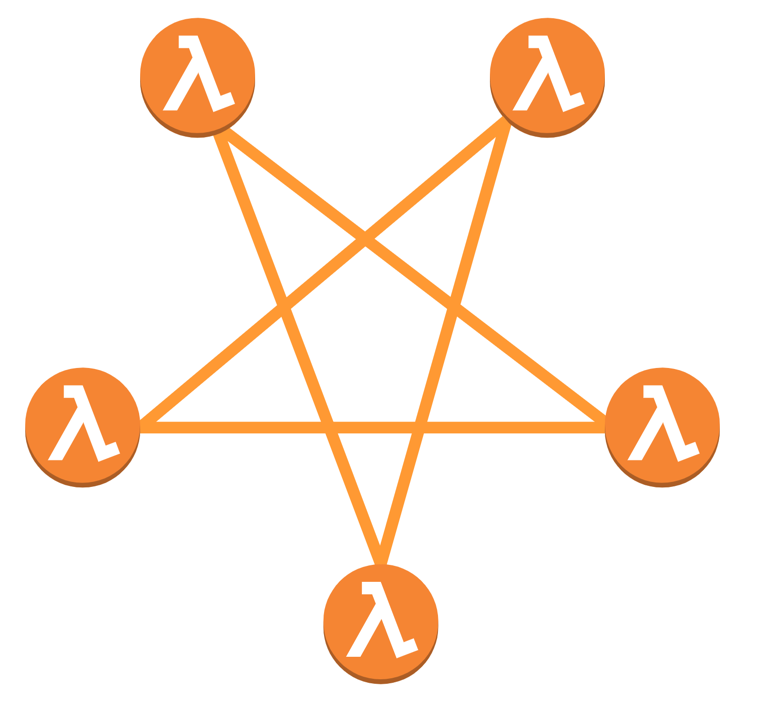
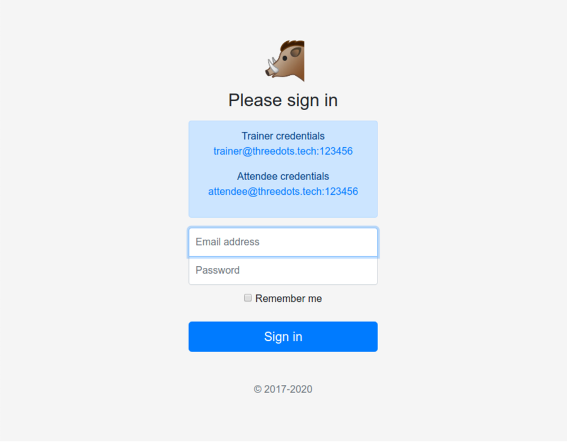
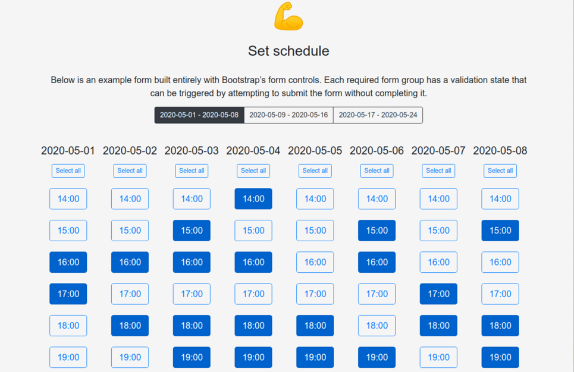
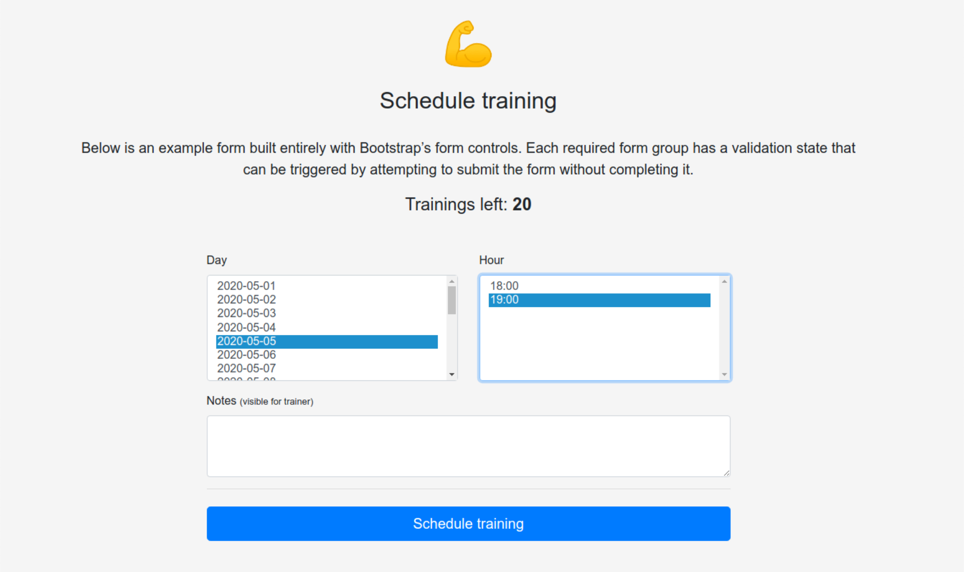
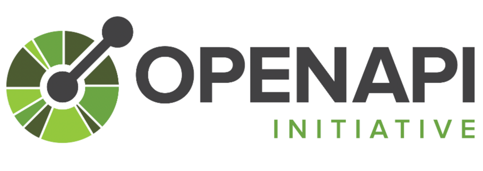
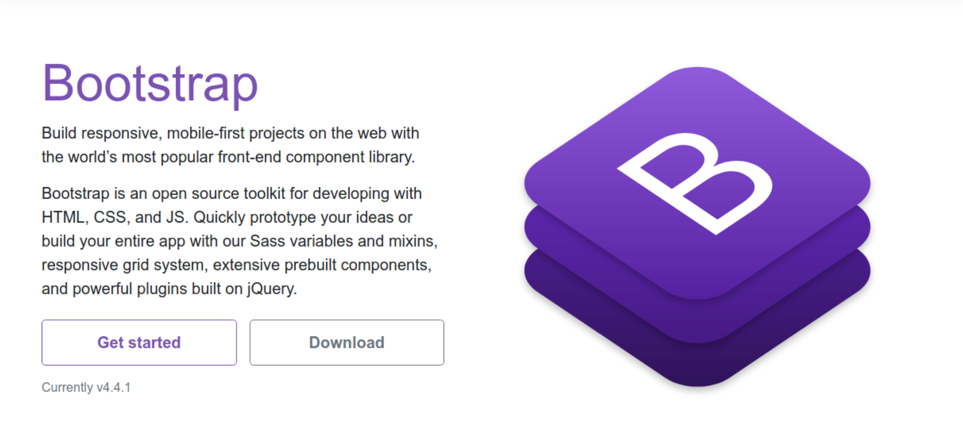
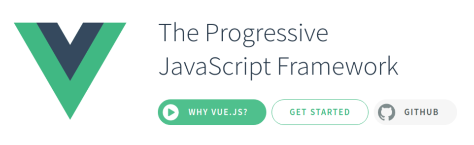
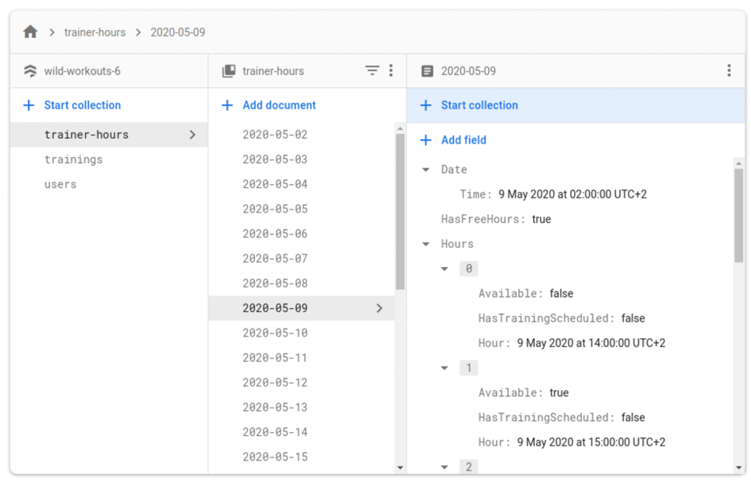

# Building a serverless application with Google Cloud Run and Firebase 使用 Google Cloud Run 和 Firebase 构建无服务器应用程序

Robert Laszczak 罗伯特·拉斯扎克

Welcome to the first chapter covering how to build business-oriented applications in Go! In this book, we want to show
you how to build applications that are easy to develop, maintain, and fun to work with in the long term.

欢迎来到第一章，介绍如何在 Go 中构建面向业务的应用程序！在本书中，我们想向您展示如何构建易于开发、维护和长期使用的应用程序。

The idea of this book is to not focus too much on infrastructure and implementation details. But we need to have some
base on which we can build later. In this chapter, we start by covering some basic tools from Google Cloud that can help
us to do that.

本书的想法是不要过多地关注基础设施和实施细节。但我们需要有一些基础，以便我们以后可以建立。在这一章中，我们首先介绍 Google Cloud 的一些基本工具，它们可以帮助我们做到这一点。

Why serverless? 为什么选择 serverless？

**Running a Kubernetes cluster requires a lot of support from “DevOps teams”.** Let’s skip the fact that DevOps is not a
job title for now.

**运行一个Kubernetes集群需要 "DevOps团队 "的大量支持**。让我们暂时跳过DevOps不是一个工作头衔这一事实。


Figure 2.1: DevOps is a culture and mindset. It is not a job title! Slide from The gordian knot - Alberto Brandolini

Figure 2.1: DevOps是一种文化和思维方式。它不是一个工作头衔! 幻灯片来自于《戈尔迪安结》 - 阿尔贝托·布兰多里尼

Small applications that can be easily run on one virtual machine are now being deployed on super complex Kubernetes
clusters. All these clusters require a lot of maintenance.

可以很容易地在一台虚拟机上运行的小型应用程序，现在被部署在超级复杂的Kubernetes集群上。所有这些集群都需要大量的维护。

On the other hand, moving applications to containers has given us much flexibility in building and deploying them. It
allowed us to do rapid deployments of hundreds of microservices with a lot of autonomy. But the cost for that is high.

另一方面，将应用程序转移到容器中，使我们在构建和部署它们时有了很大的灵活性。它使我们能够对数百个微服务进行快速部署，并具有很大的自主性。但这样做的成本很高。

Wouldn’t it be great if any fully managed solution existed?

如果存在一个完全托管的解决方案，那不是很好吗？

Maybe your company is already using a managed Kubernetes cluster. If so, you probably already know that even your
managed cluster still requires a ton of “DevOps” support.

也许您的公司已经在使用托管 Kubernetes 集群。如果是这样，您可能已经知道，即使您的托管集群仍然需要大量的“DevOps”支持。

Maybe serverless? Well, splitting a big application to multiple, independent Lambdas (Cloud Functions) is a great way to
an unmaintainable cataclysm.

也许无服务器？好吧，将一个大型应用程序拆分为多个独立的 Lambda（云函数）是解决不可维护灾难的好方法。



Figure 2.2: You should probably rethink your architecture if it can be used for summoning demons. But wait, is it the
only way to build serverless applications? No!

Figure 2.2: 如果它可以用于召唤恶魔，您可能应该重新考虑您的架构。但是等等，这是构建无服务器应用程序的唯一方法吗？不！ // 如果它未来可能带来灾难，您可能应该重新考虑您的架构

### Google Cloud Run

The idea of Google Cloud Run is pretty simple - you **just need to provide a Docker container, and Google Cloud runs
it.**

Google Cloud Run的理念非常简单--**你只需要提供一个Docker容器，Google Cloud就可以运行它**。

Inside this container, you can run an application written in any language that can expose a port with your HTTP or gRPC
API.

在这个容器内，你可以运行一个用任何语言编写的应用程序，它可以用你的 HTTP 或 gRPC API 暴露一个端口。

You are not limited to synchronous processing – you can process Pub/Sub messages inside of this container.

你并不局限于同步处理--你可以在这个容器中处理Pub/Sub消息。

**And that’s all that you need from the infrastructure side. Google Cloud does all the magic**. Based on the traffic, the
container will automatically scale up and down. Sounds like a perfect solution ?

**这就是你在基础设施方面所需要的一切。谷歌云做所有的魔法**。 基于traffic，容器将自动扩大和缩小。听起来像是一个完美的解决方案？

In practice, it is not so simple. There are many articles showing how to use Google Cloud Run, but they usually show
**small bricks that may be used for building an application**.

在实践中，事情并不是那么简单。有很多文章展示了如何使用 Google Cloud Run，但它们通常显示 **可用于构建应用程序的小部分**。

**It’s hard to join all these bricks from multiple places to create a fully working project** (been there, done that).

**很难将所有这些来自多个地方的砖块连接起来，形成一个完整的工作项目**(亲身经历过)。

In most cases, these articles leave out the problem of vendor lock-in. The deployment method should be just an
implementation detail. I’ve already covered this topic in
the [Why using Microservices or Monolith can be just a detail?](https://threedots.tech/post/microservices-or-monolith-its-detail/)
article in 2018.

在大多数情况下，这些文章忽略了厂商锁定的问题。部署方法应该只是一个实施细节。我已经在2018年的 [《为什么使用微服务或单片机可以只是一个细节？》](https://threedots.tech/post/microservices-or-monolith-its-detail/)一文中谈到了这个话题。

But what is most important – using all the newest and most shiny technologies doesn’t mean that your application will
not become a hated legacy in the next 3 months.

但最重要的是——使用所有最新、最耀眼的技术并不意味着您的应用程序在未来 3 个月内不会成为令人讨厌的遗产。

**Serverless solves only infrastructure challenges. It doesn’t stop you from building an application that is hard to
maintain**. I even have the impression that it’s the opposite – all these fancy applications sooner or later are the
hardest to maintain.

无服务器仅解决基础架构挑战。它无法阻止您构建难以维护的应用程序。我甚至觉得情况恰恰相反——所有这些花哨的应用程序迟早会变成最难维护的。

**For this book, we created a fully functional, real-life application. You can deploy this application with one command
to Google Cloud using Terraform. You can run the local copy with one docker-compose command.**

在本书中，我们创建了一个功能齐全的真实应用程序。你可以使用 Terraform，用一条命令将这个应用程序部署到谷歌云。你可以用一条 docker-compose 命令来运行本地副本。

There is also one thing that we are doing differently than others. **We included some subtle issues, that from our
observations are common in Go projects.** In the long term, these small issues become critical and stop us from adding
new features.

还有一件事我们正在做的事情与其他事情不同。我们包括了一些微妙的问题，根据我们的观察，这些问题在 Go 项目中很常见。从长远来看，这些小问题变得至关重要，并阻止我们添加新功能。

Have we lost our minds? Not yet. **This approach will help you to understand what issues you can solve and what
techniques can help.** It is also a kind of challenge for practices that we use. If something is not a problem, why
should we use any technique to solve it?

我们失去了理智吗？还没有。这种方法将帮助你了解你可以解决哪些问题，哪些技术可以帮助你。这也是对我们使用的做法的一种挑战。如果某件事不是问题，我们为什么要用任何技术来解决它？

### Plan 方案

In the next couple of chapters, we will cover all topics related to running the application on Google Cloud. In this
part, we didn’t add any issues or bad practices. **The first chapters may be a bit basic if you already have some
experience in Go. We want to ensure that if you are just starting with Go, you will be able to follow more complex
topics that come next.**

在接下来的几章中，我们将介绍与在 Google Cloud 上运行应用程序相关的所有主题。在这一部分中，我们没有添加任何问题或不良做法。如果你已经有一些 Go 经验，前几章可能有点基础。我们希望确保如果您刚开始使用
Go，您将能够关注接下来出现的更复杂的主题。

Next, we will refactor parts of the application handling business logic. **This part will be much more complex.**

接下来，我们将重构应用程序中处理业务逻辑的部分。这一部分会复杂得多。

### Running the project locally 在本地运行项目

The ability to run a project locally is critical for efficient development. It is very annoying when you are not able to
check changes that you did in a simple and fast way.

在本地运行一个项目的能力对于高效的开发来说至关重要。如果你不能以简单而快速的方式检查你所做的修改，那是非常令人讨厌的。

It’s much harder to achieve it for projects built from hundreds of microservices. Fortunately, our project has only 5
services. In Wild Workouts we created Docker Compose with live code reloading for both frontend and backend. For the
frontend, we are using a container with vue-cli-service serve tool. For the backend, the situation is a bit more
complex. In all containers, we are running the reflex tool. reflex listens for any code changes that trigger the
recompilation of the service. If you are interested in details, you can find them in
our [Go Docker dev environment with Go Modules and live code reloading](https://threedots.tech/post/go-docker-dev-environment-with-go-modules-and-live-code-reloading)
blog post.

对于由数百个微服务构建的项目来说，实现它要困难得多。幸运的是，我们的项目只有 5 个服务。在 Wild Workouts 中，我们为前端和后端创建了带有热加载的 Docker Compose。对于前端，我们使用带有
vue-cli-service 服务工具的容器。对于后端，情况要复杂一些。在所有容器中，我们都在运行 reflex 工具。 reflex 侦听任何触发重新编译服务的代码更改。如果您对细节感兴趣，您可以在我们的
[带有Go Modules和 热加载 的Go Docker开发环境](https://threedots.tech/post/go-docker-dev-environment-with-go-modules-and-live-code-reloading)
博客文章找到它们。

#### Requirements 要求

The only requirements needed to run the project are [Docker](https://www.docker.com/)
and [Docker Compose](https://docs.docker.com/compose/).

运行该项目所需的唯一要求是 [Docker](https://www.docker.com/) 和 [Docker Compose](https://docs.docker.com/compose/)。

#### Running

```shell
git clone https://github.com/ThreeDotsLabs/wild-workouts-go-ddd-example.git && cd wild-workouts-go-ddd-example
```

And run Docker Compose:
运行 Docker Compose:

```shell
docker-compose up
```

After downloading all JS and Go dependencies, you should see a message with the frontend address:

下载所有 JS 和 Go 依赖项后，您应该会看到一条带有前端地址的消息：

```shell
web_1             | $ vue-cli-service serve
web_1             |  INFO  Starting development server...
web_1             |  DONE  Compiled successfully in 6315ms11:18:26 AM
web_1             |
web_1             |
web_1             |   App running at:
web_1             |   - Local:   http://localhost:8080/
web_1             |
web_1             |   It seems you are running Vue CLI inside a container.
web_1             |   Access the dev server via http://localhost:<your container's external mapped port>/
web_1             |
web_1             |   Note that the development build is not optimized.
web_1             |   To create a production build, run yarn build.
```

Congratulations! Your local version of the Wild Workouts application is available
at [http://localhost:8080/](http://localhost:8080/).

恭喜你！Wild Workouts 应用程序的运行在本地[http://localhost:8080/](http://localhost:8080/)。

There is also a public version available
at [https://threedotslabs-wildworkouts.web.app](https://threedotslabs-wildworkouts.web.app/).

这里也有一个公开的版本，可在[https://threedotslabs-wildworkouts.web.app](https://threedotslabs-wildworkouts.web.app/)。

### What Wild Workouts can do? Wild Workouts 能做什么？

How often did you see tutorials without any real-life functionality? How often didn’t patterns from these tutorials work
in real projects? **Probably too often. Real life is not as simple as in tutorials**.

您多久看到一次没有任何实际功能的教程？这些教程中的模式在实际项目中不起作用的频率如何？**可能太频繁了。现实生活并不像教程中那么简单**。

To avoid this problem, we created Wild Workouts application as a fully functional project. It’s much harder to do
shortcuts and skip extra complexity when an application needs to be complete. It makes all chapters longer, but there
are no shortcuts here. **If you don’t spend enough time in the beginning, you will lose much more time later during the
implementation. Or even worse – you’ll be fixing problems in a rush with the application already running on
production.**

为了避免这个问题，我们将 Wild Workouts
应用程序创建为一个功能齐全的项目。当一个应用程序需要完整时，做捷径和跳过额外的复杂性要难得多。它使所有章节都变长了，但这里没有捷径。如果您在开始时没有花费足够的时间，那么您将在稍后的实施过程中浪费更多时间。或者更糟糕的是 ——
你会在已经在生产环境中运行的应用程序中匆忙解决问题。

#### tl;dr

Wild Workouts is an application for personal gym trainers and attendees.

Wild Workouts 是一款针对私人健身教练和参与者的应用程序。



Figure 2.3: 登陆页

Trainers can set a schedule when they are available for the training.

培训师可以设定一个他们可以参加培训的时间表。

Attendees can schedule training for provided dates.

参加者可以在提供的日期安排培训

Other functionalities are:

其他功能还有

- management of “credits” (how many trainings the attendee can schedule)
  “学分”管理（参加者可以安排多少次培训）
- cancellation 取消
    * if a training is canceled less than 24 hours before the time it begins, the attendee will not receive their
      credits back 如果在培训开始前24小时内取消培训，参训者将不会收他们的学分。


Figure 2.4: Schedule

Figure 2.4: 日程


Figure 2.5: Schedule training

Figure 2.5: 安排培训时间

- training reschedule 培训重新安排时间
    * if someone wants to reschedule a training less than 24 hours before the time it begins, it needs to be approved by
      the second participant (trainer or attendee)
      如果有人想在培训开始前24小时内重新安排培训时间，需要得到第二位参与者（培训师或参会者）的批准。
- calendar view 浏览日程表 Sounds simple. What can go wrong?

### Frontend 前端

If you are not interested in the frontend part, you can go straight to the Backend section.

如果你对前端部分不感兴趣，可以直接进入后端部分。

I’m rather a backend engineer and to be honest I’m not the greatest JavaScript and frontend specialist. **But we can’t
have an application working end-to-end without a frontend!**

我是一名后端工程师，老实说，我不是最伟大的 JavaScript 和前端专家。但是我们不能让应用程序在没有前端的情况下端到端工作！

In this book, we focus on the backend part. I will give a high-level overview of what technologies I used on the
frontend. It will be nothing new to you if you have any basic frontend knowledge. For more details, I recommend to check
the source code in the  [web/directory](https://bit.ly/3uw3xtB).

在本书中，我们关注后端部分。我将对我在前端使用的技术进行高级概述。如果您有任何基本的前端知识，这对您来说并不是什么新鲜事。更多详细信息，我建议查看 [web/directory](https://bit.ly/3uw3xtB)。

### OpenAPI (Swagger) client

Nobody likes to keep API contracts up to date manually. It’s annoying and counterproductive to keep multiple bor- ing
JSONs up-to-date. OpenAPI solves this problem with JavaScript HTTP client and Go HTTP server generated from the provided
[specification](https://bit.ly/37D3hPE). We will dive into details in the Backend part.

没有人喜欢手动更新 API 合约。让多个无聊的 JSON 保持最新状态既烦人又适得其反。 OpenAPI 使用提供的 [规范](https://bit.ly/37D3hPE) 生成的 JavaScript HTTP 客户端和 Go HTTP
服务器解决了这个问题。我们将在后端部分深入探讨细节。


Figure 2.6: OpenAPI

### Bootstrap

You probably already know [Bootstrap](https://getbootstrap.com/), the greatest friend of every backend engineer, like
me. Fighting with HTML and CSS is the part of frontend development that I dislike the most. Bootstrap provided me almost
all building blocks needed for creating HTML of the application.

你可能已经知道 [Bootstrap](https://getbootstrap.com/)，每个后端工程师最好的朋友，就像我一样。与 HTML 和 CSS 抗争是我最不喜欢的前端开发部分。 Bootstrap 为我提供了创建应用程序
HTML 所需的几乎所有构建块。



Figure 2.7: Bootstrap

### Vue.js

After checking a couple of the most popular frontend frameworks, I decided to use [Vue.js](https://vuejs.org/v2/guide/).
I really enjoyed the simplicity of this solution.

在检查了几个最流行的前端框架后，我决定使用 [Vue.js](https://vuejs.org/v2/guide/) 。我真的很喜欢这个解决方案的简单性。



Figure 2.8: Vue.js

I was starting my journey as a full-stack developer in the pre-jQuery times. The frontend tooling made huge progress...
but I’ll stay with the backend for now.

在前 jQuery 时代，我开始了我作为全栈开发人员的旅程。前端工具取得了巨大的进步... 但我现在会留在后端。

## Backend 后端

The backend of Wild Workouts is built from 3 services.

- *trainer* – provides public [HTTP](https://bit.ly/3aGUC0b) and internal [gRPC endpoints](https://bit.ly/3aGUC0b) for
  managing trainer schedule /

- *trainings* – provides public [HTTP](https://bit.ly/3upucIc) for managing attendee trainings 培训 – 提供公共 HTTP 用于管理参加者培训
- *users* – provides public [HTTP endpoints](https://bit.ly/3uh4rtA) and
  internal [gRPC endpoints](https://bit.ly/3uh4rtA) , manages credits and user data

If a service exposes 2 types of APIs, each of them is exposed in a separate process.

Wild Workouts 的后端由 3 个服务构建而成。

- *trainer* – 提供公共 [HTTP](https://bit.ly/3aGUC0b) 和内部 [gRPC endpoints](https://bit.ly/3aGUC0b) 来管理培训师时间表
- *trainings* – 提供公共 [HTTP](https://bit.ly/3upucIc) 用于管理参加者培训
- *users* – 提供公共 [HTTP endpoints](https://bit.ly/3uh4rtA) 和内部 [gRPC endpoints](https://bit.ly/3uh4rtA)，管理信用和用户数据

如果一个服务公开了两种类型的 API，它们中的每一种都在一个单独的进程中公开。

### Public HTTP API / 公共 HTTP API

Most operations performed by applications are triggered by the public HTTP API. I’ve heard many times the question from
newcomers to Go what framework they should use to create an HTTP service. **I always advise against using any kind of
HTTP framework in Go. A simple router, like [chi](https://github.com/go-chi/chi) is more than enough.** chi provides us
only the lightweight glue to define what URLs and methods are supported by our API. Under the hood, it uses the Go
standard library http package, so all related tools like middlewares are 100% compatible.

应用程序执行的大多数操作都是由公共 HTTP API 触发的。我多次听到 Go 新手提出的问题，他们应该使用什么框架来创建 HTTP 服务。**我总是建议不要在 Go 中使用任何类型的 HTTP
框架。一个简单的路由器，比如 [chi](https://github.com/go-chi/chi) 就足够了**。chi 只为我们提供了轻量级的粘合剂来定义我们的 API 支持哪些 URL 和方法。在底层，它使用 Go 标准库 http
包，因此所有相关工具（如中间件）都是 100% 兼容的。

It may be a bit weird to not use a framework if you are coming from any language where Spring, Symfony, Django, or
Express may be the obvious choice. It was weird for me too. Using any kind of framework in Go adds unnecessary
complexity and will couple your project with this framework. [KISS](https://en.wikipedia.org/wiki/KISS_principle).

如果您来自 Spring、Symfony、Django 或 Express 可能是显而易见的选择的任何语言，那么不使用框架可能会有点奇怪。这对我来说也很奇怪。在 Go
中使用任何类型的框架都会增加不必要的复杂性，并将您的项目与该框架耦合。[KISS](https://en.wikipedia.org/wiki/KISS_principle).

All the services are running the HTTP server in the same way. It sounds like a good idea to not copy it 3 times.

所有的服务都在以同样的方式运行HTTP服务器。这听起来是个好主意，不要复制3次。

```go
package server

func RunHTTPServer(createHandler func(router chi.Router) http.Handler) {
	apiRouter := chi.NewRouter()
	setMiddlewares(apiRouter)
	rootRouter := chi.NewRouter()
	// we are mounting all APIs under /api path
	rootRouter.Mount("/api", createHandler(apiRouter))
	logrus.Info("Starting HTTP server")
	http.ListenAndServe(":"+os.Getenv("PORT"), rootRouter)
}
```

Source: http.go on [GitHub](https://bit.ly/3bonCsL)

chi provides us with a set of useful built-in HTTP middlewares, but we are not limited only to them. All middlewares
compatible with Go standard library will work.

chi 为我们提供了一组有用的内置 HTTP 中间件，但我们不仅限于它们。所有与 Go 标准库兼容的中间件都可以工作。

> Long story short – middlewares allow us to do anything before and after a request is executed (with access to the http.Request). Using HTTP middlewares gives us a lot of flexibility in building our custom HTTP server. We are building our server from multiple decoupled components that you can customize for your purposes.
> 长话短说 - 中间件允许我们在请求执行之前和之后做任何事情（通过访问 http.Request）。使用 HTTP 中间件为我们构建自定义 HTTP 服务器提供了很大的灵活性。我们正在从多个解耦组件构建我们的服务器，您可以根据自己的目的对其进行自定义。

```go
package server

func setMiddlewares(router *chi.Mux) {
	router.Use(middleware.RequestID)
	router.Use(middleware.RealIP)
	router.Use(logs.NewStructuredLogger(logrus.StandardLogger()))
	router.Use(middleware.Recoverer)

	addCorsMiddleware(router)
	addAuthMiddleware(router)

	router.Use(
		middleware.SetHeader("X-Content-Type-Options", "nosniff"),
		middleware.SetHeader("X-Frame-Options", "deny"),
	)
	router.Use(middleware.NoCache)
}
```

Source: http.go on [GitHub](https://bit.ly/3aFCFzn)

We have our framework almost ready now. :) It’s time to use that. We can call server.RunHTTPServer in the trainings
service.

我们的框架现在几乎准备好了。 :) 是时候使用它了。我们可以在培训服务中调用 server.RunHTTPServer。

```go
package main

// ...
func main() {
	// ...
	server.RunHTTPServer(func(router chi.Router) http.Handler {
		return HandlerFromMux(HttpServer{firebaseDB, trainerClient, usersClient}, router)
	})
}
```

Source: main.go on [GitHub](https://bit.ly/3k63dNf)

createHandler needs to return http.Handler. In our case it is HandlerFromMux generated
by [oapi-codegen](https://github.com/deepmap/oapi-codegen).

createHandler 需要返回 http.Handler。在我们的例子中，它是由 [oapi-codegen](https://github.com/deepmap/oapi-codegen) 生成的 HandlerFromMux。

It provides us all the paths and query parameters from the [OpenAPI specs](https://bit.ly/37D3hPE).

它为我们提供了来自 [OpenAPI规范](https://bit.ly/37D3hPE) 的所有路径和查询参数。

```go
package main

// HandlerFromMux creates http.Handler with routing matching OpenAPI spec based on the provided mux.
func HandlerFromMux(si ServerInterface, r chi.Router) http.Handler {
	r.Group(func(r chi.Router) {
		r.Use(GetTrainingsCtx)
		r.Get("/trainings", si.GetTrainings)
	})
	r.Group(func(r chi.Router) {
		r.Use(CreateTrainingCtx)
		r.Post("/trainings", si.CreateTraining)
	})
	// ...
	return r
}
```

Source: openapi_api.gen.go on [GitHub](https://bit.ly/3bqtTUN)

```yaml
# ...
paths:
  /trainings:
    get:
      operationId: getTrainings
      responses:
        '200':
          description: todo
          content:
            application/json:
              schema:
                $ref: '#/components/schemas/Trainings'
        default:
          description: unexpected error
          content:
            application/json:
              schema:
                $ref: '#/components/schemas/Error'
# ...
```

Source: trainings.yml on [GitHub](https://bit.ly/3pFKRDI)

If you want to make any changes to the OpenAPI spec, you need to regenerate Go server and JavaScript clients after. You
need to run:

如果您想对 OpenAPI 规范进行任何更改，您需要在之后重新生成 Go 服务器和 JavaScript 客户端。你需要运行：

```shell
make openapi
```

Part of the generated code is ServerInterface. It contains all methods that need to be supported by the API.
Implementation of server functionality is done by implementing that interface.

生成的代码的一部分是 ServerInterface 。它包含 API 需要支持的所有方法。服务器功能的实现是通过实现该接口来完成的。

```go
package main

type ServerInterface interface {
	// (GET /trainings)
	GetTrainings(w http.ResponseWriter, r *http.Request)
	// (POST /trainings)
	CreateTraining(w http.ResponseWriter, r *http.Request)
	// ...
}
```

Source: openapi_api.gen.go on [GitHub](https://bit.ly/3pInFol)

This is an example of how trainings.HttpServer is implemented:

这是如何实现 trainings.HttpServer 的示例：

```go
package main

import (
	"github.com/go-chi/render"
	"gitlab.com/threedotslabs/wild-workouts/pkg/internal/auth"
	"gitlab.com/threedotslabs/wild-workouts/pkg/internal/genproto/trainer"
	"gitlab.com/threedotslabs/wild-workouts/pkg/internal/genproto/users"
	"gitlab.com/threedotslabs/wild-workouts/pkg/internal/server/httperr"
	"net/http"
)

type HttpServer struct {
	db            db
	trainerClient trainer.TrainerServiceClient
	usersClient   users.UsersServiceClient
}

func (h HttpServer) GetTrainings(w http.ResponseWriter, r *http.Request) {
	user, err := auth.UserFromCtx(r.Context())
	if err != nil {
		httperr.Unauthorised("no-user-found", err, w, r)
		return
	}
	trainings, err := h.db.GetTrainings(r.Context(), user)
	if err != nil {
		httperr.InternalError("cannot-get-trainings", err, w, r)
		return
	}
	trainingsResp := Trainings{trainings}
	render.Respond(w, r, trainingsResp)
}
```

Source: http.go on [GitHub](https://bit.ly/3ukpVWH)

But HTTP paths are not the only thing generated from OpenAPI spec. More importantly, it provides us also the models for
responses and requests. Models are, in most cases, much more complex than API paths and methods. Generating them can
save time, issues, and frustration during any API contract changes.

但HTTP路径并不是OpenAPI规范中唯一产生的东西。更重要的是，它还为我们提供了响应和请求的模型。在大多数情况下，模型要比API路径和方法复杂得多。生成它们可以节省时间、问题和在任何API合同变化中的挫折感。

```yaml
# ...

schemas:
  Training:
    type: object
    required: [ uuid, user, userUuid, notes, time, canBeCancelled, moveRequiresAccept ]
    properties:
      uuid:
        type: string
        format: uuid
      user:
        type: string
        example: Mariusz Pudzianowski
      userUuid:
        type: string
        format: uuid
      notes:
        type: string
        example: "let's do leg day!"
      time:
        type: string
        format: date-time
      canBeCancelled:
        type: boolean
      moveRequiresAccept:
        type: boolean
      proposedTime:
        type: string
        format: date-time
      moveProposedBy:
        type: string

  Trainings:
    type: object
    required: [ trainings ]
    properties:
      trainings:
        type: array
        items:
          $ref: '#/components/schemas/Training'
# ...
```

Source: trainings.yml on [GitHub](https://bit.ly/2P0KI1n)

```go
package main

import "time"

// Training defines model for Training.
type Training struct {
	CanBeCancelled     bool       `json:"canBeCancelled"`
	MoveProposedBy     *string    `json:"moveProposedBy,omitempty"`
	MoveRequiresAccept bool       `json:"moveRequiresAccept"`
	Notes              string     `json:"notes"`
	ProposedTime       *time.Time `json:"proposedTime,omitempty"`
	Time               time.Time  `json:"time"`
	User               string     `json:"user"`
	UserUuid           string     `json:"userUuid"`
	Uuid               string     `json:"uuid"`
}

// Trainings defines model for Trainings.
type Trainings struct {
	Trainings []Training `json:"trainings"`
}
```

Source: openapi_types.gen.go on [GitHub](https://bit.ly/3k7NYDj)

### Cloud Firestore database / Cloud Firestore 数据库

All right, we have the HTTP API. But even the best API without any data and without the ability to save anything is
useless.

好了，我们有HTTP API。但即使是最好的API，如果没有任何数据，没有保存任何东西的能力，也是没有用的。

If we want to build the application in the most modern, scalable, and truly serverless way, Firestore is a natural
choice. We will have that out of the box. What is the cost of that?

如果我们想以最现代、可扩展和真正的无服务器方式构建应用程序，Firestore是一个自然的选择。我们将拥有开箱即用的功能。这方面的成本是什么？


Figure 2.9: Firestore

If we are talking about financial cost for
the [Europe multi-region](https://firebase.google.com/docs/firestore/pricing#europe) option we need to pay:

- $0.06 per 100,000 documents reads
- $0.18 per 100,000 documents writes
- $0.02 per 100,000 documents deletes
- $0.18/GiB of stored data/month

如果我们谈论的是 [欧洲多地区](https://firebase.google.com/docs/firestore/pricing#europe) 选项的财务成本，我们需要支付。

- 每 100,000 份文档读取 0.06 美元
- 每 100,000 份文档写入 0.18 美元
- 每100,000份文件删除0.02美元
- 0.18 美元/GiB 的存储数据/月

Sounds pretty cheap? / 听起来很便宜吧？

For comparison, let’s take the cheapest [Cloud SQL MySQL](https://cloud.google.com/sql/pricing#2nd-gen-pricing)
db-f1-micro instance with shared Virtual CPU and 3 GB of storage as a reference – it costs $15.33/month. The cheapest
instance with high availability and with 1 non-shared Virtual CPU costs $128.21/month

为了进行比较，让我们以最便宜的 [Cloud SQL MySQL](https://cloud.google.com/sql/pricing#2nd-gen-pricing) db-f1-micro 实例为参考，它具有共享的虚拟 CPU 和
3GB 的存储空间，费用为15.33美元/月。最便宜的实例具有高可用性和1个非共享的虚拟 CPU，费用为128.21美元/月。

What is even better, in the [free plan](https://firebase.google.com/pricing), you can store up to 1 GiB of data with 20k
document writes per day.

更棒的是，在免费计划中，您可以存储多达 1 GiB 的数据，每天写入 20k 文档。

Firestore is a NoSQL database, so we should not expect to build relational models in the SQL manner. Instead of that, we
have a system of [hierarchical collections](https://firebase.google.com/docs/firestore/data-model). In our case, the
data model is pretty simple, so we have only one level of collections.

Firestore是一个NoSQL数据库，所以我们不应该期望以SQL方式建立关系模型。相反，我们有一个 [分层集合](https://firebase.google.com/docs/firestore/data-model)
的系统。在我们的案例中，数据模型非常简单，所以我们只有一个层次的集合。

In contrast to many NoSQL databases, Firestore offers ACID transactions on any operation. It also works when updating
multiple documents.

与许多NoSQL数据库相比，Firestore在任何操作上都提供ACID事务。它在更新多个文档时也能发挥作用。

#### Firestore limitations / Firestore 限制

The important limitation may be the limit of 1 update / second / one document. It still means that you can update a lot
of independent documents in parallel. It is an important factor that you should consider while designing your database.
In some cases, you should consider batching operations, different documents design, or using a different database. If
data is changing often, maybe a key-value database would be a good choice?

重要的限制可能是
1次更新/秒/一个文档的限制。这仍然意味着您可以并行更新许多独立的文档。这是您在设计数据库时应该考虑的一个重要因素。在某些情况下，您应该考虑批处理操作、不同的文档设计或使用不同的数据库。如果数据经常变化，也许键值数据库是个不错的选择？

From my experience, the limitation of 1 update per second per document is not a serious problem. In most cases, when I
was using Firestore, we were updating a lot of independent documents. This is also true.

根据我的经验，每个文件每秒1次更新的限制并不是一个严重的问题。在大多数情况下，当我使用Firestore时，我们要更新很多独立的文档。这也是事实。



Figure 2.10: Firestore Console

Figure 2.10: Firestore 控制台

when using Firestore for event sourcing - you will only use append operations. In Wild Workouts, we should also not have
a problem with this limit.

当使用Firestore进行事件源时--你将只使用追加操作。在Wild Workouts中，我们也不应该有这种限制的问题。

> I have also observed that Firestore needs some time to warm up. In different words – if you want to insert 10 mln documents within one minute after you just set up a new project, it may not work. I guess this is related to some internal magic that handles scaleability. Fortunately, in the real world, it is not common to have traffic spikes from 0 to 10 mln writes / minute.
>
> 我还观察到，Firestore需要一些时间来热身。换句话说--如果你想在一分钟内插入10百万个文件，在你刚刚建立了一个新的项目之后，它可能无法工作。我猜这与一些处理可扩展性的内部魔法有关。幸运的是，在现实世界中，出现从0到10百万次写入/分钟的峰值并不常见。

#### Running Firestore locally / 在本地运行 Firestore

Unfortunately Firestore emulator is not perfect.

不幸的是，Firestore 模拟器并不完美。

I found some situations where the emulator was not 100% compatible with the real version. I also had some situations
when I was doing an update and read of the same document in the transaction, and it caused a deadlock. From my point of
view, this functionality is enough for local development.

我发现有些情况下，模拟器与真实版本不是100%兼容。我还遇到了一些情况，当我在事务中对同一个文档进行更新和读取时，会造成死锁。从我的观点来看，这个功能对于本地开发来说已经足够了。

The alternative may be to have a separate Google Cloud project for local development. My preference here is to have a
local environment that is truly local and doesn’t depend on any external services. It is also easier to set up and can
be used later in Continuous Integration.

另一种方法可能是为本地开发建立一个单独的Google Cloud项目。在这里，我更倾向于拥有一个真正的本地环境，不依赖任何外部服务。它也更容易设置，并且可以在以后的持续集成中使用。

**Since the end of May, the Firestore emulator provides a UI**. It is added to the Docker Compose and is available
at http://localhost:4000/. When I’m writing this, sub-collections are not displayed properly32 in the UI in the
emulator. Don’t worry, for Wild Workouts it’s not a problem.

自 5 月底以来，Firestore 模拟器提供了 UI。它被添加到 Docker Compose 并在 http://localhost:4000/ 上可用。当我写这篇文章时，子集合在模拟器的 UI 中没有正确显示32。不用担心，对于
Wild Workouts，这不是问题。

#### Using Firestore / 使用 Firestore

Apart from Firestore implementation, the code works in the same way locally and on the production. When we are using
emulator locally, we need to run our application with env FIRESTORE_EMULATOR_HOST set to emulator hostname (in our case
firestore:8787). It is set in the .env file

除了Firestore的实现之外，代码在本地和生产中的工作方式是一样的。当我们在本地使用仿真器时，我们需要在运行我们的应用程序时，将 env FIRESTORE_EMULATOR_HOST 设置为模拟器的主机名（在我们的例子中是
Firestore：8787）。它被设置在 `.env` 文件中

On production, all magic is done by Google Cloud under the hood, and no extra configuration is needed.

在生产中，所有的魔法都由 Google Cloud 在后台完成，不需要额外的配置。

```go
package main

func main() {
	// ...

	firebaseClient, err := firestore.NewClient(ctx, os.Getenv("GCP_PROJECT"))
	if err != nil {
		panic(err)
	}

	// ...
}
```

Source: main.go on [GitHub](https://bit.ly/3bnhTDC)

Here is the example of how I used Firestore client for querying trainer schedule. You can see how I
used [queries functionality](https://firebase.google.com/docs/firestore/query-data/queries#simple_queries) to get only
dates from the queried dates interval.

下面是我如何使用 Firestore
客户端查询培训师计划的例子。你可以看到我是如何使用[查询功能](https://firebase.google.com/docs/firestore/query-data/queries#simple_queries)，从被查询的日期区间中只获取日期。

```go
package main

import (
	// ...
	"cloud.google.com/go/firestore"
	// ...
)

// ...
type db struct {
	firestoreClient *firestore.Client
}

func (d db) TrainerHoursCollection() *firestore.CollectionRef {
	return d.firestoreClient.Collection("trainer-hours")
}

// ...
func (d db) QueryDates(params *GetTrainerAvailableHoursParams, ctx context.Context) ([]Date, error) {
	iter := d.
		TrainerHoursCollection().
		Where("Date.Time", ">=", params.DateFrom).
		Where("Date.Time", "<=", params.DateTo).
		Documents(ctx)
	var dates []Date

	for {
		doc, err := iter.Next()
		if err == iterator.Done {
			break
		}
		if err != nil {
			return nil, err
		}

		date := Date{}
		if err := doc.DataTo(&date); err != nil {
			return nil, err
		}
		date = setDefaultAvailability(date)
		dates = append(dates, date)
	}

	return dates, nil
}
```

Source: firestore.go on [GitHub](https://bit.ly/3btJPG9)

There is also no extra data mapping needed. Firestore library can marshal any struct with public fields or
`map[string]interface`. As long as there is nothing weird inside. You can find the entire specification of how
conversion is done in
cloud.google.com/go/firestore [GoDoc](https://godoc.org/cloud.google.com/go/firestore#DocumentSnapshot.DataTo).

也不需要额外的数据映射。Firestore库可以处理任何带有公共字段或 `map[string]interface` 的结构。只要里面没有什么奇怪的东西。你可以在
cloud.google.com/go/firestore [GoDoc](https://godoc.org/cloud.google.com/go/firestore#DocumentSnapshot.DataTo)
中找到关于如何转换的全部规范。

```go
package main

type Date struct {
	Date         openapi_types.Date `json:"date"`
	HasFreeHours bool               `json:"hasFreeHours"`
	Hours        []Hour             `json:"hours"`
}
```

Source: openapi_types.gen.go on [GitHub](https://bit.ly/3pBnSd3)

```
date := Date{}
if err := doc.DataTo(&date); err != nil {
    return nil, err
}
```

Source: firestore.go on [GitHub](https://bit.ly/3k7rPoM)

### Production deployment tl;dr / 生产部署 (内容提要)

You can deploy your own version of Wild Workouts with one command:

您可以使用一个命令部署您自己的 Wild Workouts 版本：

```shell
cd terraform/

make

Fill all required parameters:
    project [current: wild-workouts project]:       # <----- put your Wild Workouts Google Cloud project name here (it will be created) 
    user [current: email@gmail.com]:                # <----- put your Google (Gmail, G-suite etc.) e-mail here
    billing_account [current: My billing account]:  # <----- your billing account name, can be found here https://console.cloud.google.com/billing
    region [current: europe-west1]: 
    firebase_location [current: europe-west]: 

# it may take a couple of minutes...

The setup is almost done!

Now you need to enable Email/Password provider in the Firebase console.
To do this, visit https://console.firebase.google.com/u/0/project/[your-project]/authentication/providers

You can also downgrade the subscription plan to Spark (it's set to Blaze by default).
The Spark plan is completely free and has all features needed for running this project.

Congratulations! Your project should be available at: https://[your-project].web.app

If it's not, check if the build finished successfully: https://console.cloud.google.com/cloud-build/builds?project=[your-project]

If you need help, feel free to contact us at https://threedots.tech

```

We will describe the deployment in detail in the next chapters.

我们将在接下来的章节中详细描述该部署。

### What’s next? / 下一步是什么？

In the next chapters, we will cover internal gRPC communication between services and HTTP Firebase authentication.

在接下来的章节中，我们将介绍服务之间的内部 gRPC 通信和 HTTP Firebase 身份验证。

The code with gRPC communication and authentication is already on our GitHub. Feel free to read, run, and experiment
with it.

带有 gRPC 通信和身份验证的代码已经在我们的 GitHub 上。随意阅读、运行和试验它。

#### Deployment and infrastructure / 部署和基础架构

The infrastructure part is described in Chapter 14. It covers in details:

基础设施部分将在第14章中描述。它详细地涵盖了:

- Terraform
- Cloud Run
- CI/CD
- Firebase hosting

#### What is wrong with this application?! / 这个应用程序有什么问题？！

After finishing all chapters describing the current application, we will start the part related with refactoring and
adding new features to Wild Workouts.

在完成描述当前应用程序的所有章节后，我们将开始与重构和为Wild Workouts添加新功能有关的部分。

**We don’t want to use many fancy techniques just to make our CVs look better. Our goal is to solve issues present in
the application using** Domain-Driven Design, Clean Architecture, CQRS, Event Storming, and Event Modeling.

我们不想为了让我们的简历看起来更好而使用许多花哨的技术。我们的目标是使用领域驱动设计、清洁架构、CQRS、事件风暴和事件建模来解决应用中存在的问题。

We will do it by refactoring. It should be then visible **what issues are solved and how it makes the imple- mentation
more clean**. Maybe during this we will even see that some of these techniques are not useful in Go, who knows.

我们将通过重构来做到这一点。这时应该可以看到哪些问题得到了解决，以及如何使实现更加简洁。也许在这个过程中，我们甚至会发现这些技术中的一些在Go中并不实用，谁知道呢。