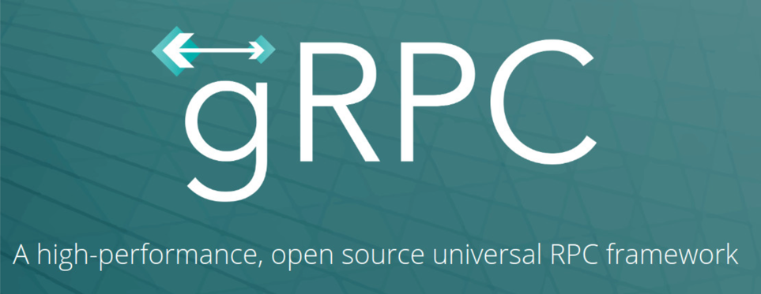
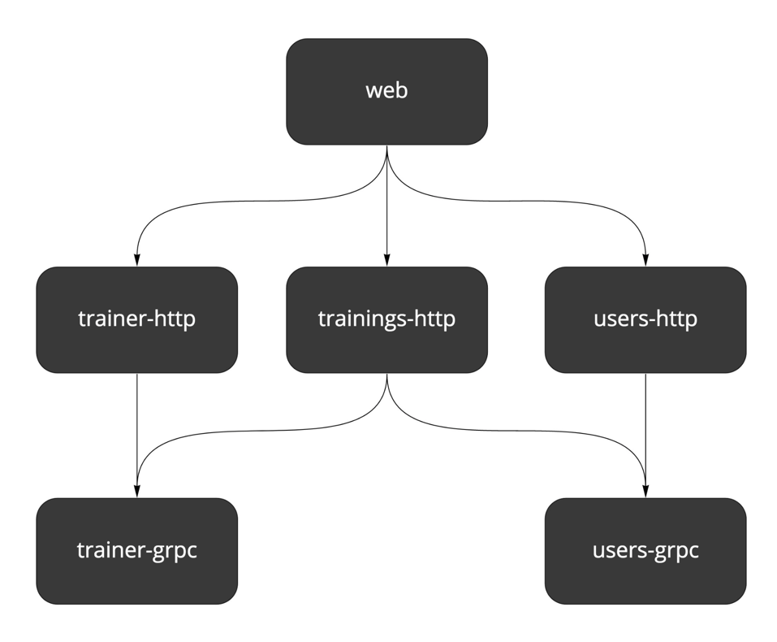
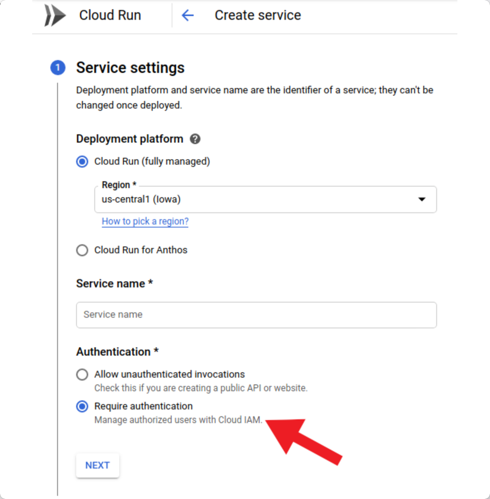
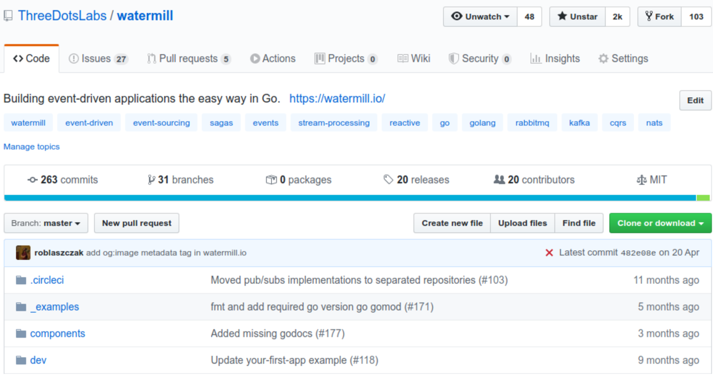

## gRPC communication on Google Cloud Run / 在 Google Cloud Run 上使用 gRPC 通信

Robert Laszczak / 罗伯特·拉斯扎克

In this chapter we show how you can **build robust, internal communication between your services using gRPC**. We also
cover some extra configuration required to set up authentication and TLS for the Cloud Run.

在本章中，我们将展示如何**使用gRPC在你的服务之间建立强大的内部通信**。我们还介绍了为 Cloud Run 设置身份验证和 TLS 所需的一些额外配置。

### Why gRPC? / 为什么选择 gRPC？

Let’s imagine a story, that is true for many companies:

让我们想象一个故事，对于许多公司来说都是如此：

Meet Dave. Dave is working in a company that spent about 2 years on building their product from scratch. During this
time, they were pretty successful in finding thousands of customers, who wanted to use their product. They started to
develop this application during the biggest “boom” for microservices. It was an obvious choice for them to use that kind
of architecture. Currently, they have more than 50 microservices using HTTP calls to communicate with each other.

认识Dave。Dave 在一家公司工作，该公司花了大约 2 年时间从头开始构建他们的产品。在此期间，他们非常成功地找到了成千上万想要使用他们产品的客户。
他们在微服务“最火的”时期开始开发这个应用程序。对他们来说，使用这种架构是一个明显的选择。目前，他们有50多个微服务使用HTTP调用来相互通信。

Of course, Dave’s company didn’t do everything perfectly. The biggest pain is that currently all engineers are afraid to
change anything in HTTP contracts. It is easy to make some changes that are not compatible or not returning valid data.
It’s not rare that the entire application is not working because of that. “Didn’t we built microservices to avoid that?”
– this is the question asked by scary voices in Dave’s head every day.

当然，Dave的公司并不是每件事都做得很完美。最痛苦的是，目前所有工程师都害怕更改 HTTP 协议中的任何内容。很容易做一些不兼容或不返回有效数据的更改。因为这个原因，整个应用程序无法工作的情况并不罕见。
我们建立微服务不是为了避免这种情况吗？- 这是 Dave 每天脑海中可怕的声音所问的问题。

Dave already proposed to use OpenAPI for generating HTTP server responses and clients. But he shortly found that he
still can return invalid data from the API.

Dave已经提议使用OpenAPI来生成HTTP服务器响应和客户端。但他很快发现，他仍然可以从API返回无效的数据。

It doesn’t matter if it (already) sounds familiar to you or not. The solution for Dave’s company is simple and
straightforward to implement. **You can easily achieve robust contracts between your services by using gRPC**.

如果它（已经）对你来说听起来很熟悉或不熟悉，这并不重要。Dave 公司的解决方案简单易行。**你可以通过使用gRPC轻松实现你的服务之间的强大契约**。



<center> Figure 3.1: gRPC logo</center>

The way of how servers and clients are generated from gRPC is way much stricter than OpenAPI. It’s needless to say that
it’s infinitely better than the OpenAPI’s client and server that are just copying the structures.

gRPC生成服务器和客户端的方式比OpenAPI要严格得多。不用说，它比OpenAPI的客户端和服务器只是复制结构要好得多。

> It’s important to remember that gRPC doesn’t solve the **data quality problems**. In other words – you can still send data that is not empty, but doesn’t make sense. It’s important to ensure that data is valid on many levels, like the robust contract, contract testing, and end-to-end testing.
>
> 重要的是要记住，gRPC并不能解决数据质量问题。换句话说--你仍然可以发送不是空的、但没有意义的数据。重要的是要确保数据在很多层面上是有效的，比如说健全的合同、合同测试和端到端的测试。

Another important “why” may be performance. You can find many studies that **gRPC may be even 10x faster than REST**.
When your API is handling millions of millions of requests per second, it may be a case for cost optimization. In the
context of applications like Wild Workouts, where traffic may be less than 10 requests/sec, **it doesn’t matter**.

另一个重要的“原因”可能是性能。你可以找到许多研究，**gRPC甚至可能比REST快10倍**。当你的API每秒处理数以百万计的请求时，可能就会出现成本优化的情况。在像Wild Workouts这样的应用背景下，traffic
可能少于10个请求/秒，这并不重要。

To be not biased in favor of using gRPC, I tried to find any reason not to use it for internal communication. I failed
here:

为了不偏向于使用gRPC，我试图找到任何不使用它进行内部通信的理由。我在这里失败了：

- **the entry point is low**,
- adding a gRPC server doesn’t need any extra infrastructure work – it works on top of HTTP/2,
- it workis with many languages like Java, C/C++, Python, C#, JS,
  and [more](https://grpc.io/about/#officially-supported-languages-and-platforms)
- in theory, you are even able to use gRPC for [the frontend communication](https://grpc.io/blog/state-of-grpc-web/) (I
  didn’t test that),
- it’s “Goish” – **the compiler ensures that you are not returning anything stupid**.

- 入口点低。
- 添加一个gRPC服务器不需要任何额外的基础设施工作--它在HTTP/2的基础上工作。
- 它与许多语言如Java、C/C++、Python、C#、JS [等](https://grpc.io/about/#officially-supported-languages-and-platforms) 兼容。
- 理论上，你甚至可以使用gRPC进行 [前端通信](https://grpc.io/blog/state-of-grpc-web/) （我没有测试）。
- 它是 "Goish"- **编译器确保你不会返回任何愚蠢的东西**。

Sounds promising? Let’s verify that with the implementation in Wild Workouts!

听起来很棒？让我们通过 Wild Workouts 中的实现来验证这一点！

### Generated server / 生成的服务器

Currently, we don’t have a lot of gRPC endpoints in Wild Workouts. We can update trainer hours availability and user
training balance (credits).

目前，我们在Wild Workouts中没有大量的gRPC端点。我们可以更新培训师的可用时间和用户培训余额（学分）。

Let’s check Trainer gRPC service. To define our gRPC server, we need to create `trainer.proto` file.

让我们检查一下Trainer gRPC服务。为了定义我们的gRPC服务器，我们需要创建trainer.proto文件。



<center> Figure 3.2: Architecture </center>
<center> Figure 3.2: 架构 </center>

```protobuf
syntax = "proto3";

package trainer;

import "google/protobuf/timestamp.proto";

service TrainerService {
  rpc IsHourAvailable(IsHourAvailableRequest) returns (IsHourAvailableResponse) {}
  rpc UpdateHour(UpdateHourRequest) returns (EmptyResponse) {}
}

message IsHourAvailableRequest {
  google.protobuf.Timestamp time = 1;
}

message IsHourAvailableResponse {
  bool is_available = 1;
}

message UpdateHourRequest {
  google.protobuf.Timestamp time = 1;

  bool has_training_scheduled = 2;
  bool available = 3;
}

message EmptyResponse {}
```

Source: [trainer.proto on GitHub](https://bit.ly/3blVhna)

The `.proto` definition is converted into Go code by using Protocol Buffer Compiler (protoc).

`.proto` 定义通过使用 Protocol Buffer Compiler (protoc) 转换为 Go 代码。

```makefile
.PHONY: proto
proto:
    protoc --go_out=plugins=grpc:internal/common/genproto/trainer -I api/protobuf api/protobuf/trainer.proto
    protoc --go_out=plugins=grpc:internal/common/genproto/users -I api/protobuf api/protobuf/users.proto
```

Source: [Makefile on GitHub](https://bit.ly/3aEAsnE)
> To generate Go code from .proto you need to install [protoc](https://grpc.io/docs/protoc-installation/) and [protoc  Go Plugin](https://grpc.io/docs/quickstart/go/). A list of supported types can be found in  [Protocol Buffers Version 3 Language Specification](https://developers.google.com/protocol-buffers/docs/reference/proto3-spec#fields). More complex built-in types like Timestamp can be found in [Well-Known Types list](https://developers.google.com/protocol-buffers/docs/reference/google.protobuf)
>
> 要从 .proto 生成 Go 代码，您需要安装 [protoc](https://grpc.io/docs/protoc-installation/) 和 [protoc  Go Plugin](https://grpc.io/docs/quickstart/go/)。可以在 [Protocol Buffers Version 3 Language Specification](https://developers.google.com/protocol-buffers/docs/reference/proto3-spec#fields) 中找到支持的类型列表。可以在 [Well-Known Types](https://developers.google.com/protocol-buffers/docs/reference/google.protobuf) 列表中找到更复杂的内置类型，例如 Timestamp


This is how an example generated model looks like:

这是一个生成模型的例子:

```go
package trainer

type UpdateHourRequest struct {
	Time                 *timestamp.Timestamp `protobuf:"bytes,1,opt,name=time,proto3" json:"time,omitempty"`
	HasTrainingScheduled bool                 `protobuf:"varint,2,opt,name=has_training_scheduled,json=hasTrainingScheduled,proto3" json:"has_training_scheduled,omitempty"`
	Available            bool                 `protobuf:"varint,3,opt,name=available,proto3" json:"available,omitempty"`
	XXX_NoUnkeyedLiteral struct{}             `json:"-"`
	// ... more proto garbage ;)
}
```

Source: [trainer.pb.go on GitHub](https://bit.ly/37yjVjc)

And the server:

和服务：

```go
package trainer

type TrainerServiceServer interface {
	IsHourAvailable(context.Context, *IsHourAvailableRequest) (*IsHourAvailableResponse, error)
	UpdateHour(context.Context, *UpdateHourRequest) (*EmptyResponse, error)
}
```

Source: [trainer.pb.go on GitHub](https://bit.ly/3dwBjIN)

The difference between HTTP and gRPC is that in gRPC we don’t need to take care of what we should return and how to do
that. If I would **compare the level of confidence with HTTP and gRPC, it would be like comparing Python and Go**. This
way is much more strict, and it’s impossible to return or receive any invalid values – **compiler will let us know about
that**.

HTTP 和 gRPC 之间的区别在于，在 gRPC 中我们不需要关心我们应该返回什么以及如何返回。如果我要**比较HTTP和gRPC的可信度，那就像比较Python和Go一样**。这种方式更加严格，不可能返回或接收任何无效的值 --
编译器会让我们知道这一点。

Protobuf also has built-in ability to handle deprecation of fields and
handling [backward-compatibility](https://developers.google.com/protocol-buffers/docs/proto3#backwards-compatibility-issues)
. That’s pretty helpful in an environment with many independent teams.

Protobuf也有内置的能力来处理字段的废弃和处理[向后兼容](https://developers.google.com/protocol-buffers/docs/proto3#backwards-compatibility-issues)。这在有许多独立团队的环境中是相当有帮助的。

### Protobuf vs gRPC

> Protobuf (Protocol Buffers) is Interface Definition Language used by default for defining the service interface and the structure of the payload. Protobuf is also used for serializing these models to binary format.
> Protobuf（Protocol Buffers）是默认使用的接口定义语言，用于定义服务接口和 payload 的结构。 Protobuf 还用于将这些模型序列化为二进制格式。
>
> You can find more details about gRPC and Protobuf on gRPC [Concepts](https://grpc.io/docs/guides/concepts/) page.
> 你可以在 gRPC [Concepts](https://grpc.io/docs/guides/concepts/) 页面上找到更多关于gRPC和Protobuf的细节。

Implementing the server works in almost the same way as in HTTP generated by [OpenAPI](./chapter02.md) – we need to
implement an interface ( `TrainerServiceServer` in that case).

实现服务器的工作方式与 [OpenAPI](./chapter02.md) 生成的HTTP中的工作方式几乎相同 -- 我们需要实现一个接口（在这种情况下为 `TrainerServiceServer` ）。

```go
package main

type GrpcServer struct {
	db db
}

func (g GrpcServer) IsHourAvailable(ctx context.Context, req *trainer.IsHourAvailableRequest) (*trainer.IsHourAvailableResponse, error) {
	timeToCheck, err := grpcTimestampToTime(req.Time)
	if err != nil {
		return nil, status.Error(codes.InvalidArgument, "unable to parse time")
	}

	model, err := g.db.DateModel(ctx, timeToCheck)
	if err != nil {
		return nil, status.Error(codes.Internal, fmt.Sprintf("unable to get data model: %s", err))
	}

	if hour, found := model.FindHourInDate(timeToCheck); found {
		return &trainer.IsHourAvailableResponse{IsAvailable: hour.Available && !hour.HasTrainingScheduled}, nil
	}

	return &trainer.IsHourAvailableResponse{IsAvailable: false}, nil
}

```

Source: [grpc.go on GitHub](https://bit.ly/3pG9SPj)

As you can see, you cannot return anything else than `IsHourAvailableResponse`, and you can always be sure that you will
receive `IsHourAvailableRequest`. In case of an error, you can return one of
predefined [error codes](https://godoc.org/google.golang.org/grpc/codes#Code). They are more up-to-date nowadays than
HTTP status codes.

正如你所看到的，除了 `IsHourAvailableResponse`，你不能返回任何其他东西，而且你总是可以确定你将收到 `IsHourAvailableRequest`。
在出现错误的情况下，你可以返回一个预定义的 [错误代码](https://godoc.org/google.golang.org/grpc/codes#Code) 。它们比HTTP状态代码更符合当今时代的要求。

Starting the gRPC server is done in the same way as with HTTP server:

启动 gRPC 服务器的方式与使用 HTTP 服务器的方式相同：

```go
package main

func main() {

	// ...

	server.RunGRPCServer(func(server *grpc.Server) {
		svc := GrpcServer{firebaseDB}
		trainer.RegisterTrainerServiceServer(server, svc)
	})

	// ...

}
```

Source: [main.go on GitHub](https://bit.ly/2ZCKnDQ)

### Internal gRPC client / 内部 gRPC 客户端

After our server is running, it’s time to use it. First of all, we need to create a client
instance. `trainer.NewTrainerServiceClient` is generated from `.proto`.

在我们的服务器运行之后，就该使用它了。首先，我们需要创建一个客户端实例。 `trainer.NewTrainerServiceClient` 是从 `.proto` 生成的。

```go
package trainer

type TrainerServiceClient interface {
	IsHourAvailable(ctx context.Context, in *IsHourAvailableRequest, opts ...grpc.CallOption) (*IsHourAvailableResponse, error)
	UpdateHour(ctx context.Context, in *UpdateHourRequest, opts ...grpc.CallOption) (*EmptyResponse, error)
}

type trainerServiceClient struct {
	cc grpc.ClientConnInterface
}

func NewTrainerServiceClient(cc grpc.ClientConnInterface) TrainerServiceClient {
	return &trainerServiceClient{cc}
}

```

Source: [trainer.pb.go on GitHub](https://bit.ly/3k8V5vo)

To make generated client work, we need to pass a couple of extra options. They will allow handling:

- authentication
- TLS encryption
- “service discovery” (we use hardcoded names of services provided by [Terraform](./chapter14.md)
  via `TRAINER_GRPC_ADDR` env).

为了使生成的客户端工作，我们需要传递几个额外的选项。它们将允许处理：

- 认证
- TLS 加密
- “服务发现” (我们使用 [Terraform](./chapter14.md) 通过 `TRAINER_GRPC_ADDR` env 硬编码服务的名称)

```go
package client

import (
	// ...
	"gitlab.com/threedotslabs/wild-workouts/pkg/internal/genproto/trainer"

// ...

func NewTrainerClient() (client trainer.TrainerServiceClient, close func() error, err error) {
	grpcAddr := os.Getenv("TRAINER_GRPC_ADDR")
	if grpcAddr == "" {
		return nil, func() error { return nil }, errors.New("empty env TRAINER_GRPC_ADDR")
	}
	opts, err := grpcDialOpts(grpcAddr)
	if err != nil {
		return nil, func() error { return nil }, err
	}
	conn, err := grpc.Dial(grpcAddr, opts...)
	if err != nil {
		return nil, func() error { return nil }, err
	}
	return trainer.NewTrainerServiceClient(conn), conn.Close, nil
}
```

Source: [grpc.go on GitHub](https://bit.ly/2M94vKJ)

After our client is created we can call any of its methods. In this example, we call `UpdateHour` while creating a
training.

在我们的客户端被创建后，我们可以调用它的任何方法。在这个例子中，我们在创建训练时调用`UpdateHour`。

```go
package main

import (
	"github.com/golang/protobuf/ptypes"
	// ...
	"github.com/pkg/errors"
	"gitlab.com/threedotslabs/wild-workouts/pkg/internal/genproto/trainer"
	// ...
)

type HttpServer struct {
	db            db
	trainerClient trainer.TrainerServiceClient
	usersClient   users.UsersServiceClient
}

// ...
func (h HttpServer) CreateTraining(w http.ResponseWriter, r *http.Request) {
	// ...
	timestamp, err := ptypes.TimestampProto(postTraining.Time)
	if err != nil {
		return errors.Wrap(err, "unable to convert time to proto timestamp")
	}
	_, err = h.trainerClient.UpdateHour(ctx, &trainer.UpdateHourRequest{
		Time:                 timestamp,
		HasTrainingScheduled: true,
		Available:            false,
	})
	if err != nil {
		return errors.Wrap(err, "unable to update trainer hour")
	}
	// ...
}
```

Source: [http.go on GitHub](https://bit.ly/3aDglGr)

### Cloud Run authentication & TLS / Cloud Run 身份验证和 TLS

Authentication of the client is handled by Cloud Run out of the box. The simpler (and recommended by us) way is using
Terraform. We describe it in details in [Setting up infrastructure with Terraform (Chapter 14)](./chapter14.md).

客户端的认证是由Cloud Run开箱即用。更简单的（也是我们推荐的）方法是使用Terraform。我们在 [《用Terraform 建立基础设施》（第14章）](./chapter14.md) 中详细描述了这一点。

One thing that doesn’t work out of the box is sending authentication with the request. Did I already mention that
standard gRPC transport is HTTP/2? For that reason, we can just use the old, good JWT for that.

有一件事在开箱后并不奏效，那就是随请求发送认证。我是否已经提到，标准的 gRPC 传输是 HTTP/2？出于这个原因，我们可以使用老的、好的JWT来做这个。

To make it work, we need to implement `google.golang.org/grpc/credentials.PerRPCCredentials` interface. The
implementation is based on the official guide
from [Google Cloud Documentation](https://cloud.google.com/run/docs/authenticating/service-to-service#go).

为了使其工作，我们需要实现 `google.golang.org/grpc/credentials.PerRPCCredentials`
接口。这个实现是基于 [Google Cloud 文档](https://cloud.google.com/run/docs/authenticating/service-to-service#go) 的官方指南。



<center>Figure 3.3: You can also enable Authentication from Cloud Run UI. You need to also grant the roles/run.invoker
role to service’s service account.</center> 


<center>Figure 3.3: 你也可以从 Cloud Run 界面启用认证。你还需要向服务的服务账户授予 role/run.invoker 角色。</center> 

```go
package client

import (
	"context"
	"fmt"
	"strings"

	"cloud.google.com/go/compute/metadata"
	"github.com/pkg/errors"
	"google.golang.org/grpc/credentials"
)

type metadataServerToken struct {
	serviceURL string
}

func newMetadataServerToken(grpcAddr string) credentials.PerRPCCredentials {
	// based on https://cloud.google.com/run/docs/authenticating/service-to-service#go
	// service need to have https prefix without port
	serviceURL := "https://" + strings.Split(grpcAddr, ":")[0]

	return metadataServerToken{serviceURL}
}

// GetRequestMetadata is called on every request, so we are sure that token is always not expired
func (t metadataServerToken) GetRequestMetadata(ctx context.Context, in ...string) (map[string]string, error) {
	// based on https://cloud.google.com/run/docs/authenticating/service-to-service#go
	tokenURL := fmt.Sprintf("/instance/service-accounts/default/identity?audience=%s", t.serviceURL)
	idToken, err := metadata.Get(tokenURL)
	if err != nil {
		return nil, errors.Wrap(err, "cannot query id token for gRPC")
	}

	return map[string]string{
		"authorization": "Bearer " + idToken,
	}, nil
}

func (metadataServerToken) RequireTransportSecurity() bool {
	return true
}
```

Source: [auth.go on GitHub](https://bit.ly/3k62Y4N)

The last thing is passing it to the `[]grpc.DialOption` list passed when creating all gRPC clients.

最后是把它传递给创建所有 gRPC 客户端时传递的 `[]grpc.DialOption` 列表。

It’s also a good idea to ensure that the our server’s certificate is valid with `grpc.WithTransportCredentials`.

使用 `grpc.WithTransportCredentials` 确保我们服务器的证书有效也是一个好主意。

Authentication and TLS encryption are disabled on the local Docker environment.

在本地 Docker 环境中禁用身份验证和 TLS 加密。

```go
package client

func grpcDialOpts(grpcAddr string) ([]grpc.DialOption, error) {
	if noTLS, _ := strconv.ParseBool(os.Getenv("GRPC_NO_TLS")); noTLS {
		return []grpc.DialOption{grpc.WithInsecure()}, nil
	}
	systemRoots, err := x509.SystemCertPool()
	if err != nil {
		return nil, errors.Wrap(err, "cannot load root CA cert")
	}
	creds := credentials.NewTLS(&tls.Config{
		RootCAs: systemRoots,
	})
	return []grpc.DialOption{
		grpc.WithTransportCredentials(creds),
		grpc.WithPerRPCCredentials(newMetadataServerToken(grpcAddr)),
	}, nil
}
```

Source: [grpc.go on GitHub](https://bit.ly/2ZAMMz2)

### Are all the problems of internal communication solved? / 内部沟通的所有问题都解决了吗？

**A hammer is great for hammering nails but awful for cutting a tree. The same applies to gRPC or any other technique**.

**锤子用来敲打钉子很好，但用不能用来砍树。gRPC和任何其他技术一样。**

**gRPC works great for synchronous communication, but not every process is synchronous by nature. Applying synchronous
communication everywhere will end up creating a slow, unstable system**. Currently, Wild Workouts doesn’t have any flow
that should be asynchronous. We will cover this topic deeper in the next chapters by implementing new features. In the
meantime, you can check [Watermill](http://watermill.io/) library, which was also created by us. It helps with building
asynchronous, event-driven applications the easy way.

**gRPC对于同步通信非常有效，但并不是每个进程都是同步的。在所有地方应用同步通信最终会产生一个缓慢、不稳定的系统。** 目前，Wild Workouts
没有任何应该是异步的流程。我们将在接下来的章节中通过实现新的功能来深入探讨这个话题。同时，你可以查看 [Watermill](http://watermill.io/)
库，它也是由我们创建的。它有助于以简单的方式构建异步的、事件驱动的应用程序。


<center>Figure 3.4: Watermill</center>

### What’s next? / 下一步是什么？

Having robust contracts doesn’t mean that we are not introducing unnecessary internal communication. In some cases
operations can be done in one service in a simpler and more pragmatic way.

拥有健全的合同并不意味着我们没有引入不必要的内部沟通。在某些情况下，操作可以在一个服务中以更简单和更务实的方式完成。

It is not simple to avoid these issues. Fortunately, we know techniques that are successfully helping us with that. We
will share that with you soon.

要避免这些问题并不简单。幸运的是，我们知道一些技术，正在成功地帮助我们解决这个问题。我们将很快与你分享。