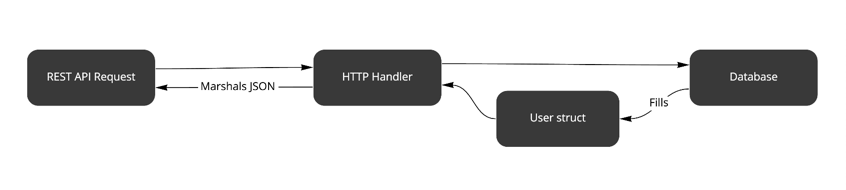
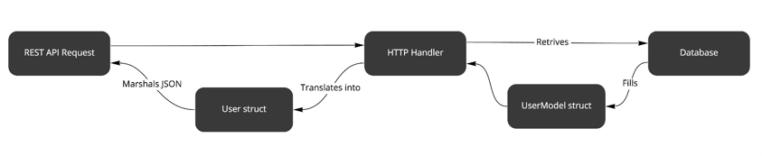

## When to stay away from DRY

Miłosz Smółka

In this chapter, we begin refactoring of Wild Workouts. Previous chapters will give you more context, but reading them
isn’t necessary to understand this one.

### Background story

Meet Susan, a software engineer, bored at her current job working with legacy enterprise software. Susan started looking
for a new gig and found Wild Workouts startup that uses serverless Go microservices. This seemed like something fresh
and modern, so after a smooth hiring process, she started her first day at the company.

There were just a few engineers in the team, so Susan’s onboarding was blazing fast. Right on the first day, she was
assigned her first task that was supposed to make her familiar with the application.

We need to store each user’s last IP address. It will enable new security features in the future, like extra
confirmation when logging in from a new location. For now, we just want to keep it in the database.

Susan looked through the application for some time. She tried to understand what’s happening in each service and where
to add a new field to store the IP address. Finally, she discovered a [User](https://bit.ly/2NUFZha) structure that she
could extend.

```shell
 // User defines model for User.
 type User struct {
        Balance     int     `json:"balance"`
        DisplayName string  `json:"displayName"`
        Role        string  `json:"role"`
+       LastIp      string  `json:"lastIp"`
 }
```

It didn’t take Susan long to post her first pull request. Shortly, Dave, a senior engineer, added a comment during code
review.

<center>I don’t think we’re supposed to expose this field via the REST API.</center>  

Susan was surprised, as she was sure she updated the database model. Confused, she asked Dave if this is the correct
place to add a new field.

Dave explained that Firestore, the application’s database, stores documents marshaled from Go structures. So the User
struct is compatible with both frontend responses and storage.

“Thanks to this approach, you don’t need to duplicate the code. It’s enough to change
the [YAML definition](https://bit.ly/2NKI4Mp) once and regenerate the file”, he said enthusiastically.

Grateful for the tip, Susan added one more change to hide the new field from the API response.

```shell
diff --git a/internal/users/http.go b/internal/users/http.go
index 9022e5d..cd8fbdc 100644
--- a/internal/users/http.go
+++ b/internal/users/http.go
@@ -27,5 +30,8 @@ func (h HttpServer) GetCurrentUser(w http.ResponseWriter, r *http.Request) {
        user.Role = authUser.Role
        user.DisplayName = authUser.DisplayName

+       // Don't expose the user's last IP externally
+       user.LastIp = nil
+
        render.Respond(w, r, user)
 }
```

One line was enough to fix this issue. That was quite a productive first day for Susan.

### Second thoughts

Even though Susan’s solution was approved and merged, something bothered her on her commute home. **Is it the right
approach to keep the same struct for both API response and database model?** Don’t we risk accidentally exposing user’s
private details if we keep extending it as the application grows? What if we’d like to change only the API response
without changing the database fields?



<center>Figure 5.1: Original solution</center>

What about splitting the two structures? That’s what Susan would do at her old job, but maybe these were enterprise
patterns that should not be used in a Go microservice. Also, the team seemed very rigorous about the
**Don’t Repeat Yourself** principle.

### Refactoring

The next day, Susan explained her doubts to Dave and asked for his opinion. At first, he didn’t understand the concern
and mentioned that maybe she needs to get used to the “Go way” of doing things.

Susan pointed to another piece of code in Wild Workouts that used a similar ad-hoc solution. She shared that, from her
experience, such code can quickly get out of control.

```
    user, err := h.db.GetUser(r.Context(), authUser.UUID)
    if err != nil {
        httperr.InternalError("cannot-get-user", err, w, r)
        return
    }
    user.Role = authUser.Role
    user.DisplayName = authUser.DisplayName

    render.Respond(w, r, user)
```

It seems the HTTP handler modifies the user in-place.

Eventually, they agreed to discuss this again over a new PR. Shortly, Susan prepared a refactoring proposal.

```shell
diff --git a/internal/users/firestore.go b/internal/users/firestore.go
index 7f3fca0..670bfaa 100644
--- a/internal/users/firestore.go
+++ b/internal/users/firestore.go
@@ -9,6 +9,13 @@ import (
        "google.golang.org/grpc/status"
 )

+type UserModel struct {
+       Balance     int
+       DisplayName string
+       Role        string
+       LastIP      string
+}
+
diff --git a/internal/users/http.go b/internal/users/http.go
index 9022e5d..372b5ca 100644
--- a/internal/users/http.go
+++ b/internal/users/http.go
@@ -1,6 +1,7 @@
-       user.Role = authUser.Role
-       user.DisplayName = authUser.DisplayName

-       render.Respond(w, r, user)
+       userResponse := User{
+               DisplayName: authUser.DisplayName,
+               Balance:     user.Balance,
+               Role:        authUser.Role,
+       }
+
+       render.Respond(w, r, userResponse)
 }

```

Source: [14d9e7badcf5a91811059d377cfa847ec7b4592f on GitHub]()

This time, Susan didn’t touch the OpenAPI definition. After all, she wasn’t supposed to introduce any changes to the
REST API. Instead, she manually created another structure, just like User, but exclusive to the database model. Then,
she extended it with a new field.

This time, Susan didn’t touch the OpenAPI definition. After all, she wasn’t supposed to introduce any changes to the
REST API. Instead, she manually created another structure, just like User, but exclusive to the database model. Then,
she extended it with a new field.

The new solution is a bit longer in code lines, but it removed code coupling between the REST API and the database
layer (all without introducing another microservice). The next time someone wants to add a field, they can do it by
updating the proper structure.


<center>Figure 5.2: Refactored solution</center>

### The Clash of Principles

Dave’s biggest concern was that the second solution breaks
the [DRY](https://en.wikipedia.org/wiki/Don%27t_repeat_yourself) principle and introduces boilerplate. On the other
hand, Susan was afraid that the original approach violates the Single Responsibility Principle (the “S”
in [SOLID](https://en.wikipedia.org/wiki/SOLID)). Who’s right?

It’s tough to come up with strict rules. Sometimes code duplication seems like a boilerplate, but it’s one of the best
tools to fight code coupling. It’s helpful to ask yourself if the code using the common structure is likely to change
together. If not, it’s safe to assume duplication is the right choice.

Usually, DRY is better applied to behaviors, not data. For example, extracting common code to a separate function
doesn’t have the downsides we discussed so far.

### What’s the big deal?

Is such a minor change even “architecture”?

Susan introduced a little change that had consequences she didn’t know about. It was obvious to other engineers, but not
for a newcomer. I guess you also know **the feeling of being afraid to introduce changes in an unknown system because
you can’t know what it could trigger**。

If you make many wrong decisions, even small, they tend to compound. Eventually, developers start to complain that it’s
hard to work with the application. The turning point is when someone mentions a “rewrite”, and suddenly, you know you
have a big problem.

The alternative to good design is always bad design. There is no such thing as no design.

Adam Judge ()

It’s worth discussing architecture decisions before you stumble on issues. “No architecture” will just leave you with
bad architecture.

### Can microservices save you?

With all benefits that microservices gave us, a dangerous idea also appeared, preached by some “how-to build
microservices” guides. **It says that microservices will simplify your application**. Because building large software
projects is hard, some promise that you won’t need to worry about it if you split your application into tiny chunks.

This idea sounds good on paper, but it misses the point of splitting software. How do you know where to put the
boundaries? Will you just separate a service based on each database entity? REST endpoints? Features? **How do you
ensure low coupling between services?**

### The Distributed Monolith

If you start with poorly separated services, you’re likely to end up with the same monolith you tried to avoid, with
added network overhead and complex tooling to manage this mess (also known as a distributed monolith). You will just
replace highly coupled modules with highly coupled services. And because now everyone runs a Kubernetes cluster, you may
even think you’re following the industry standards.

Even if you can rewrite a single service in one afternoon, can you as quickly change how services communicate with each
other? What if they are owned by multiple teams, based on wrong boundaries? Consider how much simpler it is to refactor
a single application.

Everything above doesn’t void other benefits of using microservices, like independent deployments (crucial for
Continuous Delivery) and easier horizontal scaling. Like with all patterns, make sure you use the right tool for the
job, at the right time.

> We introduced similar issues on purpose in Wild Workouts. We will look into this in future chapters and discuss other splitting techniques. You can find some of the ideas in Robert’s post: [Why using Microservices or Monolith can be just a detail?](https://threedots.tech/post/microservices-or-monolith-its-detail/)
>
>

### Does this all apply to Go?

Open-source Go projects are usually low-level applications and infrastructure tools. This was especially true in the
early days, but it’s still hard to find good examples of Go applications that handle **domain logic**.

By “domain logic”, I don’t mean financial applications or complex business software. **If you develop any kind of web
application, there’s a solid chance you have some complex domain cases you need to model somehow**.

Following some DDD examples can make you feel like you’re no longer writing Go. I’m well aware that forcing OOP patterns
straight from Java is not fun to work with. However, **there are some language-agnostic ideas that I think are worth
considering**.

### What’s the alternative?

We spent the last few years exploring this topic. We really like the simplicity of Go, but also had success with ideas
from Domain-Driven Design
and [Clean Architecture](https://blog.cleancoder.com/uncle-bob/2012/08/13/the-clean-architecture.html).

For some reason, developers didn’t stop talking about technical debt and legacy software with the arrival of microser-
vices. Instead of looking for the silver bullet, we prefer to use business-oriented patterns together with microservices
in a pragmatic way.

We’re not done with the refactoring of Wild Workouts yet. In [Clean Architecture (Chapter 9)](./chapter09.md), we will
see how to introduce Clean Architecture to the project.