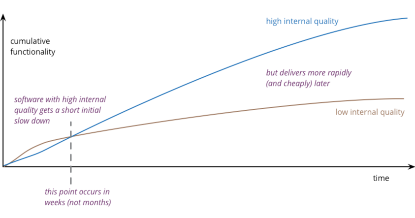

## Domain-Driven Design Lite / 领域驱动设计精简版

Robert Laszczak / 罗伯特·拉斯扎克

When I started working in Go, the community was not looking positively on techniques like DDD (Domain-Driven Design) and
Clean Architecture. I heard multiple times: “Don’t do Java in Golang!”, “I’ve seen that in Java, please don’t!”.

当我开始在 Go 中工作时，社区对 DDD（领域驱动设计）和清洁架构等技术并不积极。我多次听到：“不要在 Golang 中做 Java！”，“我在 Java 中看到过，请不要这样做！”。

These times, I already had almost 10 years of experience in PHP and Python. I’ve seen too many bad things already there.
I remember all these “Eight-thousanders” (methods with +8k lines of code ) and applications that nobody wanted to
maintain. I was checking old git history of these ugly monsters, and they all looked harmless in the beginning. But with
time, small, innocent problems started to become more significant and more serious. I’ve also seen how DDD and Clean
Architecture solved these issues.

这些时候，我已经有将近 10 年的 PHP 和 Python 经验。我已经在那里看到了太多不好的事情。我记得所有这些“八千”（具有 +8k 行代码的方法）和没人想维护的应用程序。 我正在检查这些丑陋怪物的旧 git
历史，它们一开始看起来都无害。但随着时间的推移，一些小的、无辜的问题开始变得越来越重要，越来越严重。我也看到了DDD和清洁架构是如何解决这些问题的。

Maybe Golang is different? Maybe writing microservices in Golang will fix this issue?

也许 Golang 不一样？也许用 Golang 编写微服务可以解决这个问题？

### It was supposed to be so beautiful / 它本应是如此美丽的

Now, after exchanging experience with multiple people and having the ability to see a lot of codebases, my point of view
is a bit cleaner than 3 years ago. Unfortunately, I’m now far from thinking that just using Golang and microservices
will save us from all of these issues that I’ve encountered earlier. I started to actually have flashbacks from the old,
bad times.

现在，在和多人交流经验并有能力看很多代码库之后，我的观点比 3 年前干净了一点。不幸的是，我现在还没有想到仅仅使用 Golang 和微服务就能让我们摆脱之前遇到的所有这些问题。实际上，我开始回想起过去糟糕的时光。

It’s less visible because of the relatively younger codebase. It’s less visible because of the Golang design. But I’m
sure that with time, we will have more and more legacy Golang applications that nobody wants to maintain.

由于相对年轻的代码库，它不太明显。由于 Golang 设计，它不太明显。但我敢肯定，随着时间的推移，我们将拥有越来越多没人愿意维护的遗留 Golang 应用程序。

Fortunately, 3 years ago, despite to chilly reception I didn’t give up. I decided to try to use DDD and related
techniques that worked for me previously in Go. With Milosz we were leading teams for 3 years that were all successfully
using DDD, Clean Architecture, and all related, not-popular-enough techniques in Golang. They gave us the ability to
develop our applications and products with constant velocity, regardless of the age of the code.

幸运的是，3年前，尽管受到了冷遇，但我并没有放弃。我决定尝试使用DDD和相关技术，这些技术以前在Go中对我很有效。与Milosz一起，我们领导的团队在3年内都成功地使用了DDD、Clean
Architecture以及所有相关的、在Golang中不够流行的技术。它们使我们能够以恒定的速度开发我们的应用程序和产品，而不管代码的年龄如何。

It was obvious from the beginning, that moving patterns 1:1 from other technologies will not work. What is essential, we
did not give up idiomatic Go code and microservices architecture - they fit together perfectly!
Today I would like to share with you first, most straightforward technique – DDD lite.

从一开始就很明显，从其他技术中以 1:1 的方式移动模式是行不通的。最重要的是，我们没有放弃惯用的 Go 代码和微服务架构——它们完美地结合在一起！今天先跟大家分享一下最直接的技术 —— DDD lite。

### State of DDD in Golang / Golang 中的 DDD 现状

Before sitting to write this chapter, I checked a couple of articles about DDD in Go in Google. I will be brutal here:
they are all missing the most critical points making DDD working. **If I imagine that I would read these articles
without any DDD knowledge, I would not be encouraged to use them in my team. This superficial approach may also be the
reason why DDD is still not socialized in the Go community**.

在坐下来写这一章之前，我在Google上查看了几篇关于Go中的DDD的文章。我在这里要粗暴地指出：他们都忽略了使DDD发挥作用的最关键点。**如果我想象我会在没有任何 DDD
知识的情况下阅读这些文章，我不会被鼓励在我的团队中使用它们。这种肤浅的做法也可能是 DDD 在 Go 社区中仍然没有社交化的原因。**

In this book, we try to show all essential techniques and do it in the most pragmatic way. Before describing any
patterns, we start with a question: what does it give us? It’s an excellent way to challenge our current thinking.

在本书中，我们试图展示所有基本技术，并以最实用的方式进行。在描述任何模式之前，我们先从一个问题开始：它给了我们什么？这是挑战我们当前思维的绝佳方式。

I’m sure that we can change the Go community reception of these techniques. We believe that they are the best way to
implement complex business projects. **I believe that we will help to establish the position of Go as a great language
for building not only infrastructure but also business software**.

我确信我们可以改变 Go 社区对这些技术的接受程度。我们相信，它们是实现复杂业务项目的最佳方式。

### You need to go slow, to go fast / 你需要走得慢一点，才能走得快一点

It may be tempting to implement the project you work on in the simplest way. It’s even more tempting when you feel
pressure from “the top”. Are we using microservices, though? If it is needed, will we just rewrite the service? I heard
that story multiple times, and it rarely ended with a happy end. **It’s true that you will save some time with taking
shortcuts. But only in the short term**.
以最简单的方式实施您从事的项目可能很诱人。当你感受到来自“上层”的压力时，它就更诱人了。但是，我们是否在使用微服务？如果需要，我们会重写服务吗？我多次听到这个故事，但它很少以一个快乐的结局结束。
**确实，走捷径可以节省一些时间。但仅在短期内。**

Let’s consider the example of tests of any kind. You can skip writing tests at the beginning of the project. You will
obviously save some time and management will be happy. **Calculation seems to be simple – the project was delivered
faster**.

让我们考虑任何类型的测试的例子。您可以在项目开始时跳过编写测试。您显然会节省一些时间，管理层也会很高兴。计算似乎很简单 —— 项目交付得更快。

But this shortcut is not worthwhile in the longer term. When the project grows, your team will start to be afraid of
making any changes. In the end, the sum of time that you will spend will be higher than implementing tests from the
beginning. **You will be slow down in the long term because of sacrificing quality for quick performance boost at the
beginning**. On the other hand - if a project is not critical and needs to be created fast, you can skip tests. It
should be a pragmatic decision, not just “we know better, and we do not create bugs”.

但从长远来看，这种捷径是不值得的。当项目增长时，你的团队会开始害怕做任何改变。最后，你所花费的时间总和将比从一开始就实施测试要多。从长远来看，你会因为在一开始就为快速提高性能而牺牲质量而放慢速度。另一方面，如果一个项目不是很关键，需要快速创建，你可以跳过测试。这应该是一个务实的决定，而不仅仅是 "
我们知道得更多，而且我们不会产生bug"。

The case is the same for DDD. When you want to use DDD, you will need a bit more time in the beginning, but long-term
saving is enormous. However, not every project is complex enough to use advanced techniques like DDD.

DDD 的情况也是如此。当你想使用 DDD 时，一开始你会需要更多的时间，但长期的节省是巨大的。然而，并不是每个项目都足够复杂，可以使用 DDD 等高级技术。

**There is no quality vs. speed tradeoff. If you want to go fast in the long term, you need to keep high quality**.

不存在质量与速度的权衡。如果你想长期快速发展，你需要保持高质量。

**That’s great, but do you have any evidence it works?**

这很好，但你有任何证据证明它有效吗？

If you asked me this question two years ago, I would say: “Well, I feel that it works better!”. But just trusting my
words may be not enough.

如果你两年前问我这个问题，我会说。"嗯，我觉得它的效果更好！"。但是仅仅相信我的话可能是不够的。

There are many tutorials showing some dumb ideas and claiming that they work without any evidence – let’s don’t trust
them blindly!

有许多教程展示了一些愚蠢的想法，并在没有任何证据的情况下声称它们是有效的--我们不要盲目地相信它们!



<center>Figure 6.1: ‘Is High Quality Software Worth the Cost?’ from martinfowler.com</center>
<center>Figure 6.1: “高质量的软件是否值得付出代价？”来自 martinfowler.com</center>

Just to remind: if someone has a couple thousand Twitter
followers, [that alone is not a reason to trust them](https://en.wikipedia.org/wiki/Authority_bias)!

我想提醒的是：如果某人有几千个Twitter粉丝，[仅此一点并不能成为信任他们的理由](https://en.wikipedia.org/wiki/Authority_bias)!

Fortunately, 2 years
ago [Accelerate: The Science of Lean Software and DevOps: Building and Scaling High Perform- ing Technology Organizations](https://www.amazon.com/Accelerate-Software-Performing-Technology-Organizations/dp/1942788339)
was released. In brief, this book is a description of what factors affect development teams’ performance. But the reason
this book became famous is that it’s not just a set of not validated ideas – **it’s based on scientific research.**

幸运的是，2年前 [Accelerate: The Science of Lean Software and DevOps: Building and Scaling High Perform- ing Technology Organizations](https://www.amazon.com/Accelerate-Software-Performing-Technology-Organizations/dp/1942788339)
发布了。简而言之，这本书描述了哪些因素会影响开发团队的绩效。但这本书之所以出名，是因为它不仅仅是一套未经验证的观点 -- **它是基于科学研究的结果。**

**I was mostly interested with the part showing what allows teams to be top-performing teams.** This book shows some
obvious facts, like introducing DevOps, CI/CD, and loosely coupled architecture, which are all an essential factor in
high-performing teams.

**我最感兴趣的是显示什么能让团队成为顶级表现的团队的部分。** 这本书展示了一些显而易见的事实，比如介绍了DevOps、CI/CD和松散耦合的架构，这些都是高绩效团队的一个重要因素。

> If things like DevOps and CI/CD are not obvious to you, you can start with these books: [The Phoenix Project](https://www.amazon.com/Phoenix-Project-DevOps-Helping-Business/dp/0988262592) and [The DevOps Handbook](https://www.amazon.com/DevOps-Handbook-World-Class-Reliability-Organizations/dp/1942788002)
>
> 如果 DevOps 和 CI/CD 之类的东西对您来说不是很明显，您可以从以下书籍开始：[The Phoenix Project](https://www.amazon.com/Phoenix-Project-DevOps-Helping-Business/dp/0988262592) 和 [The DevOps Handbook](https://www.amazon.com/DevOps-Handbook-World-Class-Reliability-Organizations/dp/1942788002)

What Accelerate tells us about top-performing teams?

Accelerate 告诉我们什么关于表现最好的团队？

We found that high performance is possible with all kinds of systems, provided that systems and the teams that build and
maintain them—are loosely coupled.

我们发现，只要系统以及构建和维护它们的团队是松散耦合的，各种系统都可以实现高性能。

This key architectural property enables teams to easily test and deploy individual components or services even as the
organization and the number of systems it operates grow—that is, it allows organizations to increase their productivity
as they scale.

这一关键的架构属性使团队能够轻松地测试和部署单个组件或服务，即使在组织及其运行的系统数量增长时也是如此——也就是说，它允许组织在扩展时提高其生产力。

So let’s use microservices, and we are done? I would not be writing this chapter if it was enough.

那么让我们使用微服务，我们完成了吗？如果足够的话，我不会写这一章。

- Make large-scale changes to the design of their system without depending on other teams to make changes in their
  systems or creating significant work for other teams
- Complete their work without communicating and coordinating with people outside their team
- Deploy and release their product or service on demand, regardless of other services it depends upon
- Do most of their testing on demand, without requiring an integrated test environment Perform deployments during normal
  business hours with negligible downtime

- 在不依赖其他团队对其系统进行更改或为其他团队创建大量工作的情况下对其系统设计进行大规模更改
- 在不与团队以外的人沟通和协调的情况下完成他们的工作
- 按需部署和发布他们的产品或服务，而不考虑它所依赖的其他服务
- 按需进行大部分测试，无需集成测试环境 在正常工作时间内执行部署，停机时间可忽略不计

Unfortunately, in real life, many so-called service-oriented architectures don’t permit testing and deploy- ing services
independently of each other, and thus will not enable teams to achieve higher performance.

不幸的是，在现实生活中，许多所谓的面向服务的架构并不允许测试和部署相互独立的服务，因此不会使团队获得更高的性能。

[...] employing the latest whizzy microservices architecture deployed on containers is no guarantee of higher
performance if you ignore these characteristics. [...] To achieve these characteristics, design systems are loosely
coupled — that is, can be changed and validated independently of each other.

[...] 如果忽略这些特征，采用部署在容器上的最新奇特的微服务架构并不能保证更高的性能。
[...] 为了实现这些特性，设计系统是松散耦合的——也就是说，可以相互独立地进行更改和验证。

Using just microservices architecture and splitting services to small pieces is not enough. If it’s done in a wrong way,
it adds extra complexity and slows teams down. DDD can help us here.

仅仅使用微服务架构和将服务分割成小块是不够的。如果方式不对，就会增加额外的复杂性，并拖慢团队的速度。在此，DDD可以帮助我们。

I’m mentioning DDD term multiple times. What DDD actually is?

我多次提到DDD一词。DDD究竟是什么？

## What is DDD (Domain-Driven Design) / 什么是 DDD (领域驱动设计)

Let’s start with Wikipedia definition: / 让我们从维基百科的定义开始：

- Domain-driven design (DDD) is the concept that the structure and language of your code (class names, class methods,
  class variables) should match the business domain. For example, if your software processes loan applications, it might
  have classes such as LoanApplication and Customer, and methods such as AcceptOffer and Withdraw.

  领域驱动设计 (DDD) 是指代码的结构和语言（类名、类方法、类变量）应与业务领域相匹配的概念。例如，如果您的软件处理贷款申请，它可能具有诸如 LoanApplication 和 Customer 之类的类，以及诸如
  AcceptOffer 和 Withdraw 之类的方法。
  

  <center>Figure 6.2: No, God please no!</center>

Well, it’s not the perfect one. It’s still missing some most important points.

嗯，这不是一个完美的方案。它仍然缺少一些最重要的点。

It’s also worth to mention, that DDD was introduced in 2003. That’s pretty long time ago. Some distillation may be
helpful to put DDD in the 2020 and Go context.

还值得一提的是，DDD是在2003年推出的。那是相当长的时间了。一些提炼可能有助于将DDD放在2020年和Go的背景中。

> If you are interested in some historical context on when DDD was created, you should check [Tackling Complexity in the Heart of Software](https://youtu.be/dnUFEg68ESM?t=1109) by the DDD creator - Eric Evans
>
> 如果你对DDD创建的历史背景感兴趣，你应该看看DDD创建者Eric Evans写的[《解决软件核心的复杂性》](https://youtu.be/dnUFEg68ESM?t=1109)。

My simple DDD definition is: Ensure that you solve valid problem in the optimal way. After that implement the solution
in a way that your business will understand without any extra translation from technical language needed.

我对DDD的简单定义是：确保你以最佳方式解决有效问题。之后，以你的企业能够理解的方式实施解决方案，而不需要任何额外的技术语言翻译。

How to achieve that? / 如何实现这一目标？

### Coding is a war, to win you need a strategy! / 编码是一场战争，要想取胜，你需要一个策略!

I like to say that “5 days of coding can save 15 minutes of planning”.

我喜欢说“5 天的编码可以节省 15 分钟的计划时间”。

Before starting to write any code, you should ensure that you are solving a valid problem. It may sound obvious, but in
practice from my experience, it’s not as easy as it sounds. This is often the case that the solution created by
engineers is not actually solving the problem that the business requested. A set of patterns that helps us in that field
is named Strategic DDD patterns.

在开始写任何代码之前，你应该确保你正在解决一个有效的问题。这听起来很明显，但从我的经验来看，实际上并不像听起来那么容易。通常的情况是，工程师所创造的解决方案实际上并没有解决业务所要求的问题。
在这个领域，有一套模式可以帮助我们，它被命名为DDD的战略模式。

From my experience, DDD Strategic Patterns are often skipped. The reason is simple: we are all developers, and we like
to write code rather than talk to the “business people”. Unfortunately, this approach when we are closed in a basement
without talking to any business people has a lot of downsides. Lack of trust from the business, lack of knowledge of how
the system works (from both business and engineering side), solving wrong problems – these are just some of the most
common issues.

根据我的经验，DDD 战略模式经常被跳过。原因很简单：我们都是开发人员，我们喜欢编写代码而不是与“业务人员”交谈。
不幸的是，当我们关在地下室而不与任何商务人士交谈时，这种方法有很多缺点。缺乏来自业务的信任，缺乏对系统工作原理的了解（从业务和工程方面）， 解决错误的问题——这些只是最常见的一些问题。

The good news is that in most cases it’s caused by a lack of proper techniques like Event Storming. They can give both
sides advantages. What is also surprising is that talking to the business may be one of the most enjoyable parts of the
work!

好消息是，在大多数情况下，它是由缺乏适当的技术如事件风暴造成的。它们可以给双方带来优势。同样令人惊讶的是，与企业交谈可能是工作中最令人愉快的部分之一

Apart from that, we will start with patterns that apply to the code. They can give us some advantages of DDD. They will
also be useful for you faster.

除此以外，我们将从适用于代码的模式开始。它们可以给我们带来DDD的一些优势。它们也会更快地对你有用。

Without Strategic patterns, I’d say that you will just have 30% of advantages that DDD can give you. We will go back to
Strategic patterns in the next chapters.

如果没有战略模式，我想说，你将只拥有DDD所能提供的30%的优势。在接下来的章节中，我们将再次讨论战略模式。

### DDD Lite in Go / Go 中的 DDD Lite

After a pretty long introduction, it’s finally time to touch some code! In this chapter, we will cover some basics of
**Tactical Domain-Driven Design patterns in Go**. Please keep in mind that this is just the beginning. There will be a
couple more chapters needed to cover the entire topic.

在经历了相当长的介绍之后，终于到了接触一些代码的时候了 在本章中，我们将介绍Go中战术领域驱动设计模式的一些基础知识。请记住，这只是一个开始。还需要有几章来涵盖整个主题。

One of the most crucial parts of Tactical DDD is trying to reflect the domain logic directly in the code.

战术DDD最关键的部分之一是试图在代码中直接反映领域逻辑。

But it’s still some non-specific definition – and it’s not needed at this point. I don’t also want to start by
describing what are Value Objects, Entities, Aggregates. Let’s better start with practical examples.

但这仍然是一些不具体的定义--而且在这一点上不需要。我也不想从描述什么是价值对象、实体、聚合开始。让我们最好从实际的例子开始。

### Refactoring of trainer service / 重构培训员服务

The first (micro)service that we will refactor is trainer. We will leave other services untouched now – we will go back
to them later.

我们将重构的第一个（微）服务是 trainer。我们现在将保持其他服务不变 - 我们以后会再去碰它们。

This service is responsible for keeping the trainer schedule and ensuring that we can have only one training scheduled
in one hour. It also keeps the information about available hours (trainer’s schedule).

该服务负责保持培训师的日程安排，并确保我们在一小时内只能安排一次培训。它还保留有关可用时间的信息（培训师的时间表）。

The initial implementation was not the best. Even if it is not a lot of logic, some parts of the code started to be
messy. I have also some feeling based on experience, that with time it will get worse.

最初的实现并不是最好的。即使不是很多的逻辑，代码的某些部分也开始杂乱无章。根据经验，我也有一些感觉，随着时间的推移，情况会越来越糟。

```go
package main

type GrpcServer struct {
	db db
}

func (g GrpcServer) UpdateHour(ctx context.Context, req *trainer.UpdateHourRequest) (*trainer.EmptyResponse, error) {
	trainingTime, err := grpcTimestampToTime(req.Time)
	if err != nil {
		return nil, status.Error(codes.InvalidArgument, "unable to parse time")
	}

	date, err := g.db.DateModel(ctx, trainingTime)
	if err != nil {
		return nil, status.Error(codes.Internal, fmt.Sprintf("unable to get data model: %s", err))
	}

	hour, found := date.FindHourInDate(trainingTime)
	if !found {
		return nil, status.Error(codes.NotFound, fmt.Sprintf("%s hour not found in schedule", trainingTime))
	}

	if req.HasTrainingScheduled && !hour.Available {
		return nil, status.Error(codes.FailedPrecondition, "hour is not available for training")
	}

	if req.Available && req.HasTrainingScheduled {
		return nil, status.Error(codes.FailedPrecondition, "cannot set hour as available when it have training scheduled")
	}
	if !req.Available && !req.HasTrainingScheduled {
		return nil, status.Error(codes.FailedPrecondition, "cannot set hour as unavailable when it have no training scheduled")
	}
	hour.Available = req.Available

	if hour.HasTrainingScheduled && hour.HasTrainingScheduled == req.HasTrainingScheduled {
		return nil, status.Error(codes.FailedPrecondition, fmt.Sprintf("hour HasTrainingScheduled is already %t", hour.HasTrainingScheduled))
	}

	hour.HasTrainingScheduled = req.HasTrainingScheduled
	if err := g.db.SaveModel(ctx, date); err != nil {
		return nil, status.Error(codes.Internal, fmt.Sprintf("failed to save date: %s", err))
	}

	return &trainer.EmptyResponse{}, nil
}
```

Source: [grpc.go on GitHub](https://bit.ly/3qR2nWY)

Even if it’s not the worst code ever, it reminds me what I’ve seen when I checked the git history of the code I worked
on. I can imagine that after some time some new features will arrive and it will be much worse. It’s also hard to mock
dependencies here, so there are also no unit tests.

即使这不是有史以来最糟糕的代码，它也让我想起了我在检查我工作的代码的git历史时看到的情况。我可以想象，一段时间后，一些新的功能会出现，情况会更糟糕。这里也很难模拟依赖关系，所以也没有单元测试。

### The First Rule - reflect your business logic literally / 第一条规则--从字面上反映你的业务逻辑

While implementing your domain, you should stop thinking about structs like dummy data structures or “ORM like” entities
with a list of setters and getters. You should instead think about them like **types with behavior**.

在实现你的领域时，你应该停止考虑像虚拟数据结构这样的结构或带有 setter 和 getter 列表的“类似 ORM”的实体。相反，您应该将它们视为具有行为的类型。

When you are talk with your business stakeholders, they say “I’m scheduling training on 13:00”, rather than “I’m setting
the attribute state to ‘training scheduled’ for hour 13:00.”.

当你和你的商业利益相关者交谈时，他们说 "我正在安排13:00的培训"，而不是 "我正在设置13:00的属性状态为'培训计划'"。

They also don’t say: “you can’t set attribute status to ‘training_scheduled’”. It is rather: “You can’t schedule
training if the hour is not available”. How to put it directly in the code?

他们也没有说。"你不能将属性状态设置为'training_scheduled'"。相反，它是这样说的。"如果这个小时没有时间，你就不能安排培训"。如何把它直接写在代码里？

```go
package hour

func (h *Hour) ScheduleTraining() error {
	if !h.IsAvailable() {
		return ErrHourNotAvailable
	}
	h.availability = TrainingScheduled
	return nil
}
```

Source: [availability.go on GitHub](https://bit.ly/3aBnS8A)

One question that can help us with implementation is: “Will business understand my code without any extra translation of
technical terms?”. You can see in that snippet, that **even not technical person will be able to understand when you can
schedule training**.

可以帮助我们实施的一个问题是：“企业是否会在不额外翻译技术术语的情况下理解我的代码？”。您可以在该片段中看到，即使不是技术人员也能够理解您何时可以安排培训。

This approach’s cost is not high and helps to tackle complexity to make rules much easier to understand. Even if the
change is not big, we got rid of this wall of ifs that would become much more complicated in the future.

这种方法的成本并不高，而且有助于解决复杂性，使规则更容易理解。即使变化不大，我们也摆脱了这堵在未来会变得更加复杂的 "如果 "墙。

We are also now able to easily add unit tests. What is good – we don’t need to mock anything here. The tests are also a
documentation that helps us understand how Hour behaves.

我们现在也能够轻松地添加单元测试。什么是好的 - 我们不需要在这里模拟任何东西。测试也是一个文档，帮助我们理解 Hour 的行为方式。

```go
package hour_test

func TestHour_ScheduleTraining(t *testing.T) {
	h, err := hour.NewAvailableHour(validTrainingHour())
	require.NoError(t, err)
	require.NoError(t, h.ScheduleTraining())
	assert.True(t, h.HasTrainingScheduled())
	assert.False(t, h.IsAvailable())
}

func TestHour_ScheduleTraining_with_not_available(t *testing.T) {
	h := newNotAvailableHour(t)
	assert.Equal(t, hour.ErrHourNotAvailable, h.ScheduleTraining())
}
```

Source: [availability_test.go on GitHub](https://bit.ly/3bofN6D)

Now, if anybody will ask the question “When I can schedule training”, you can quickly answer that. In a bigger systems,
the answer to this kind of question is even less obvious – multiple times I spent hours trying to find all places where
some objects were used in an unexpected way. The next rule will help us with that even more.

现在，如果有人问“我什么时候可以安排培训”这个问题，您可以快速回答。在一个更大的系统中，这类问题的答案就更不明显了——多次我花了几个小时试图找到所有的地方，其中一些对象被以意外的方式使用。下一条规则将更多地帮助我们解决这个问题。

### Testing Helpers / 测试助手

It’s useful to have some helpers in tests for creating our domain entities. For example: `newExampleTrainingWithTime`,
`newCanceledTraining` etc. It also makes our domain tests much more readable.

在创建我们的域实体的测试中有一些帮助程序很有用。例如：`newExampleTrainingWithTime`、`newCanceledTraining` 等。它还使我们的域测试更具可读性。

Custom asserts, like `assertTrainingsEquals` can also save a lot of
duplication. [github.com/google/go-cmp](https://github.com/google/go-cmp) library is extremely useful for comparing
complex structs. It allows us to compare our domain types with private field,
skip [some field validation](https://godoc.org/github.com/google/go-cmp/cmp/cmpopts#IgnoreFields) or
implement [custom validation functions](https://godoc.org/github.com/google/go-cmp/cmp/cmpopts#IgnoreFields).

自定义断言，如 `assertTrainingsEquals` 也可以节省大量重复。github.com/google/go-cmp库对于比较复杂的结构极为有用。它允许我们用私有字段比较我们的域类型，跳过一些字段验证或实现自定义验证函数。

```go
package test2

func assertTrainingsEquals(t *testing.T, tr1, tr2 *training.Training) {
	cmpOpts := []cmp.Option{
		cmpRoundTimeOpt,
		cmp.AllowUnexported(
			training.UserType{},
			time.Time{},
			training.Training{},
		),
	}
	assert.True(
		t,
		cmp.Equal(tr1, tr2, cmpOpts...),
		cmp.Diff(tr1, tr2, cmpOpts...),
	)
}

```

It’s also a good idea to provide a Must version of constructors used often, so for example `MustNewUser`. In contrast
with normal constructors, they will panic if parameters are not valid (for tests it’s not a problem).

为经常使用的构造函数提供 "必须 "版本也是一个好主意，例如 `MustNewUser`。与普通的构造函数相比，如果参数无效，它们就会 `panic`（对于测试来说，这并不是一个问题）。

```go
package t

func NewUser(userUUID string, userType UserType) (User, error) {
	if userUUID == "" {
		return User{}, errors.New("missing user UUID")
	}
	if userType.IsZero() {
		return User{}, errors.New("missing user type")
	}
	return User{userUUID: userUUID, userType: userType}, nil
}

func MustNewUser(userUUID string, userType UserType) User {
	u, err := NewUser(userUUID, userType)
	if err != nil {
		panic(err)
	}
	return u
}
```

The Second Rule: always keep a valid state in the memory

第二条规则：在内存中始终保持有效状态

- I recognize that my code will be used in ways I cannot anticipate, in ways it was not designed, and for longer than it
  was ever intended. / 我认识到，我的代码将以我无法预料的方式被使用，而且使用的时间比它的初衷更长。
    - The Rugged Manifesto / 坚固的宣言 (https://ruggedsoftware.org/)

The world would be better if everyone would take this quote into account. I’m also not without fault here. From my
observation, when you are sure that the object that you use is always valid, it helps to avoid a lot of ifs and bugs.
You will also feel much more confident knowing that you are not able to do anything stupid with the current code.

如果每个人都能考虑到这句话，世界就会变得更好。我在这里也不是没有错。根据我的观察，当你确信你所使用的对象总是有效的时候，它有助于避免很多的if和bug。你也会感到更有信心，因为你知道你不可能用当前的代码做任何愚蠢的事情。

I have many flashbacks that I was afraid to make some change because I was not sure of the side effects of it.
**Developing new features is much slower without confidence that you are correctly using the code!**

我有很多倒叙，我不敢做出一些改变，因为我不确定它的副作用。**如果对自己是否正确使用代码没有信心，开发新的功能就会慢得多!**

Our goal is to do validation in only one place (good DRY) and ensure that nobody can change the internal state of the
Hour. The only public API of the object should be methods describing behaviors. No dumb getters and setters!. We need to
also put our types to separate package and make all attributes private.

我们的目标是只在一个地方做验证（良好的DRY），并确保没有人可以改变Hour的内部状态。该对象的唯一公共API应该是描述行为的方法。没有愚蠢的 `getters` 和 `setters`
！我们还需要把我们的类型放到独立的包中，并使所有的属性成为私有。

```go

package hour

type Hour struct {
	hour         time.Time
	availability Availability
}

// ...
func NewAvailableHour(hour time.Time) (*Hour, error) {
	if err := validateTime(hour); err != nil {
		return nil, err
	}
	return &Hour{
		hour:         hour,
		availability: Available,
	}, nil
}
```

Source: [hour.go on GitHub](https://bit.ly/3se9o4I)

We should also ensure that we are not breaking any rules inside of our type.

我们还应该确保我们的类型里面没有违反任何规则。

Bad example/不好的例子:

```
h := hour.NewAvailableHour("13:00")
if h.HasTrainingScheduled() {
  h.SetState(hour.Available)
} else {
  return errors.New("unable to cancel training")
}
```

Good example / 好的例子:

```
func (h *Hour) CancelTraining() error {
  if !h.HasTrainingScheduled() {
    return ErrNoTrainingScheduled
  }
  h.availability = Available
    return nil
}
  
  // ...
  h := hour.NewAvailableHour("13:00")
  if err := h.CancelTraining(); err != nil {
    return err
  }
```

### The Third Rule - domain needs to be database agnostic / 第三条规则--领域需要与数据库无关

There are multiple schools here – some are telling that it’s fine to have domain impacted by the database client. From
our experience, keeping the domain strictly without any database influence works best.

这里有多种流派--有些人告诉我们，数据库客户端对域的影响是可以的。根据我们的经验，严格保持领域不受任何数据库的影响效果最好。

The most important reasons are:

- domain types are not shaped by used database solution – they should be only shaped by business rules
- we can store data in the database in a more optimal way
- because of the Go design and lack of “magic” like annotations, ORM’s or any database solutions are affecting in even
  more significant way

最重要的原因是：

- 领域类型不受使用的数据库解决方案的影响 —— 它们应该只受业务规则的影响
- 我们可以用一种更理想的方式在数据库中存储数据
- 由于Go的设计和缺乏像注解这样的 "魔法"，ORM或任何数据库解决方案都会受到更严重的影响。

### Domain-First approach / 领域优先方法

> If the project is complex enough, we can spend even 2-4 weeks to work on the domain layer, with just in-memory database implementation. In that case, we can explore the idea deeper and defer the decision to choose the database later. All our implementation is just based on unit tests.
> We tried that approach a couple of times, and it always worked nicely. It is also a good idea to have some timebox here, to not spend too much time.
> Please keep in mind that this approach requires a good relationship and a lot of trust from the business! **If your relationship with business is far from being good, Strategic DDD patterns will improve that. Been there, done that!**
>
> 如果项目足够复杂，我们甚至可以花2-4周的时间在领域层工作，只用内存数据库实现。在这种情况下，我们可以更深入地探索这个想法，并推迟决定是否选择数据库。我们所有的实现都只是基于单元测试。我们试过几次这种方法，总是很顺利。在这里有一些时间框架也是一个好主意，不要花费太多的时间。请记住，这种方法需要一个良好的关系和来自业务的大量信任!
> 如果你与业务的关系远远不够好，战略DDD模式将改善这一状况。我也有过这样的经历。

To not make this chapter long, let’s just introduce the Repository interface and assume that it works.

为了不使本章冗长，我们只介绍一下Repository接口，并假设它能工作。

I will cover this topic more in-depth in the next chapter.

我将在下一章更深入地讨论这个主题。

```go

package hour

type Repository interface {
	GetOrCreateHour(ctx context.Context, time time.Time) (*Hour, error)
	UpdateHour(
		ctx context.Context,
		hourTime time.Time,
		updateFn func(h *Hour) (*Hour, error),
	) error
}

```

Source: [repository.go on GitHub](https://bit.ly/2NP1NuA)

> You may ask why UpdateHour has `updateFn func(h *Hour) (*Hour, error)` – we will use that for han- dling transactions nicely. You can learn more in The Repository Pattern (Chapter 7).
> 你可能会问为什么 UpdateHour 有 `updateFn func(h *Hour) (*Hour, error)` ——我们将使用它来很好地处理事务。您可以在存储库模式（第 7 章）中了解更多信息。

### Using domain objects / 使用领域对象

I did a small refactor of our gRPC endpoints, to provide an API that is more “behavior-oriented” rather
than [CRUD](https://en.wikipedia.org/wiki/Create,_read,_update_and_delete). It reflects better the new characteristic of
the domain. From my experience, it’s also much easier to maintain multiple, small methods than one, “god” method
allowing us to update everything.

我对我们的gRPC端点做了一个小的重构，以提供一个更 "面向行为 "的API，而不是 [CRUD](https://en.wikipedia.org/wiki/Create,_read,_update_and_delete)
。它更好地反映了这个领域的新特点。根据我的经验，维护多个小方法比维护一个允许我们更新一切的 "神 "方法要容易得多。

```shell
--- a/api/protobuf/trainer.proto
+++ b/api/protobuf/trainer.proto
@@ -6,7 +6,9 @@ import "google/protobuf/timestamp.proto";
 
 service TrainerService {
   rpc IsHourAvailable(IsHourAvailableRequest) returns (IsHourAvailableResponse) {}
-  rpc UpdateHour(UpdateHourRequest) returns (EmptyResponse) {}
+  rpc ScheduleTraining(UpdateHourRequest) returns (EmptyResponse) {}
+  rpc CancelTraining(UpdateHourRequest) returns (EmptyResponse) {}
+  rpc MakeHourAvailable(UpdateHourRequest) returns (EmptyResponse) {}
 }
 
 message IsHourAvailableRequest {
@@ -19,9 +21,6 @@ message IsHourAvailableResponse {
 
 message UpdateHourRequest {
   google.protobuf.Timestamp time = 1;
-
-  bool has_training_scheduled = 2;
-  bool available = 3;
 }
 
 message EmptyResponse {}

```

Source: [0249977c58a310d343ca2237c201b9ba016b148e on GitHub](https://bit.ly/3pFL4H0)

The implementation is now much simpler and easier to understand. We also have no logic here - just some orchestration.
Our gRPC handler now has 18 lines and no domain logic!

现在的实现要简单得多，也更容易理解。我们在这里也没有逻辑--只是一些协调工作。我们的gRPC处理程序现在有18行，没有领域逻辑

```go
package main

func (g GrpcServer) MakeHourAvailable(ctx context.Context, request *trainer.UpdateHourRequest) (*trainer.EmptyResponse, error) {
	trainingTime, err := protoTimestampToTime(request.Time)
	if err != nil {
		return nil, status.Error(codes.InvalidArgument, "unable to parse time")
	}

	if err := g.hourRepository.UpdateHour(ctx, trainingTime, func(h *hour.Hour) (*hour.Hour, error) {
		if err := h.MakeAvailable(); err != nil {
			return nil, err
		}

		return h, nil
	}); err != nil {
		return nil, status.Error(codes.Internal, err.Error())
	}

	return &trainer.EmptyResponse{}, nil
}
```

Source: [grpc.go on GitHub](https://bit.ly/3pD36Kd)

#### No more Eight-thousanders / 不再有八千米以上山峰

> As I remember from the old-times, many Eight-thousanders were actually controllers with a lot of domain logic in HTTP controllers.
>
> 在我的记忆中，许多八千米以上山峰实际上是控制器，在HTTP控制器中有许多域的逻辑。
>
> With hiding complexity inside of our domain types and keeping rules that I described, we can prevent uncontrolled growth in this place.
>
>通过将复杂性隐藏在我们的领域类型里面，并保持我所描述的规则，我们可以防止在这个地方的不可控增长。

### That’s all for today / 这就是本章的全部内容

I don’t want to make this chapter too long – let’s go step by step!

我不想把这一章写得太长--让我们一步一步来！"。

If you can’t wait, the entire working diff for the refactor is available on [GitHub](https://bit.ly/3umRYES). In the
next chapter, I’ll cover one part from the diff that is not explained here: repositories.

如果你等不及了，整个重构的工作差异可以在 [GitHub](https://bit.ly/3umRYES) 上找到。在下一章中，我将介绍这里没有解释的部分：存储库。

Even if it’s still the beginning, some simplifications in our code are visible.

即使这仍然是个开始，我们的代码中的一些简化是可见的。

The current implementation of the model is also not perfect – that’s good! You will never implement the perfect model
from the beginning. **It’s better to be prepared to change this model easily, instead of wasting time to make it
perfect**. After I added tests of the model and separated it from the rest of the application, I can change it without
any fear.

目前的模型实施也不完美--这很好! 你永远不会从一开始就实施完美的模型。最好是准备好轻松地改变这个模型，而不是浪费时间来使它完美。在我添加了模型的测试，并将其与应用程序的其他部分分开后，我可以毫无顾忌地改变它。

### Can I already put that I know DDD to my CV? / 我可以在我的简历中写上我知道DDD吗？

Not yet./ 暂时不行。

I needed 3 years after I heard about DDD to the time when I connected all the dots (It was before I heard about Go).
After that, I’ve seen why all techniques that we will describe in the next chapters are so important. But before
connecting the dots, it will require some patience and trust that it will work. It is worth that! You will not need 3
years like me, but we currently planned about 10 chapters on both strategic and tactical patterns. It’s a lot of new
features and parts to refactor in Wild Workouts left!

在听到DDD之后，我需要3年时间才能将所有的点联系起来（那是在我听到Go之前）。在那之后，我明白了为什么我们将在接下来的章节中描述的所有技术是如此重要。但在连接这些点之前，需要一些耐心和信任，相信会有效果。这是很值得的!
你不会像我一样需要3年时间，但我们目前计划了大约10个章节，涉及战略和战术模式。 Wild Workouts 中还有很多新功能和部件需要重构！

I know that nowadays a lot of people promise that you can become expert in some area after 10 minutes of an article or a
video. The world would be beautiful if it would be possible, but in reality, it is not so simple.

我知道，现在很多人都承诺，只要看了一篇文章或一段视频10分钟，你就能成为某个领域的专家。如果能做到这一点，世界将是美好的，但在现实中，这并不是那么简单。

Fortunately, a big part of the knowledge that we share is universal and can be applied to multiple technologies, not
only Go. You can treat these learnings as an investment in your career and mental health in the long term. There is
nothing better than solving the right problems without fighting with unmaintainable code!

幸运的是，我们所分享的知识有很大一部分是通用的，可以应用于多种技术，而不仅仅是 Go。从长远来看，你可以把这些知识当作是对你的职业和心理健康的投资。没有什么比解决正确的问题，而不与不可维护的代码作斗争更好的了！这就是我们的目标。