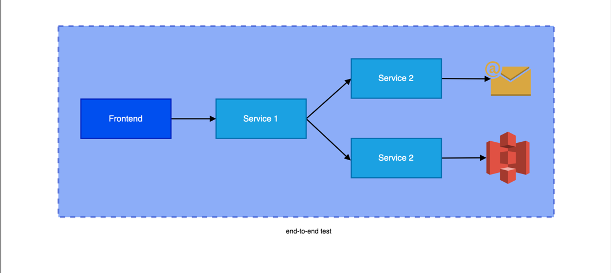

## High-Quality Database Integration Tests / 高质量的数据库集成测试

Robert Laszczak / 罗伯特·拉斯扎克

Did you ever hear about a project where changes were tested on customers that you don’t like or countries that are not
profitable? Or even worse – did you work on such project?

你是否曾经听说过一个项目，在你不喜欢的客户或不赚钱的国家测试变化？或者更糟糕的是--你在这样的项目中工作过吗？

It’s not enough to say that it’s just not fair and not professional. It’s also hard to develop anything new because you
are afraid to make any change in your codebase.

仅仅说这是不公平和不专业是不够的。因为你害怕在你的代码库中做任何改变，所以也很难开发新的东西。

In [2019 HackerRank Developer Skills Report](https://research.hackerrank.com/developer-skills/2019#jobsearch3)
Professional growth & learning was marked as the most critical factor during looking for a new job. Do you think you can
learn anything and grow when you test your application in that way?

在 [2019年HackerRank开发者技能报告](https://research.hackerrank.com/developer-skills/2019#jobsearch3)
中，专业成长与学习被标记为寻找新工作期间最关键的因素。你认为当你以这种方式测试你的应用程序时，你可以学到任何东西和成长吗？

It’s all leading to frustration and burnout.

这一切都导致挫折和倦怠。

To develop your application easily and with confidence, you need to have a set of tests on multiple levels. __In this
chapter, I will cover in practical examples how to implement high-quality database integration tests. I will also cover
basic Go testing techniques, like test tables, assert functions, parallel execution, and black-box testing.__

为了轻松和自信地开发你的应用程序，你需要有一套多层次的测试。
__在本章中，我将通过实际示例介绍如何实现高质量的数据库集成测试。我还将介绍基本的 Go 测试技术，例如测试表、断言函数、并行执行和黑盒测试。__

What it actually means that test quality is high?

测试质量高实际上意味着什么？

### 4 principles of high-quality tests / 4 个高质量测试的原则

I prepared 4 rules that we need to pass to say that our integration tests quality is high.

我准备了 4 条我们需要通过的规则来说明我们的集成测试质量很高。

#### 1. Fast 快速的

Good tests need to be fast. There is no compromise here. / 好的测试需要快速。这里没有妥协。

Everybody hates long-running tests. Let’s think about your teammates’ time and mental health when they are waiting for
test results. Both in CI and locally. It’s terrifying.

每个人都讨厌长时间运行的测试。让我们想想你的队友在等待测试结果时的时间和心理健康。在 CI 和本地。太可怕了。

When you wait for a long time, you will likely start to do anything else in the meantime. After the CI passes (
hopefully), you will need to switch back to this task. Context switching is one of the biggest productivity killers.
It’s very exhausting for our brains. We are not robots.

当你等待很长一段时间时，你很可能会在此期间开始做其他任何事情。在CI通过后(希望如此)，您将需要切换回此任务。情境切换是最大的生产力杀手之一。这对我们的大脑来说是非常累人的。我们不是机器人。

I know that there are still some companies where tests can be executing for 24 hours. We don’t want to follow this
approach. You should be able to run your tests locally in less than 1 minute, ideally in less than 10s. I know that
sometimes it may require some time investment. It’s an investment with an excellent ROI (Return Of Investment)! In that
case, you can really quickly check your changes. Also, deployment times, etc. are much shorter.

我知道，仍然有一些公司的测试可以24小时执行。我们不想遵循这种方法。您应该能够在不到1分钟的时间内在本地运行测试，理想情况下不超过10秒。我知道，有时这可能需要一些时间投资。这是一项具有极高投资回报率的投资！在这种情况下，您可以真正快速地检查您的更改。此外，部署时间等也要短得多。

It’s always worth trying to find quick wins that can reduce tests execution the most from my
experience. [Pareto principle (80/20 rule)](https://en.wikipedia.org/wiki/Pareto_principle) works here perfectly!

从我的经验来看，尝试找到能够最大限度地减少测试执行的快速胜利总是值得的。[帕累托法则(80/20法则)](https://en.wikipedia.org/wiki/Pareto_principle)在这里非常有效！

#### 2. Testing enough scenarios on all levels / 在所有级别上测试足够的场景

I hope that you already know that 100% test coverage is not the best idea (as long as it is not a simple/critical
library).

我希望您已经知道100%的测试覆盖率不是最好的想法(只要它不是一个简单/关键的库)。

It’s always a good idea to ask yourself the question “how easily can it break?”. It’s even more worth to ask this
question if you feel that the test that you are implementing starts to look exactly as a function that you test. At the
end we are not writing tests because tests are nice, but they should save our ass!

问自己“它有多容易坏？”这个问题总是一个好主意。如果您觉得您正在实施的测试开始看起来与您测试的功能完全一样，那么问这个问题就更值得了。最后，我们不是在编写测试，因为测试很好，但它们应该会拯救我们!

From my experience, __coverage like 70-80% is a pretty good result in Go__.

根据我的经验，__70-80% 的覆盖率在 Go 中是一个相当不错的结果。__

It’s also not the best idea to cover everything with component or end-to-end tests. First – you will not be able to do
that because of the inability to simulate some error scenarios, like rollbacks on the repository. Second – it will break
the first rule. These tests will be slow.

用组件或端到端测试涵盖所有内容也不是最好的主意。首先，您将无法这样做，因为您无法模拟某些错误场景，如对存储库的回滚。第二，它会违反第一条规则。这些测试将是缓慢的。




Tests on several layers should also overlap, so we will know that integration is done correctly.

几个层上的测试也应该重叠，这样我们就可以知道集成是正确完成的。

You may think that solution for that is simple: the test pyramid! And that’s true… sometimes. Especially in applications
that handle a lot of operations based on writes.

你可能认为这个问题的解决方案很简单：测试金字塔！这是真的，…有时候。尤其是在处理大量基于写入的操作的应用程序中。


<center>Figure 8.1: Testing Pyramid</center>

<center>Figure 8.1: 测试金字塔</center>

But what, for example, about applications that aggregate data from multiple other services and expose the data via API?
It has no complex logic of saving the data. Probably most of the code is related to the database operations. In this
case, we should use __reversed test pyramid__ (it actually looks more like a christmas tree). When big part of our
application is connected to some infrastructure (for example: database) it’s just hard to cover a lot of functionality
with unit tests.

但是，例如，对于从多个其他服务聚合数据并通过API公开数据的应用程序，情况又如何呢？它没有保存数据的复杂逻辑。可能大部分代码都与数据库操作相关。在这种情况下，我们应该使用 __反向测试金字塔__ (它实际上看起来更像一棵圣诞树)
。当我们的应用程序的很大一部分连接到一些基础设施(例如：数据库)时，很难用单元测试覆盖很多功能。

#### 3. Tests need to be robust and deterministic / 测试需要健壮和确定性

Do you know that feeling when you are doing some urgent fix, tests are passing locally, you push changes to the
repository and ... after 20 minutes they fail in the CI? It’s incredibly frustrating. It also discourages us from adding
new tests. It’s also decreasing our trust in them.

你知道当你做一些紧急修复，测试在本地通过，你将更改推送到存储库并且...在 20 分钟后它们在 CI 中失败时的感觉吗？这令人难以置信的沮丧。它也阻止我们添加新的测试。这也降低了我们对他们的信任。

You should fix that issue as fast as you can. In that
case, [Broken windows theory](https://en.wikipedia.org/wiki/Broken_windows_theory) is really valid.
您应该尽快解决该问题。在那种情况下，[破窗效应](https://en.wikipedia.org/wiki/Broken_windows_theory) 确实有效。


<center>Figure 8.2: Christmas Tree</center>

<center>Figure 8.2: 圣诞树</center>

#### 4. You should be able to execute most of the tests locally / 您应该能够在本地执行大部分测试

Tests that you run locally should give you enough confidence that the feature that you developed or refactored is still
working. __E2E tests should just double-check if everything is integrated correctly__.

您在本地运行的测试应该会给您足够的信心，使您相信您开发或重构的功能仍在工作。
__E2e测试应该只是重复检查是否一切都正确的集成。__

You will have also much more confidence when contracts between services are robust because of
using [gRPC](./chapter03.md), protobuf, or OpenAPI.

当服务之间的合约由于使用  [gRPC](./chapter03.md)、protobuf 或 OpenAPI 而变得健壮时，您也会更有信心。

This is a good reason to cover as much as we can at lower levels (starting with the lowest): unit, integration, and
component tests. Only then E2E.

这是在较低级别（从最低级别开始）尽可能多地涵盖的一个很好的理由：单元、集成和组件测试。只有E2E。

### Implementation / 实现

We have some common theoretical ground. But nobody pays us for being the master of theory of programming. Let’s go to
some practical examples that you can implement in your project.

我们有一些共同的理论基础。但没有人会因为我们是编程理论的大师而付钱给我们。让我们来看看您可以在项目中实现的一些实际示例。

Let’s start with the repository pattern that I described in the previous chapter.

让我们从我在上一章中描述的存储库模式开始。

The way how we can interact with our database is defined by the hour.Repository interface. It assumes that our
repository implementation is stupid. All complex logic is handled by domain part of our application. __It should just
save the data without any validations, etc. One of the significant advantages of that approach is the simplification of
the repository and tests implementation__.

我们如何与数据库交互的方式由 hour.Repository 接口定义。它假设我们的存储库实现是愚蠢的。所有复杂的逻辑都由我们应用程序的领域部分处理。
__它应该只保存数据而不进行任何验证，等等。这种方法的一个重要优势是简化了存储库和测试实现。__

In the previous chapter I prepared three different database implementations: MySQL, Firebase, and in-memory. We will
test all of them. All of them are fully compatible, so we can have just one test suite.

在上一章中，我准备了三种不同的数据库实现：MySQL、Firebase 和 memory。我们将测试所有这些。它们都是完全兼容的，所以我们可以只有一个测试套件。

```go
package hour

type Repository interface {
	GetOrCreateHour(ctx context.Context, hourTime time.Time) (*Hour, error)
	UpdateHour(
		ctx context.Context,
		hourTime time.Time,
		updateFn func(h *Hour) (*Hour, error),
	) error
}
```

Source: [repository.go on GitHub](https://bit.ly/3aBdRbt)

Because of multiple repository implementations, in our tests we iterate through a list of them.

由于有多个存储库实现，在我们的测试中，我们迭代了它们的列表。

> It’s actually a pretty similar pattern to how we implemented [tests in Watermill](https://github.com/ThreeDotsLabs/watermill/blob/master/pubsub/tests/test_pubsub.go). All Pub/Sub implementations are passing the same test suite.
>
> 这实际上与我们在 [Water Mill中实现测试](https://github.com/ThreeDotsLabs/watermill/blob/master/pubsub/tests/test_pubsub.go) 的模式非常相似。所有的发布/订阅实现都通过了相同的测试套件。

All tests that we will write will be black-box tests. In other words – we will only cover public functions with tests.
To ensure that, all our test packages have the _test suffix. That forces us to use only the public interface of the
package.
__It will pay back in the future with much more stable tests, that are not affected by any internal changes.__
If you cannot write good black-box tests, you should consider if your public APIs are well designed.

我们将编写的所有测试都是黑盒测试。换句话说——我们只会用测试覆盖公共函数。为了确保这一点，我们所有的测试包都有 _test 后缀。这迫使我们只使用包的公共接口。
__它将在未来以更稳定的测试回报，这些测试不受任何内部变化的影响。__
如果你不能编写好的黑盒测试，你应该考虑你的公共 API 是否设计得很好。

All our repository tests are executed in parallel. Thanks to that, they take less than 200ms. After adding multiple test
cases, this time should not increase significantly.

我们所有的存储库测试都是并行执行的。多亏了这一点，它们只需不到200毫秒。在添加多个测试用例之后，该时间应该不会显著增加。

```go
package main_test

// ...
func TestRepository(t *testing.T) {
	rand.Seed(time.Now().UTC().UnixNano())

	repositories := createRepositories(t)

	for i := range repositories {
		// When you are looping over slice and later using iterated value in goroutine (here because of t.Parallel()),
		// you need to always create variable scoped in loop body!
		// More info here: https://github.com/golang/go/wiki/CommonMistakes#using-goroutines-on-loop-iterator-variables
		r := repositories[i]

		t.Run(r.Name, func(t *testing.T) {
			// It's always a good idea to build all non-unit tests to be able to work in parallel.
			// Thanks to that, your tests will be always fast and you will not be afraid to add more tests because of slowdown.
			t.Parallel()

			t.Run("testUpdateHour", func(t *testing.T) {
				t.Parallel()
				testUpdateHour(t, r.Repository)
			})
			t.Run("testUpdateHour_parallel", func(t *testing.T) {
				t.Parallel()
				testUpdateHour_parallel(t, r.Repository)
			})
			t.Run("testHourRepository_update_existing", func(t *testing.T) {
				t.Parallel()
				testHourRepository_update_existing(t, r.Repository)
			})
			t.Run("testUpdateHour_rollback", func(t *testing.T) {
				t.Parallel()
				testUpdateHour_rollback(t, r.Repository)
			})
		})
	}
}
```

Source: [hour_repository_test.go on GitHub](https://bit.ly/3sj7H69)

When we have multiple tests, where we pass the same input and check the same output, it is a good idea to use a
technique known as test table. The idea is simple: you should define a slice of inputs and expected outputs of the test
and iterate over it to execute tests.

当我们有多个测试时，我们通过相同的输入并检查相同的输出，使用一种称为测试表的技术是一个好主意。想法很简单：您应该定义测试的输入和预期输出的切片，并迭代它以执行测试。

```go
package main_test

func testUpdateHour(t *testing.T, repository hour.Repository) {
	t.Helper()
	ctx := context.Background()

	testCases := []struct {
		Name       string
		CreateHour func(*testing.T) *hour.Hour
	}{
		{
			Name: "available_hour",
			CreateHour: func(t *testing.T) *hour.Hour {
				return newValidAvailableHour(t)
			},
		},
		{
			Name: "not_available_hour",
			CreateHour: func(t *testing.T) *hour.Hour {
				h := newValidAvailableHour(t)
				require.NoError(t, h.MakeNotAvailable())

				return h
			},
		},
		{
			Name: "hour_with_training",
			CreateHour: func(t *testing.T) *hour.Hour {
				h := newValidAvailableHour(t)
				require.NoError(t, h.ScheduleTraining())

				return h
			},
		},
	}

	for _, tc := range testCases {
		t.Run(tc.Name, func(t *testing.T) {
			newHour := tc.CreateHour(t)

			err := repository.UpdateHour(ctx, newHour.Time(), func(_ *hour.Hour) (*hour.Hour, error) {
				// UpdateHour provides us existing/new *hour.Hour,
				// but we are ignoring this hour and persisting result of `CreateHour`
				// we can assert this hour later in assertHourInRepository
				return newHour, nil
			})
			require.NoError(t, err)

			assertHourInRepository(ctx, t, repository, newHour)
		})
	}
}
```

Source: [hour_repository_test.go on GitHub](https://bit.ly/3siawUZ)

You can see that we used a very popular [github.com/stretchr/testify](https://github.com/stretchr/testify) library. It’s
significantly reducing boilerplate in tests by providing multiple helpers
for [asserts](https://godoc.org/github.com/stretchr/testify/assert).

您可以看到，我们使用了一个非常受欢迎的  [github.com/stretchr/testify](https://github.com/stretchr/testify)
库。它通过为 [断言](https://godoc.org/github.com/stretchr/testify/assert) 提供多个帮助器，显著减少了测试中的样板。

#### require.NoError()

> When assert.NoError assert fails, tests execution is not interrupted.
>
> 当 assert.NoError 断言失败时，测试执行不会中断。
>
> It’s worth to mention that asserts from require package are stopping execution of the test when it fails. Because of that, it’s often a good idea to use require for checking errors. In many cases, if some operation fails, it doesn’t make sense to check anything later.
>
> 值得一提的是，require 包中的断言会在测试失败时停止执行。因此，使用 require 来检查错误通常是一个好主意。在许多情况下，如果某些操作失败，那么以后检查任何内容都没有意义。
>
> When we assert multiple values, assert is a better choice, because you will receive more context.
>
> 当我们断言多个值时，Assert是更好的选择，因为您将获得更多上下文。

If we have more specific data to assert, it’s always a good idea to add some helpers. It removes a lot of duplication,
and improves tests readability a lot!

如果我们有更具体的数据要断言，添加一些助手总是一个好主意。它消除了很多重复，并大大提高了测试的可读性！

```go
package main_test

func assertHourInRepository(ctx context.Context, t *testing.T, repo hour.Repository, hour *hour.Hour) {
	require.NotNil(t, hour)
	hourFromRepo, err := repo.GetOrCreateHour(ctx, hour.Time())
	require.NoError(t, err)
	assert.Equal(t, hour, hourFromRepo)
}
```

Source: [hour_repository_test.go on GitHub](https://bit.ly/37uw4Wk)

### Testing transactions / 测试事物

Mistakes taught me that I should not trust myself when implementing complex code. We can sometimes not understand the
documentation or just introduce some stupid mistake. You can gain the confidence in two ways:

1. TDD - let’s start with a test that will check if the transaction is working properly.
2. Let’s start with the implementation and add tests later.

错误告诉我，在实现复杂代码时我不应该相信自己。我们有时无法理解文档，或者只是引入了一些愚蠢的错误。您可以通过两种方式获得信心：

1. TDD - 让我们从检查事务是否正常工作的测试开始。
2. 让我们从实现开始，然后添加测试。

```go
package main_test

func testUpdateHour_rollback(t *testing.T, repository hour.Repository) {
	t.Helper()
	ctx := context.Background()
	hourTime := newValidHourTime()
	err := repository.UpdateHour(ctx, hourTime, func(h *hour.Hour) (*hour.Hour, error) {
		require.NoError(t, h.MakeAvailable())
		return h, nil
	})
	err = repository.UpdateHour(ctx, hourTime, func(h *hour.Hour) (*hour.Hour, error) {
		assert.True(t, h.IsAvailable())
		require.NoError(t, h.MakeNotAvailable())
		return h, errors.New("something went wrong")
	})
	require.Error(t, err)
	persistedHour, err := repository.GetOrCreateHour(ctx, hourTime)
	require.NoError(t, err)
	assert.True(t, persistedHour.IsAvailable(), "availability change was persisted, not rolled back")
}

```

Source: [hour_repository_test.go on GitHub](https://bit.ly/2ZBXKUM)

When I’m not using TDD, I try to be paranoid if test implementation is valid.

当我不使用TDD时，如果测试实现有效，我会试着变得疑神疑鬼。

To be more confident, I use a technique that I call tests sabotage.

为了更自信，我使用了一种我称之为破坏性测试的技术。

The method is pretty simple - let’s break the implementation that we are testing and let’s see if anything failed.

该方法非常简单--让我们中断我们正在测试的实现，看看是否有失败的地方。

```shell
 func (m MySQLHourRepository) finishTransaction(err error, tx *sqlx.Tx) error {
-       if err != nil {
-               if rollbackErr := tx.Rollback(); rollbackErr != nil {
-                       return multierr.Combine(err, rollbackErr)
-               }
-
-               return err
-       } else {
-               if commitErr := tx.Commit(); commitErr != nil {
-                       return errors.Wrap(err, "failed to commit tx")
-               }
-
-               return nil
+       if commitErr := tx.Commit(); commitErr != nil {
+               return errors.Wrap(err, "failed to commit tx")
        }
+
+       return nil
 }
```

If your tests are passing after a change like that, I have bad news...

如果你的测试在这样的变化后通过了，我有个坏消息...

### Testing database race conditions / 测试数据库竞争条件

Our applications are not working in the void. It can always be the case that two multiple clients may try to do the same
operation, and only one can win!

我们的应用程序在空虚中不起作用。通常情况下，两个多个客户端可能会尝试执行相同的操作，但只有一个客户端可以获胜！

In our case, the typical scenario is when two clients try to schedule a training at the same time.
__We can have only one training scheduled in one hour.__
在我们的案例中，典型的场景是两个客户尝试同时安排培训。
__我们在一小时内只能安排一次培训。__

This constraint is achieved by optimistic locking (described in __The Repository Pattern__ (Chapter 7)) and domain
constraints (described in __Domain-Driven Design Lite__ (Chapter 6)).

这种约束是通过乐观锁（在__存储库模式__（第 7 章）中描述）和领域约束（在__领域驱动设计精简版__（第 6 章）中描述）来实现的。

Let’s verify if it is possible to schedule one hour more than once. The idea is simple:
__let’s create 20 goroutines, that we will release in one moment and try to schedule training.__
We expect that exactly one worker should succeed.

让我们验证是否可以多次安排一小时。这个想法很简单：__让我们创建 20 个 goroutine，我们将立即发布它们并尝试安排训练。__ 我们预计，应该只有一名工人能够成功。

```go
package main_test

func testUpdateHour_parallel(t *testing.T, repository hour.Repository) {
	if _, ok := repository.(*main.FirestoreHourRepository); ok {
		// todo - enable after fix of https://github.com/googleapis/google-cloud-go/issues/2604
		t.Skip("because of emulator bug, it's not working in Firebase")
	}

	t.Helper()
	ctx := context.Background()

	hourTime := newValidHourTime()

	// we are adding available hour
	err := repository.UpdateHour(ctx, hourTime, func(h *hour.Hour) (*hour.Hour, error) {
		if err := h.MakeAvailable(); err != nil {
			return nil, err
		}
		return h, nil
	})
	require.NoError(t, err)

	workersCount := 20
	workersDone := sync.WaitGroup{}
	workersDone.Add(workersCount)

	// closing startWorkers will unblock all workers at once,
	// thanks to that it will be more likely to have race condition
	startWorkers := make(chan struct{})
	// if training was successfully scheduled, number of the worker is sent to this channel
	trainingsScheduled := make(chan int, workersCount)

	// we are trying to do race condition, in practice only one worker should be able to finish transaction
	for worker := 0; worker < workersCount; worker++ {
		workerNum := worker

		go func() {
			defer workersDone.Done()
			<-startWorkers

			schedulingTraining := false

			err := repository.UpdateHour(ctx, hourTime, func(h *hour.Hour) (*hour.Hour, error) {
				// training is already scheduled, nothing to do there
				if h.HasTrainingScheduled() {
					return h, nil
				}
				// training is not scheduled yet, so let's try to do that
				if err := h.ScheduleTraining(); err != nil {
					return nil, err
				}

				schedulingTraining = true

				return h, nil
			})

			if schedulingTraining && err == nil {
				// training is only scheduled if UpdateHour didn't return an error
				trainingsScheduled <- workerNum
			}
		}()
	}

	close(startWorkers)

	// we are waiting, when all workers did the job
	workersDone.Wait()
	close(trainingsScheduled)

	var workersScheduledTraining []int

	for workerNum := range trainingsScheduled {
		workersScheduledTraining = append(workersScheduledTraining, workerNum)
	}

	assert.Len(t, workersScheduledTraining, 1, "only one worker should schedule training")
}
```

Source: [hour_repository_test.go on GitHub](https://bit.ly/3pKAVJu)

__It is also a good example that some use cases are easier to test in the integration test, not in acceptance or E2E
level.__
Tests like that as E2E will be really heavy, and you will need to have more workers to be sure that they execute
transactions simultaneously.

__这也是一个很好的例子，一些用例更容易在集成测试中测试，而不是在验收或E2E级别中测试。__
像E2E这样的测试将非常繁重，您将需要更多的工作人员来确保他们同时执行事务。

### Making tests fast / 快速进行测试

__If your tests can’t be executed in parallel, they will be slow.__ Even on the best machine.

__如果你的测试不能并行执行，它们会很慢。__ 即使是在最好的机器上。

Is putting t.Parallel() enough? Well, we need to ensure that our tests are independent. In our case,
__if two tests would try to edit the same hour, they can fail randomly.__
This is a highly undesirable situation.

把t.Parallel()放进去就够了吗？嗯，我们需要确保我们的测试是独立的。在我们的案例中，__如果两个测试会试图编辑同一个小时，它们会随机失败。__ 这是一个非常不理想的情况。

To achieve that, I created the `newValidHourTime()` function that provides a random hour that is unique in the current
test run. In most applications, generating a unique UUID for your entities may be enough.

为了实现这一点，我创建了 `newValidHourTime()` 函数，它提供了一个在当前测试运行中唯一的随机小时。在大多数应用程序中，为您的实体生成唯一的 UUID 可能就足够了。

In some situations it may be less obvious, but still not impossible. I encourage you to spend some time to find the
solution. Please treat it as the investment in your and your teammates’ mental health .

在某些情况下，这可能不那么明显，但仍然不是不可能的。我鼓励你花一些时间来寻找解决方案。请将其视为对您和您的队友心理健康的投资。

```go
package main_test

// usedHours is storing hours used during the test,
// to ensure that within one test run we are not using the same hour
// (it should be not a problem between test runs)
var usedHours = sync.Map{}

func newValidHourTime() time.Time {
	for {
		minTime := time.Now().AddDate(0, 0, 1)

		minTimestamp := minTime.Unix()
		maxTimestamp := minTime.AddDate(0, 0, testHourFactory.Config().MaxWeeksInTheFutureToSet*7).Unix()

		t := time.Unix(rand.Int63n(maxTimestamp-minTimestamp)+minTimestamp, 0).Truncate(time.Hour).Local()

		_, alreadyUsed := usedHours.LoadOrStore(t.Unix(), true)
		if !alreadyUsed {
			return t
		}
	}
}
```

Source: [hour_repository_test.go on GitHub](https://bit.ly/2NN5YGV)

What is also good about making our tests independent, is no need for data cleanup. In my experience, doing data cleanup
is always messy because:

- when it doesn’t work correctly, it creates hard-to-debug issues in tests,
- it makes tests slower,
- it adds overhead to the development (you need to remember to update the cleanup function)
- it may make running tests in parallel harder.

使我们的测试独立的另一个好处是不需要数据清理。在我的经验中，进行数据清理总是很麻烦的，因为：

- 当它不能正常工作时，它会在测试中产生难以调试的问题，
- 它会让测试变慢，
- 它增加了开发的开销(您需要记住更新清理功能)
- 可能会使并行运行测试变得更加困难。

It may also happen that we are not able to run tests in parallel. Two common examples are:

- pagination – if you iterate over pages, other tests can put something in-between and move “items” in the pages.
- global counters – like with pagination, other tests may affect the counter in an unexpected way.

我们也可能无法并行运行测试。两个常见的例子是：

- 分页 – 如果您遍历页面，其他测试可以在页面之间放置一些内容并移动页面中的“项”。
- 全局计数器 – 与分页一样，其他测试可能会以意想不到的方式影响计数器。

In that case, it’s worth to keep these tests as short as we can.

在这种情况下，我们应该尽可能缩短这些测试。

Please, don’t use sleep in tests!

请不要在测试中使用 sleep ！

The last tip that makes tests flaky and slow is putting the sleep function in them. Please, don’t! It’s much better to
synchronize your tests with channels or `sync.WaitGroup{}`. They are faster and more stable in that way.

使测试变得不稳定和缓慢的最后一个技巧是将睡眠功能放入其中。请不要！最好在测试中使用 channel 或 `sync.WaitGroup{}` 同步。以这种方式，它们更快、更稳定。

If you really need to wait for something, it’s better to use assert.Eventually instead of a sleep.

如果你真的需要等待，最好使用 assert.Eventually 而不是 sleep。

- Eventually asserts that given condition will be met in waitFor time, periodically checking target function each tick.
  最终断言将在等待时间内满足给定条件，并定期检查每个节拍的目标函数。
    ```
    assert.Eventually(
        t,
        func() bool { return true }, // condition 
        time.Second, // waitFor 
        10*time.Millisecond, // tick
    )
    ```
  godoc.org/github.com/stretchr/testify/assert (https://godoc.org/github.com/stretchr/testify/assert#Eventually)

### Running / 运行

Now, when our tests are implemented, it’s time to run them!

现在，当我们的测试实现时，是时候运行它们了！

Before that, we need to start our container with Firebase and MySQL with docker-compose up.

在此之前，我们需要使用 Firebase 启动容器，并使用 docker-compose up 启动MySQL。

I prepared make test command that runs tests in a consistent way (for example, -race flag). It can also be used in the
CI.

我准备了make test命令，该命令以一致的方式运行测试(例如，-race 标志)。它也可以在CI中使用。

```shell

$ make test
?      github.com/ThreeDotsLabs/wild-workouts-go-ddd-example/internal/common/auth [no test files]
?      github.com/ThreeDotsLabs/wild-workouts-go-ddd-example/internal/common/client   [no test files]
?      github.com/ThreeDotsLabs/wild-workouts-go-ddd-example/internal/common/genproto/trainer [no test files]
?      github.com/ThreeDotsLabs/wild-workouts-go-ddd-example/internal/common/genproto/users   [no test files]
?      github.com/ThreeDotsLabs/wild-workouts-go-ddd-example/internal/common/logs [no test files]
?      github.com/ThreeDotsLabs/wild-workouts-go-ddd-example/internal/common/server   [no test files]
?      github.com/ThreeDotsLabs/wild-workouts-go-ddd-example/internal/common/server/httperr   [no test files]
ok     github.com/ThreeDotsLabs/wild-workouts-go-ddd-example/internal/trainer 0.172s
ok     github.com/ThreeDotsLabs/wild-workouts-go-ddd-example/internal/trainer/domain/hour 0.031s
?      github.com/ThreeDotsLabs/wild-workouts-go-ddd-example/internal/trainings   [no test files]
?      github.com/ThreeDotsLabs/wild-workouts-go-ddd-example/internal/users   [no test files]
```

#### Running one test and passing custom params / 运行一个测试并传递自定义参数

If you would like to pass some extra params, to have a verbose output (-v) or execute exact test (-run), you can pass it
after make test --.

如果您想要传递一些额外的参数，以获得详细的输出 (-v )或执行精确的测试( -run) ，您可以在 make test-- 之后通过它。

```shell
$ make test -- -v -run ^TestRepository/memory/testUpdateHour$
--- PASS: TestRepository (0.00s)
  --- PASS: TestRepository/memory (0.00s)
    --- PASS: TestRepository/memory/testUpdateHour (0.00s)
      --- PASS: TestRepository/memory/testUpdateHour/available_hour (0.00s) 
      --- PASS: TestRepository/memory/testUpdateHour/not_available_hour (0.00s) 
      --- PASS: TestRepository/memory/testUpdateHour/hour_with_training (0.00s)
PASS
```

If you are interested in how it is implemented, I’d recommend you check my [Makefile magic](https://bit.ly/2ZCt0mO).

如果你对它是如何实现的感兴趣，我建议你看看我的  [Makefile magic](https://bit.ly/2ZCt0mO) 。

### Debugging / 调试

Sometimes our tests fail in an unclear way. In that case, it’s useful to be able to easily check what data we have in
our database.

有时，我们的测试以一种不明确的方式失败。在这种情况下，能够轻松地检查我们的数据库中有哪些数据是很有用的。

For SQL databases my first choice for that are mycli for [MySQL](https://www.mycli.net/install) and pgcli
for [PostgreSQL](https://www.pgcli.com/). I’ve added make mycli command to Makefile, so you don’t need to pass
credentials all the time.

对于 SQL 数据库，我的首选是  [MySQL](https://www.mycli.net/install) 的 mycli 和 [PostgreSQL](https://www.pgcli.com/) 的 pgcli。我已将 make
mycli 命令添加到 Makefile，因此您无需一直传递凭据。

```shell
$ make mycli

mysql user@localhost:db> SELECT * from `hours`;
+---------------------+--------------------+
| hour                | availability       |
|---------------------+--------------------|
| 2020-08-31 15:00:00 | available          |
| 2020-09-13 19:00:00 | training_scheduled |
| 2022-07-19 19:00:00 | training_scheduled |
| 2023-03-19 14:00:00 | available          |
| 2023-08-05 03:00:00 | training_scheduled |
| 2024-01-17 07:00:00 | not_available      |
| 2024-02-07 15:00:00 | available          |
| 2024-05-07 18:00:00 | training_scheduled |
| 2024-05-22 09:00:00 | available          |
| 2025-03-04 15:00:00 | available          |
| 2025-04-15 08:00:00 | training_scheduled |
| 2026-05-22 09:00:00 | training_scheduled |
| 2028-01-24 18:00:00 | not_available      |
| 2028-07-09 00:00:00 | not_available      |
| 2029-09-23 15:00:00 | training_scheduled |
+---------------------+--------------------+
15 rows in set
```

For Firestore, the emulator is exposing the UI at [localhost:4000/firestore](http://localhost:4000/firestore/)

对于 Firestore，模拟器将 UI 暴露在 [localhost:4000/firestore](http://localhost:4000/firestore/)


<center>Figure 8.3: Firestore Console</center>

<center>Figure 8.3: Firestore 控制台</center>

### First step for having well-tested application / 拥有经过良好测试的应用程序的第一步

The biggest gap that we currently have is a lack of tests on the component and E2E level. Also, a big part of the
application is not tested at all. We will fix that in the next chapters. We will also cover some topics that we skipped
this time.

我们目前最大的差距是在组件和 E2E 级别上缺乏测试。此外，应用程序的很大一部分根本没有经过测试。我们将在接下来的章节中解决这个问题。我们还将介绍我们这次跳过的一些主题。

But before that, we have one topic that we need to cover earlier – Clean/Hexagonal architecture! This approach will help
us organize our application a bit and make future refactoring and features easier to implement. Just to remind,
__the entire source code of Wild Workouts
is [available on GitHub](https://github.com/ThreeDotsLabs/wild-workouts-go-ddd-example/). You can run it locally and
deploy to Google Cloud with one command.__

但在此之前，我们有一个主题需要早些时候讨论--清洁/六角形建筑！这种方法将帮助我们更好地组织我们的应用程序，并使未来的重构和功能更易于实现。提醒一下，[GitHub上提供了](https://github.com/ThreeDotsLabs/wild-workouts-go-ddd-example/)
Wild Workouts 的全部源代码。您可以在本地运行它，并使用一个命令部署到Google Cloud。