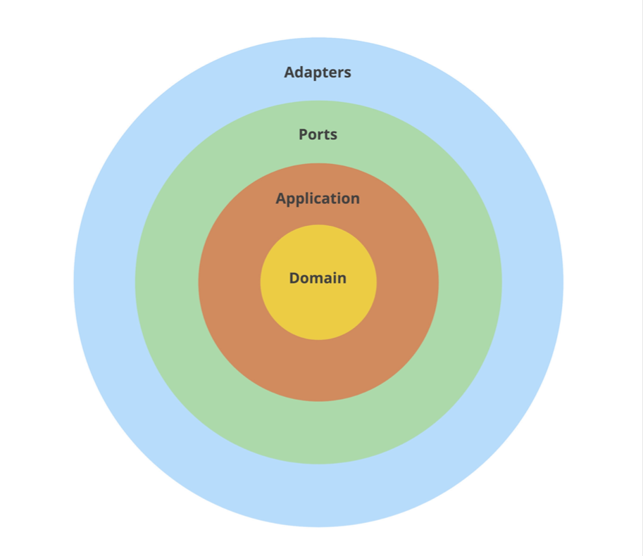

## Clean Architecture

Miłosz Smółka

The authors of [Accelerate](https://itrevolution.com/book/accelerate/) dedicate a whole chapter to software architecture
and how it affects development per- formance. One thing that often comes up is designing applications to be “loosely
coupled”.

- The goal is for your architecture to support the ability of teams to get their work done—from design through to
  deployment—without requiring high-bandwidth communication between teams.
  Accelerate (https://itrevolution.com/book/accelerate/)

> If you haven’t read [Accelerate](https://itrevolution.com/book/accelerate/) yet, I highly recommend it. The book presents scientific evidence on methods leading to high performance in development teams. The approach I describe is not only based on our experiences but also mentioned throughout the book.
>

While coupling seems mostly related to microservices across multiple teams, we find loosely coupled architecture just as
useful for work within a team. Keeping architecture standards makes parallel work possible and helps onboard new team
members.

You probably heard about the “low coupling, high cohesion” concept, but it’s rarely obvious how to achieve it. The good
news is, it’s the main benefit of Clean Architecture.

The pattern is not only an excellent way to start a project but also helpful when refactoring a poorly designed
application. I focus on the latter in this chapter. I show refactoring of a real application, so it should be clear how
to apply similar changes in your projects.

There are also other benefits of this approach we noticed:

- a standard structure, so it’s easy to find your way in the project,
- faster development in the long term,
- mocking dependencies becomes trivial in unit tests,
- easy switching from prototypes to proper solutions (e.g., changing in-memory storage to an SQL database).

### Clean Architecture

I had a hard time coming up with this chapter’s title because the pattern comes in many flavors. There’s
[Clean Architecture](https://blog.cleancoder.com/uncle-bob/2012/08/13/the-clean-architecture.html)
, [Onion Architecture](https://jeffreypalermo.com/2008/07/the-onion-architecture-part-1/)
, [Hexagonal Architecture](https://web.archive.org/web/20180822100852/http://alistair.cockburn.us/Hexagonal+architecture)
, and Ports and Adapters.

We tried to use these patterns in Go in an idiomatic way during the last couple of years. It involved trying out some
approaches, failing, changing them, and trying again.

We arrived at a mix of the ideas above, sometimes not strictly following the original patterns, but we found it works
well in Go. I will show our approach with a refactoring
of [Wild Workouts](https://github.com/ThreeDotsLabs/wild-workouts-go-ddd-example), our example application.

I want to point out that the idea is not new at all. A big part of it is __abstracting away implementation details__, a
standard in technology, especially software.

Another name for it is __separation of concerns__. The concept is so old now it exists on several levels. There are
structures, namespaces, modules, packages, and even (micro)services. All meant to keep related things within a boundary.
Sometimes, it feels like common sense:

- If you have to optimize an SQL query, you don’t want to risk changing the display format.
- If you change an HTTP response format, you don’t want to alter the database schema.

__Our approach to Clean Architecture is two ideas combined:__ separating Ports and Adapters and limiting how code
structures refer to each other.

### Before We Start

Before introducing Clean Architecture in Wild Workouts, I refactored the project a bit. The changes come from patterns
we shared in previous chapters.

The first one is using __separate models for database entities and HTTP responses.__
I’ve introduced changes in the users service in __When to stay away from DRY__ (Chapter 5). I applied the same pattern
now in trainer and trainings as well. See
the [full commit on GitHub](https://github.com/ThreeDotsLabs/wild-workouts-go-ddd-example).

The second change follows __the Repository Pattern__ that Robert introduced
in __[The Repository Pattern](./chapter07.md)__ (Chap- ter 7). [My refactoring](https://bit.ly/3bK1Pw7) moved
database-related code in trainings to a separate structure.

### Separating Ports and Adapters

Ports and Adapters can be called different names, like interfaces and infrastructure. At the core, the idea is to
explicitly separate these two categories from the rest of your application code.

We take the code in these groups and place it in different packages. We refer to them as “layers”.__The layers we
usually use are adapters, ports, application, and domain.__

- __An adapter is how your application talks to the external world.__ You have to adapt your internal structures to what
  the external API expects. Think SQL queries, HTTP or gRPC clients, file readers and writers, Pub/Sub message
  publishers.
- __A port is an input to your application__, and the only way the external world can reach it. It could be an HTTP or
  gRPC server, a CLI command, or a Pub/Sub message subscriber.
- __The application logic__ is a thin layer that “glues together” other layers. It’s also known as “use cases”. If you
  read this code and can’t tell what database it uses or what URL it calls, it’s a good sign. Sometimes it’s very short,
  and that’s fine. Think about it as an orchestrator.
- If you also follow [Domain-Driven Design](./chapter06.md), you can introduce __a domain layer that holds just the
  business logic.__

> If the idea of separating layers is still not clear, take a look at your smartphone. If you think about it, it uses similar concepts as well.
>
> You can control your smartphone using the physical buttons, the touchscreen, or voice assistant. Whether you press the “volume up” button, swipe the volume bar up, or say “Siri, volume up”, the effect is the same. There are several entry points (**ports**) to the “change volume” **logic**.
>
> When you play some music, you can hear it coming from the speaker. If you plug in headphones, the audio will automatically change to them. Your music app doesn’t care. It’s not talking with the hardware directly, but using one of the **adapters** the OS provides.
>
> Can you imagine creating a mobile app that has to be aware of the headphones model connected to the smart- phone? Including SQL queries directly inside the application logic is similar: it exposes the implementation details.
>
>



<center>Figure 9.1: Clean Architecture layers</center>

Let’s start refactoring by introducing the layers in the trainings service. The project looks like this so far:

```
trainings/
   firestore.go
   go.mod
   go.sum
   http.go
   main.go
   openapi_api.gen.go
   openapi_types.gen.go
```

This part of refactoring is simple:

1. Create ports, adapters, and app directories.
2. Move each file to the proper directory.

  ```
trainings/
├── adapters
│         └── firestore.go
├── app
├── go.mod
├── go.sum
├── main.go
└── ports
    ├── http.go
    ├── openapi_api.gen.go
    └── openapi_types.gen.go
  ```

I introduced similar packages in the trainer service. We won’t make any changes to the users service this time. There’s
no application logic there, and overall, it’s tiny. As with every technique, apply Clean Architecture where it makes
sense.

> If the project grows in size, you may find it helpful to add another level of subdirectories. For example, `adapters/hour/mysql_repository.go` or `ports/http/hour_handler.go`.
>

You probably noticed there are no files in the app package. We now have to extract the application logic from HTTP
handlers.

### The Application Layer

Let’s see where our application logic lives. Take a look at the CancelTraining method in the trainings service.

```go
package main

func (h HttpServer) CancelTraining(w http.ResponseWriter, r *http.Request) {
	trainingUUID := r.Context().Value("trainingUUID").(string)
	user, err := auth.UserFromCtx(r.Context())
	if err != nil {
		httperr.Unauthorised("no-user-found", err, w, r)
		return
	}
	err = h.db.CancelTraining(r.Context(), user, trainingUUID)
	if err != nil {
		httperr.InternalError("cannot-update-training", err, w, r)
		return
	}
}
```

Source: [http.go on GitHub](https://bit.ly/3ul3QXN)

This method is the entry point to the application. There’s not much logic there, so let’s go deeper into the
db.CancelTraining method.


Inside the Firestore transaction, there’s a lot of code that doesn’t belong to database handling.

What’s worse, the actual application logic inside this method uses the database model (TrainingModel) for decision
making:

```
if training.canBeCancelled() {
    // ...
} else {
    // ...
}
```

Source: [firestore.go on GitHub](https://bit.ly/3usH5S2)

Mixing the business rules (like when a training can be canceled) with the database model slows down development, as the
code becomes hard to understand and reason about. It’s also difficult to test such logic.

To fix this, we add an intermediate Training type in the app layer:

```go
package app

type Training struct {
	UUID           string
	UserUUID       string
	User           string
	Time           time.Time
	Notes          string
	ProposedTime   *time.Time
	MoveProposedBy *string
}

func (t Training) CanBeCancelled() bool {
	return t.Time.Sub(time.Now()) > time.Hour*24
}
func (t Training) MoveRequiresAccept() bool {
	return !t.CanBeCancelled()
}
```

Source: [training.go on GitHub](https://bit.ly/2P0KIOV)

It should now be clear on the first read when a training can be canceled. We can’t tell how the training is stored in
the database or the JSON format used in the HTTP API. That’s a good sign.

We can now update the database layer methods to return this generic application type instead of the database- specific
structure (TrainingModel). The mapping is trivial because the structs have the same fields (but from now on, they can
evolve independently from each other).

```
t := TrainingModel{}
if err := doc.DataTo(&t); err != nil {
   return nil, err 
}

trainings = append(trainings, app.Training(t))
```

Source: [trainings_firestore_repository.go on GitHub](https://bit.ly/3aFfBki)

### The Application Service

We then create a `TrainingsService` struct in the app package that will serve as the entry point to trainings
application logic.

```
type TrainingService struct {
}
func (c TrainingService) CancelTraining(ctx context.Context, user auth.User, trainingUUID string) error {
}
```

So how do we call the database now? Let’s try to replicate what was used so far in the HTTP handler.

```
type TrainingService struct { 
  db adapters.DB
}
func (c TrainingService) CancelTraining(ctx context.Context, user auth.User, trainingUUID string) error { 
  return c.db.CancelTraining(ctx, user, trainingUUID)
}
```

This code won’t compile, though.

```
import cycle not allowed
package github.com/ThreeDotsLabs/wild-workouts-go-ddd-example/internal/trainings
        imports github.com/ThreeDotsLabs/wild-workouts-go-ddd-example/internal/trainings/adapters 
        imports github.com/ThreeDotsLabs/wild-workouts-go-ddd-example/internal/trainings/app 
        imports github.com/ThreeDotsLabs/wild-workouts-go-ddd-example/internal/trainings/adapters
```

We need to __decide how the layers should refer to each other.__

### The Dependency Inversion Principle

A clear separation between ports, adapters, and application logic is useful by itself. Clean Architecture improves it
further with Dependency Inversion.

The rule states that **outer layers (implementation details) can refer to inner layers (abstractions), but not the other
way around**. The inner layers should instead depend on interfaces.

- The **Domain** knows nothing about other layers whatsoever. It contains pure business logic.
- The **Application** can import domain but knows nothing about outer layers. **It has no idea whether it’s being called
  by an HTTP request, a Pub/Sub handler, or a CLI command.**
- **Ports** can import inner layers. Ports are the entry points to the application, so they often execute application
  services or commands. However, they can’t directly access **Adapters**.
- **Adapters** can import inner layers. Usually, they will operate on types found in **Application** and **Domain**, for
  example, retrieving them from the database.


Again, it’s not a new idea. **The Dependency Inversion Principle is the “D”
in [SOLID](https://en.wikipedia.org/wiki/SOLID)**. Do you think it applies only to OOP? It just happens
that **[Go interfaces make a perfect match with it](https://dave.cheney.net/2016/08/20/solid-go-design)**.

The principle solves the issue of how packages should refer to each other. The best way to do it is rarely obvious,
especially in Go, where import cycles are forbidden. Perhaps that’s why some developers claim it’s best to avoid
“nesting” and keep all code in one package. **But packages exist for a reason, and that’s separation of concerns.**

Going back to our example, how should we refer to the database layer?

Because the Go interfaces don’t need to be explicitly implemented, we can **define them next to the code that needs
them.**

So the application service defines: _“I need a way to cancel a training with given UUID. I don’t care how you do it, but
I trust you to do it right if you implement this interface”_.

```
type trainingRepository interface {
    CancelTraining(ctx context.Context, user auth.User, trainingUUID string) error
}
type TrainingService struct { 
    trainingRepository trainingRepository
}
func (c TrainingService) CancelTraining(ctx context.Context, user auth.User, trainingUUID string) error {
    return c.trainingRepository.CancelTraining(ctx, user, trainingUUID)
}
```

Source: [training_service.go on GitHub](https://bit.ly/2NN67Kt)

The database method calls gRPC clients of trainer and users services. It’s not the proper place, so we introduce two new
interfaces that the service will use.

```
type userService interface {
    UpdateTrainingBalance(ctx context.Context, userID string, amountChange int) error
}
type trainerService interface {
    ScheduleTraining(ctx context.Context, trainingTime time.Time) error CancelTraining(ctx context.Context, trainingTime time.Time) error
}
```

Source: [training_service.go on GitHub](https://bit.ly/3k7rPVO)

> Note that “user” and “trainer” in this context are not microservices, but application (business) concepts. It just happens that in this project, they live in the scope of microservices with the same names.
>

We move implementations of these interfaces to adapters as [UsersGrpc](https://bit.ly/2P3KKFF)
and [TrainerGrpc](https://bit.ly/2P3KKFF). As a bonus, the timestamp conversion now happens there as well, invisible to
the application service.

### Extracting the Application Logic

The code compiles, but our application service doesn’t do much yet. Now is the time to extract the logic and put it in
the proper place.

Finally, we can use the update function pattern from **[The Repository Pattern](./chapter07.md)** (Chapter 7) to extract
the application logic out of the repository.

```go
package app

func (c TrainingService) CancelTraining(ctx context.Context, user auth.User, trainingUUID string) error {
	return c.repo.CancelTraining(ctx, trainingUUID, func(training Training) error {
		if user.Role != "trainer" && training.UserUUID != user.UUID {
			return errors.Errorf("user '%s' is trying to cancel training of user '%s'", user.UUID, training.UserUUID)
		}
		var trainingBalanceDelta int
		if training.CanBeCancelled() {
			// just give training back
			trainingBalanceDelta = 1
		} else {
			if user.Role == "trainer" {
				// 1 for cancelled training +1 fine for cancelling by trainer less than 24h before training 
				trainingBalanceDelta = 2
			} else {
				// fine for cancelling less than 24h before training 
				trainingBalanceDelta = 0
			}
		}
		if trainingBalanceDelta != 0 {
			err := c.userService.UpdateTrainingBalance(ctx, training.UserUUID, trainingBalanceDelta)
			if err != nil {
				return errors.Wrap(err, "unable to change trainings balance")
			}
		}
		err := c.trainerService.CancelTraining(ctx, training.Time)
		if err != nil {
			return errors.Wrap(err, "unable to cancel training")
		}
		return nil
	})
}
```

Source: [training_service.go on GitHub](https://bit.ly/3sfA8Su)

The amount of logic suggests we might want to introduce a domain layer sometime in the future. For now, let’s keep it as
it is.

I described the process for just a single CancelTraining method. Refer to the [full diff](https://bit.ly/2McYKM2) to see
how I refactored all other methods.

### Dependency Injection

How to tell the service which adapter to use? First, we define a simple constructor for the service.

```go
package app

func NewTrainingsService(
	repo trainingRepository, trainerService trainerService, userService userService,
) TrainingService {
	if repo == nil {
		panic("missing trainingRepository")
	}
	if trainerService == nil {
		panic("missing trainerService")
	}
	if userService == nil {
		panic("missing userService")
	}
	return TrainingService{
		repo: repo, trainerService: trainerService, userService: userService,
	}
}

```

Source: [training_service.go on GitHub](https://bit.ly/2ZAMS9S)

Then, in main.go we inject the adapter.

```
trainingsRepository := adapters.NewTrainingsFirestoreRepository(client)
trainerGrpc := adapters.NewTrainerGrpc(trainerClient)
usersGrpc := adapters.NewUsersGrpc(usersClient)

trainingsService := app.NewTrainingsService(trainingsRepository, trainerGrpc, usersGrpc)
```

Source: [main.go on GitHub](https://bit.ly/3dxwJdt)

Using the main function is the most trivial way to inject dependencies. We’ll look into the wire library23 as the
project becomes more complex in future chapters.

### Adding tests

Initially, the project had all layers mixed, and it wasn’t possible to mock dependencies. The only way to test it was to
use integration tests, with proper database and all services running.

While it’s OK to cover some scenarios with such tests, they tend to be slower and not as fun to work with as unit tests.
After introducing changes, I was able to [cover CancelTraining with a unit tests suite](https://bit.ly/3soDvqh).

I used the standard Go approach of table-driven tests to make all cases easy to read and understand.

```
{
    Name:     "return_training_balance_when_trainer_cancels",
    UserRole: "trainer",
    Training: app.Training{
        UserUUID: "trainer-id",
        Time:     time.Now().Add(48 * time.Hour),
    },
    ShouldUpdateBalance:   true,
    ExpectedBalanceChange: 1,
},
{
    Name:     "extra_training_balance_when_trainer_cancels_before_24h",
    UserRole: "trainer",
    Training: app.Training{
        UserUUID: "trainer-id",
        Time:     time.Now().Add(12 * time.Hour),
    },
    ShouldUpdateBalance:   true,
    ExpectedBalanceChange: 2,
},
```

Source: [training_service_test.go on GitHub](https://bit.ly/3soDvqh)

I didn’t introduce any libraries for mocking. You can use them if you like, but your interfaces should usually be small
enough to simply write dedicated mocks.

```

type trainerServiceMock struct { trainingsCancelled []time.Time
}
func (t *trainerServiceMock) CancelTraining(ctx context.Context, trainingTime time.Time) error { 
    t.trainingsCancelled = append(t.trainingsCancelled, trainingTime)
    return nil
}
```

Source: [training_service_test.go on GitHub](https://bit.ly/37uCGUv)

Did you notice the unusually high number of not implemented methods in repositoryMock? That’s because we use a single
training service for all methods, so we need to implement the full interface, even when testing just one of them.

We’ll improve it in **[Basic CQRS](./chapter10.md)** (Chapter 10).

### What about the boilerplate?

You might be wondering if we didn’t introduce too much boilerplate. The project indeed grew in size by code lines, but
that by itself doesn’t do any harm.

**It’s an investment in [loose coupling](./chapter05.md) that will pay off as the project grows.**

Keeping everything in one package may seem easier at first, but having boundaries helps when you consider working in a
team. If all your projects have a similar structure, onboarding new team members is straightforward. Consider how much
harder it would be with all layers
mixed ([Mattermost’s app package](https://github.com/mattermost/mattermost-server/tree/master/app) is an example of this
approach).

### Handling application errors

One extra thing I’ve added is [ports-agnostic errors with slugs](https://bit.ly/3bykevF). They allow the application
layer to return generic errors that can be handled by both HTTP and gRPC handlers.

```
if from.After(to) {
    return nil, errors.NewIncorrectInputError("date-from-after-date-to", "Date from after date to")
}
```

Source: [hour_service.go on GitHub](https://bit.ly/3pBCSaL)

The error above translates to 401 Bad Request HTTP response in ports. It includes a slug that can be translated on the
frontend side and shown to the user. It’s yet another pattern to avoid leaking implementation details to the application
logic.

### What else?

I encourage you to read through the [full commit](https://bit.ly/3pBCSaL) to see how I refactored other parts of Wild
Workouts.

You might be wondering how to enforce the correct usage of layers? Is it yet another thing to remember about in code
reviews?

Luckily, it’s possible to check the rules with static analysis. You can check your project with
Robert’s [go-cleanarch](https://github.com/roblaszczak/go-cleanarch) linter locally or include it in your CI pipeline.

With layers separated, we’re ready to introduce more advanced patterns.

In the next chapter, we show how to improve the project by applying CQRS.

If you’d like to read more on Clean Architecture,
see [Why using Microservices or Monolith can be just a detail](https://threedots.tech/post/microservices-or-monolith-its-detail/)
?