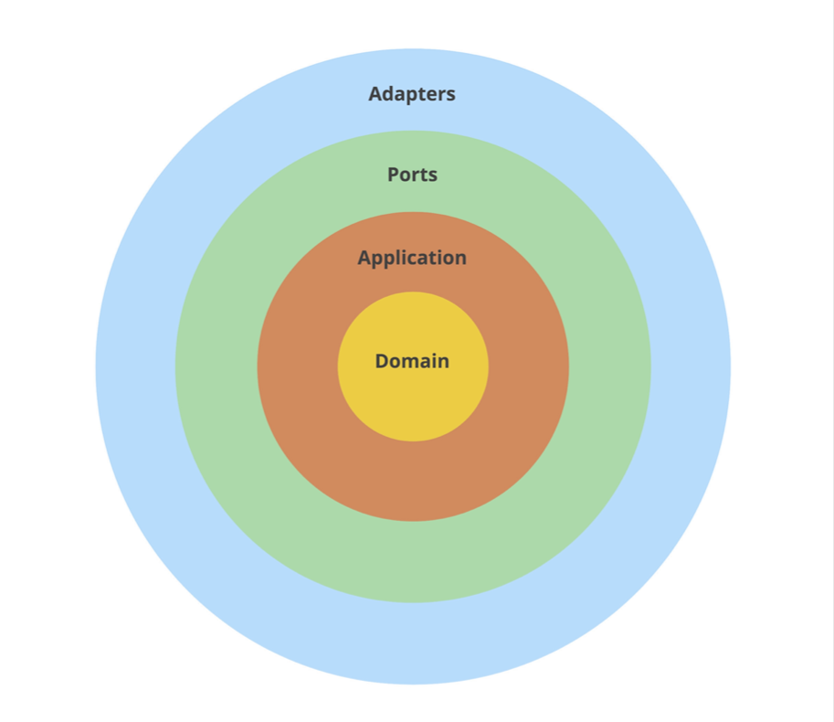
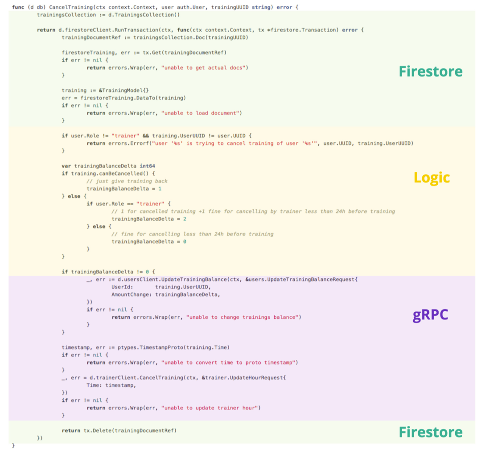
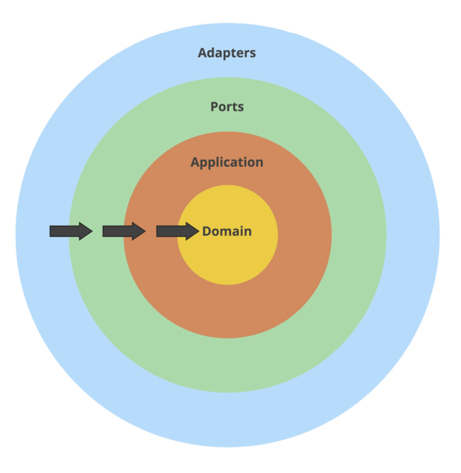

## 清洁架构

米沃什·斯莫乌卡

[Accelerate](https://itrevolution.com/book/accelerate/) 的作者用一整章的篇幅介绍了软件架构以及它如何影响开发性能。经常出现的一件事是将应用程序设计为“松散耦合”。

目标是让您的架构支持团队完成工作的能力 ——从设计到部署—— 而无需团队之间的高带宽通信。

> 如果您还没有阅读 [Accelerate](https://itrevolution.com/book/accelerate/) ，我强烈推荐它。这本书提供了有关在开发团队中实现高绩效的方法的科学证据。我描述的方法不仅基于我们的经验，而且贯穿全书。

虽然耦合似乎主要与跨多个团队的微服务相关，但我们发现松散耦合的体系结构对于团队内的工作同样有用。保持架构标准使并行工作成为可能，并有助于新团队成员的加入。

您可能听说过“低耦合、高内聚力”的概念，但很少明确如何实现它。好消息是，这是清洁架构的主要好处。

该模式不仅是启动项目的一种很好的方式，而且在重构设计不佳的应用程序时也很有用。在本章中，我将重点介绍后者。我展示了一个真实应用程序的重构，因此应该清楚如何在项目中应用类似的更改。

我们注意到这种方法还有其他好处：

- 一个标准的结构，所以很容易在项目中找到方向，
- 从长远来看更快的发展，
- 模拟依赖关系在单元测试中变得微不足道，
- 轻松从原型切换到适当的解决方案(例如，将内存存储更改为SQL数据库)。

### 清洁架构

我费了好大劲才想出这一章的标题，因为这个模式有很多种风格。 有 [清洁架构](https://blog.cleancoder.com/uncle-bob/2012/08/13/the-clean-architecture.html)
、[洋葱架构](https://jeffreypalermo.com/2008/07/the-onion-architecture-part-1/)
、[六边形架构](https://jeffreypalermo.com/2008/07/the-onion-architecture-part-1/)
以及端口和适配器。

在过去的几年里，我们试图以惯用的方式在 Go 中使用这些模式。它涉及尝试一些方法，失败，改变它们，然后再试一次。

我们混合了上述想法，有时并不严格遵循原始模式，但我们发现它在 Go
中运行良好。我将通过重构我们的示例应用程序 [Wild Workouts](https://github.com/ThreeDotsLabs/wild-workouts-go-ddd-example) 来展示我们的方法。

我想指出的是，这个想法一点也不新鲜。它的很大一部分是抽象出实现细节，这是技术，特别是软件的标准。

它的另一个名字是关注点分离。这个概念太古老了，现在它存在于几个层面上。有结构、命名空间、模块、包，甚至(微)服务。所有这些都是为了将相关的事情控制在一个范围内。有时，这感觉像是常识：

- 如果您必须优化一个SQL查询，您不想冒险更改显示格式。
- 如果更改了HTTP响应格式，则不希望更改数据库架构。

**我们的清洁架构方法结合了两个想法**： 分离端口和适配器，并限制代码结构相互引用的方式。

### 在我们开始之前

在 Wild Workouts 中引入 Clean Architecture 之前，我对项目进行了一些重构。这些变化来自我们在前几章中分享的模式。

第一个是对**数据库实体和HTTP响应使用单独的模型。**
我在[何时远离 DRY](./chapter05.md)（第 5 章）中介绍了用户服务的变化。 我现在在培训师和培训中也应用了相同的模式。请参阅 GitHub
上的[完整提交](https://github.com/ThreeDotsLabs/wild-workouts-go-ddd-example) 。

第二个变化遵循 Robert 在[存储库模式](./chapter07.md)（第 7 章）中介绍的**存储库模式**。[我的重构](https://bit.ly/3bK1Pw7) 将培训中与数据库相关的代码移到了一个单独的结构中。

### 分离端口和适配器

端口和适配器可以称为不同的名称，例如接口和基础设施。核心思想是将这两个类别与应用程序代码的其余部分明确分开。

我们将这些组中的代码放在不同的包中。我们将它们称为“层”。__我们通常使用的层是适配器、端口、应用程序和领域__

- __适配器是您的应用程序与外部世界对话的方式__， 您必须使内部结构适应外部 API 的期望。想想 SQL 查询、HTTP 或 gRPC 客户端、文件读取器和写入器、Pub/Sub 消息发布者。

- __端口是应用程序的输入__, 也是外部世界访问它的唯一途径。它可以是 HTTP 或 gRPC 服务器、CLI 命令或 Pub/Sub 消息订阅者。
- __应用程序逻辑__ 是一个将其他层“粘合在一起”的很薄的一层. 它也被称为“用例”。如果您阅读此代码并且无法分辨它使用什么数据库或它调用什么 URL，这是一个好兆头。有时它很短，这很好。把它想象成一个协调器。
- 如果您还遵循 [领域驱动设计](./chapter06.md)，则可以引入 __仅包含业务逻辑的域层。__

> 如果分层的想法仍然不清楚，请看看您的智能手机。如果您考虑一下，它也使用类似的概念。
>
> 您可以使用物理按钮、触摸屏或语音助手来控制您的智能手机。无论你是按下“提高音量”按钮，向上滑动音量条，还是说“Siri，提高音量”，效果都是一样的。“更改音量”**逻辑**有几个入口点（**端口**） 。
>
> 当您播放一些音乐时，您可以听到它从扬声器中传出。如果您插入耳机，音频将自动更改为耳机。你的音乐应用不在乎。它不是直接与硬件对话，而是使用操作系统提供的**适配器**之一。
>
> 你能想象创建一个必须知道连接到智能手机的耳机型号的移动应用程序吗？将 SQL 查询直接包含在应用程序逻辑中是类似的：它公开了实现细节。
>



<center>Figure 9.1: 清洁架构分层</center>

让我们通过在培训服务中引入层来开始重构。到目前为止，该项目看起来像这样:

```
trainings/
   firestore.go
   go.mod
   go.sum
   http.go
   main.go
   openapi_api.gen.go
   openapi_types.gen.go
```

这部分重构很简单:

1. 创建端口、适配器和应用程序目录。.
2. 将每个文件移动到正确的目录.

  ```
trainings/
├── adapters
│         └── firestore.go
├── app
├── go.mod
├── go.sum
├── main.go
└── ports
    ├── http.go
    ├── openapi_api.gen.go
    └── openapi_types.gen.go
  ```

我在培训师服务中引入了类似的软件包。这次我们不会对用户服务进行任何更改。那里没有应用程序逻辑，总的来说，它很小。与每种技术一样，在有意义的地方应用清洁架构

> 如果项目规模扩大，您可能会发现添加另一个级别的子目录会有所帮助。例如， `adapters/hour/mysql_repository.go` 或 `ports/http/hour_handler.go`.
>

您可能注意到应用程序包中没有文件。我们现在必须从 HTTP 处理程序中提取应用程序逻辑。

### 应用层

让我们看看我们的应用程序逻辑在哪里。查看培训服务中的 CancelTraining 方法。

```go
package main

func (h HttpServer) CancelTraining(w http.ResponseWriter, r *http.Request) {
	trainingUUID := r.Context().Value("trainingUUID").(string)
	user, err := auth.UserFromCtx(r.Context())
	if err != nil {
		httperr.Unauthorised("no-user-found", err, w, r)
		return
	}
	err = h.db.CancelTraining(r.Context(), user, trainingUUID)
	if err != nil {
		httperr.InternalError("cannot-update-training", err, w, r)
		return
	}
}
```

Source: [http.go on GitHub](https://bit.ly/3ul3QXN)

此方法是应用程序的入口点。那里没有太多逻辑，所以让我们更深入地了解 db.CancelTraining 方法。



在 Firestore 事务中，有很多不属于数据库处理的代码。

更糟糕的是，该方法内部的实际应用逻辑使用数据库模型（TrainingModel）进行决策：

```
if training.canBeCancelled() {
    // ...
} else {
    // ...
}
```

Source: [firestore.go on GitHub](https://bit.ly/3usH5S2)

将业务规则（例如何时可以取消培训）与数据库模型混合会减慢开发速度，因为代码变得难以理解和推理。测试这样的逻辑也很困难。

为了解决这个问题，我们在应用层添加了一个中间训练类型：

```go
package app

type Training struct {
	UUID           string
	UserUUID       string
	User           string
	Time           time.Time
	Notes          string
	ProposedTime   *time.Time
	MoveProposedBy *string
}

func (t Training) CanBeCancelled() bool {
	return t.Time.Sub(time.Now()) > time.Hour*24
}
func (t Training) MoveRequiresAccept() bool {
	return !t.CanBeCancelled()
}
```

Source: [training.go on GitHub](https://bit.ly/2P0KIOV)

现在应该在第一次阅读时清楚何时可以取消培训。我们不知道训练是如何存储在数据库中的，或者是 HTTP API 中使用的 JSON 格式。这是一个好兆头。

我们现在可以更新数据库层方法以返回此通用应用程序类型，而不是特定于数据库的结构 (TrainingModel)。映射很简单，因为结构具有相同的字段（但从现在开始，它们可以相互独立地演化）。

```
t := TrainingModel{}
if err := doc.DataTo(&t); err != nil {
   return nil, err 
}

trainings = append(trainings, app.Training(t))
```

Source: [trainings_firestore_repository.go on GitHub](https://bit.ly/3aFfBki)

### 应用服务

然后，我们在应用程序包中创建一个 `TrainingsService` 结构，作为训练应用程序逻辑的入口点。

```
type TrainingService struct {
}
func (c TrainingService) CancelTraining(ctx context.Context, user auth.User, trainingUUID string) error {
}
```

那么我们现在如何调用数据库呢？让我们尝试复制迄今为止在 HTTP 处理程序中使用的内容。

```
type TrainingService struct { 
  db adapters.DB
}
func (c TrainingService) CancelTraining(ctx context.Context, user auth.User, trainingUUID string) error { 
  return c.db.CancelTraining(ctx, user, trainingUUID)
}
```

但是，此代码不会编译。

```
import cycle not allowed
package github.com/ThreeDotsLabs/wild-workouts-go-ddd-example/internal/trainings
        imports github.com/ThreeDotsLabs/wild-workouts-go-ddd-example/internal/trainings/adapters 
        imports github.com/ThreeDotsLabs/wild-workouts-go-ddd-example/internal/trainings/app 
        imports github.com/ThreeDotsLabs/wild-workouts-go-ddd-example/internal/trainings/adapters
```

我们需要**决定这些层应该如何相互引用**。

### 依赖倒置原则

端口、适配器和应用程序逻辑之间的明确分离本身就很有用。清洁架构 通过 依赖倒置 进一步改进了它。

该规则规定外层（实现细节）可以引用内层（抽象），但不能反过来。内层应该依赖于接口。

- 领域对其他层一无所知。它包含纯业务逻辑。
- 应用程序可以导入域，但对外层一无所知。它不知道它是由 HTTP 请求、Pub/Sub 处理程序还是 CLI 命令调用的。
- 端口可以导入内层。端口是应用程序的入口点，因此它们经常执行应用程序服务或命令。但是，他们不能直接访问 Adapters。
- 适配器可以导入内层。通常，它们将对Application和Domain中的类型进行操作，例如，从数据库中检索它们。



同样，这不是一个新想法。依赖倒置原则是  [SOLID](https://en.wikipedia.org/wiki/SOLID) 中的“D” 。您认为它仅适用于 OOP
吗？恰好[Go 接口与之完美匹配](https://dave.cheney.net/2016/08/20/solid-go-design)。

该原则解决了包应该如何相互引用的问题。最好的方法很少见，尤其是在禁止导入循环的 Go 中。也许这就是为什么一些开发人员声称最好避免“嵌套”并将所有代码保存在一个包中的原因。**但是包的存在是有原因的，那就是关注点分离**。

回到我们的例子，我们应该如何引用数据库层呢？

因为 Go 接口不需要显式实现，我们可以**在需要它们的代码旁边定义它们**。

因此应用程序服务定义：“_我需要一种方法来取消具有给定 UUID 的训练。我不在乎你是怎么做的，但如果你实现了这个接口，我相信你会做对_”。

```
type trainingRepository interface {
    CancelTraining(ctx context.Context, user auth.User, trainingUUID string) error
}
type TrainingService struct { 
    trainingRepository trainingRepository
}
func (c TrainingService) CancelTraining(ctx context.Context, user auth.User, trainingUUID string) error {
    return c.trainingRepository.CancelTraining(ctx, user, trainingUUID)
}
```

Source: [training_service.go on GitHub](https://bit.ly/2NN67Kt)

数据库方法调用训练器和用户服务的 gRPC 客户端。这不是合适的地方，所以我们引入了服务将使用的两个新接口。

```
type userService interface {
    UpdateTrainingBalance(ctx context.Context, userID string, amountChange int) error
}
type trainerService interface {
    ScheduleTraining(ctx context.Context, trainingTime time.Time) error CancelTraining(ctx context.Context, trainingTime time.Time) error
}
```

Source: [training_service.go on GitHub](https://bit.ly/3k7rPVO)

> 请注意，此上下文中的“用户”和“培训师”不是微服务，而是应用程序（业务）概念。恰好在这个项目中，它们存在于同名的微服务范围内。

我们将这些接口的实现作为 [UsersGrpc](https://bit.ly/2P3KKFF) 和 [TrainerGrpc](https://bit.ly/2P3KKFF)
移动到适配器。作为奖励，时间戳转换现在也发生在那里，对应用程序服务不可见。

### 提取应用程序逻辑

代码可以编译，但我们的应用程序服务还没有做太多事情。现在是提取逻辑并将其放在适当位置的时候了。

最后，我们可以使用[存储库模式](./chapter07.md)（第 7 章）中的更新函数模式从存储库中提取应用程序逻辑。

```go
package app

func (c TrainingService) CancelTraining(ctx context.Context, user auth.User, trainingUUID string) error {
	return c.repo.CancelTraining(ctx, trainingUUID, func(training Training) error {
		if user.Role != "trainer" && training.UserUUID != user.UUID {
			return errors.Errorf("user '%s' is trying to cancel training of user '%s'", user.UUID, training.UserUUID)
		}
		var trainingBalanceDelta int
		if training.CanBeCancelled() {
			// just give training back
			trainingBalanceDelta = 1
		} else {
			if user.Role == "trainer" {
				// 1 for cancelled training +1 fine for cancelling by trainer less than 24h before training 
				trainingBalanceDelta = 2
			} else {
				// fine for cancelling less than 24h before training 
				trainingBalanceDelta = 0
			}
		}
		if trainingBalanceDelta != 0 {
			err := c.userService.UpdateTrainingBalance(ctx, training.UserUUID, trainingBalanceDelta)
			if err != nil {
				return errors.Wrap(err, "unable to change trainings balance")
			}
		}
		err := c.trainerService.CancelTraining(ctx, training.Time)
		if err != nil {
			return errors.Wrap(err, "unable to cancel training")
		}
		return nil
	})
}
```

Source: [training_service.go on GitHub](https://bit.ly/3sfA8Su)

大量的逻辑表明我们可能希望在将来的某个时候引入域层。现在，让我们保持原样

我只描述了一个 CancelTraining 方法的过程。请参阅[完整的差异](https://bit.ly/2McYKM2)以了解我如何重构所有其他方法。

### 依赖注入

如何告诉服务使用哪个适配器？首先，我们为服务定义一个简单的构造函数。

```go
package app

func NewTrainingsService(
	repo trainingRepository, trainerService trainerService, userService userService,
) TrainingService {
	if repo == nil {
		panic("missing trainingRepository")
	}
	if trainerService == nil {
		panic("missing trainerService")
	}
	if userService == nil {
		panic("missing userService")
	}
	return TrainingService{
		repo: repo, trainerService: trainerService, userService: userService,
	}
}

```

Source: [training_service.go on GitHub](https://bit.ly/2ZAMS9S)

然后，在 main.go 我们注入适配器。

```
trainingsRepository := adapters.NewTrainingsFirestoreRepository(client)
trainerGrpc := adapters.NewTrainerGrpc(trainerClient)
usersGrpc := adapters.NewUsersGrpc(usersClient)

trainingsService := app.NewTrainingsService(trainingsRepository, trainerGrpc, usersGrpc)
```

Source: [main.go on GitHub](https://bit.ly/3dxwJdt)

Using the main function is the most trivial way to inject dependencies. We’ll look into
the [wire library](https://github.com/google/wire)  as the project becomes more complex in future chapters.

使用 main 函数是注入依赖项最简单的方法。随着项目在以后的章节中变得更加复杂，我们将研究[wire](https://github.com/google/wire)。

### 添加测试

最初，该项目混合了所有层，并且无法模拟依赖项。测试它的唯一方法是使用集成测试，并运行适当的数据库和所有服务。

虽然用这样的测试覆盖一些场景是可以的，但它们往往更慢，而且不像单元测试那样有趣。引入更改后，我能够[使用单元测试套件涵盖 CancelTraining](https://bit.ly/3soDvqh) 。

我使用表驱动测试的标准 Go 方法使所有案例都易于阅读和理解。

```
{
    Name:     "return_training_balance_when_trainer_cancels",
    UserRole: "trainer",
    Training: app.Training{
        UserUUID: "trainer-id",
        Time:     time.Now().Add(48 * time.Hour),
    },
    ShouldUpdateBalance:   true,
    ExpectedBalanceChange: 1,
},
{
    Name:     "extra_training_balance_when_trainer_cancels_before_24h",
    UserRole: "trainer",
    Training: app.Training{
        UserUUID: "trainer-id",
        Time:     time.Now().Add(12 * time.Hour),
    },
    ShouldUpdateBalance:   true,
    ExpectedBalanceChange: 2,
},
```

Source: [training_service_test.go on GitHub](https://bit.ly/3soDvqh)

我没有介绍任何用于模拟的库。如果你愿意，你可以使用它们，但你的接口通常应该足够小，可以简单地编写专用的模拟。

```

type trainerServiceMock struct { trainingsCancelled []time.Time
}
func (t *trainerServiceMock) CancelTraining(ctx context.Context, trainingTime time.Time) error { 
    t.trainingsCancelled = append(t.trainingsCancelled, trainingTime)
    return nil
}
```

Source: [training_service_test.go on GitHub](https://bit.ly/37uCGUv)

您是否注意到 repositoryMock 中未实现的方法数量异常多？那是因为我们为所有方法使用单一的训练服务，所以我们需要实现完整的接口，即使只测试其中一个。

我们将在 **[Basic CQRS](./chapter10.md)**（第 10 章）中对其进行改进。

### 那样板呢？

您可能想知道我们是否没有引入太多样板。该项目的规模确实随着代码行的增加而增长，但这本身并没有任何害处。

**这是对[松散耦合](./chapter05.md) 的投资，随着项目的发展会得到回报。**

Keeping everything in one package may seem easier at first, but having boundaries helps when you consider working in a
team. If all your projects have a similar structure, onboarding new team members is straightforward. Consider how much
harder it would be with all layers
mixed ([Mattermost’s app package](https://github.com/mattermost/mattermost-server/tree/master/app) is an example of this
approach).

一开始，将所有东西都放在一个包中似乎更容易，但是当您考虑在团队中工作时，有界限会有所帮助。如果您所有的项目都具有相似的结构，那么新团队成员的入职就很简单了。考虑混合所有层会有多困难[（Mattermost 的应用程序包）](https://github.com/mattermost/mattermost-server/tree/master/app)
就是这种方法的一个例子。

### 处理应用程序错误

我添加的另一件事是[slugs 与端口无关的错误](https://bit.ly/3bykevF) 。它们允许应用层返回可由 HTTP 和 gRPC 处理程序处理的通用错误。

```
if from.After(to) {
    return nil, errors.NewIncorrectInputError("date-from-after-date-to", "Date from after date to")
}
```

Source: [hour_service.go on GitHub](https://bit.ly/3pBCSaL)

上面的错误转换为端口中的 401 Bad Request HTTP 响应。它包括一个可以在前端翻译并显示给用户的 slug。这是另一种避免将实现细节泄露给应用程序逻辑的模式。

### 还有什么？

我鼓励你通读[完整的提交](https://bit.ly/3pBCSaL) ，看看我是如何重构 Wild Workouts 的其他部分的。

您可能想知道如何强制正确使用图层？在代码审查中还需要记住另一件事吗？

幸运的是，可以通过静态分析检查规则。您可以在本地使用 Robert 的 [go-cleanarch](https://github.com/roblaszczak/go-cleanarch) 检查您的项目，或者将其包含在您的 CI 管道中。

随着层的分离，我们准备引入更高级的模式。

在下一章中，我们将展示如何通过应用 CQRS 来改进项目。

如果您想了解更多关于清洁架构的信息，请参阅 [为什么使用微服务或单体应用只是一个细节](https://threedots.tech/post/microservices-or-monolith-its-detail/) ?