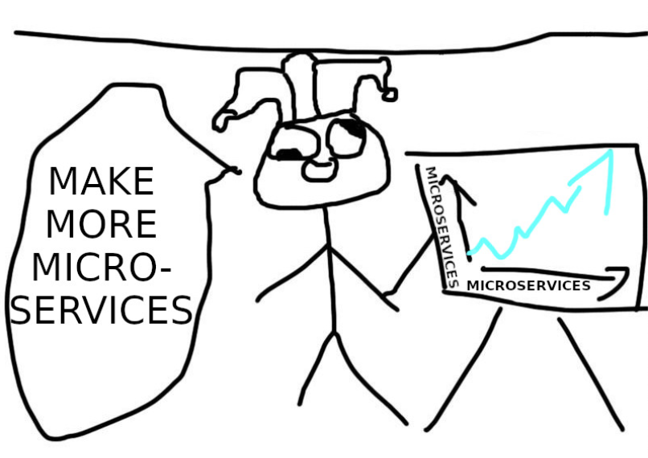

## Basic CQRS

Robert Laszczak

It’s highly likely you know at least one service that:

- has one big, unmaintainable model that is hard to understand and change,
- or where work in parallel on new features is limited,
- or can’t be scaled optimally.

But often, bad things come in threes. It’s not uncommon to see services with all these problems.

What is an idea that comes to mind first for solving these issues? Let’s split it into more microservices!

Unfortunately, without proper research and planning, the situation after blindly refactoring may be actually worse than
before:

- **business logic and flow may become even harder to understand** – a complex logic is often easier to understand if
  it’s in one place,
- **distributed transactions** – things are sometimes together for a reason; a big transaction in one database is much
  faster and less complex than distributed transaction across multiple services,
- **adding new changes may require extra coordination**, if one of the services is owned by another team.



<center>Figure 10.1: Microservices are useful, but they will not solve all your issues...</center>

To be totally clear – I’m not an enemy of microservices. **I’m just against blindly applying microservices in a way that
introduces unneeded complexity and mess instead of making our lives easier.**

Another approach is using CQRS (Command Query Responsibility Segregation) with previously
described [Clean Architecture](./chapter09.md). **It can solve the mentioned problems in a much simpler way.**

### Isn’t CQRS a complex technique?

Isn’t CQRS one of these C#/Java/über enterprise patterns that are hard to implement, and make a big mess in the code? A
lot of books, presentations, and articles describe CQRS as a very complicated pattern. But it is not the case.

**In practice, CQRS is a very simple pattern that doesn’t require a lot of investment. It can be easily extended with
more complex techniques like event-driven architecture, event-sourcing, or polyglot persistence.** But they’re not
always needed. Even without applying any extra patterns, CQRS can offer better decoupling, and code structure that is
easier to understand.

When to not use CQRS in Go? How to get all benefits from CQRS? You can learn all that in this chapter.

Like always, I will do it by refactoring [Wild Workouts](https://github.com/ThreeDotsLabs/wild-workouts-go-ddd-example)
application,

### How to implement basic CQRS in Go

CQRS (Command Query Responsibility Segregation) was
initially [described by Greg Young](https://cqrs.files.wordpress.com/2010/11/cqrs_documents.pdf).
**It has one simple assumption: instead of having one big model for reads and writes, you should have two separate
models. One for writes and one for reads.** It also introduces concepts of command and query, and leads to splitting
application services into two separate types: command and query handlers.


<center>Figure 10.2: Standard, non-CQRS architecture</center>


<center>Figure 10.3: CQRS architecture</center>

#### Command vs Query

In simplest words:
**a Query should not modify anything, just return the data. A command is the opposite one: it should make changes in the
system, but not return any data. **
Thanks to that, our queries can be cached more efficiently, and we lower the complexity of commands.

It may sound like a serious constraint, but in practice, it is not. Most of the operations that we execute are reads or
writes. Very rarely, both.

Of course, for a query, we don’t consider side effects like logs, or metrics as modifying anything. For commands, it is
also a perfectly normal thing to return an error.

> As with most rules, it is ok to break them... as long as you perfectly **understand why they were in- troduced and what tradeoffs** you make. In practice, you rarely need to break these rules. I will share examples at the end of the chapter.
>

How does the most basic implementation look in practice? In the previous chapter, Miłosz introduced an application
service that executes application use cases. Let’s start by cutting this service into separate command and query
handlers.

#### ApproveTrainingReschedule command

ApproveTrainingReschedule command.

```shell
- func (c TrainingService) ApproveTrainingReschedule(ctx context.Context, user auth.User, trainingUUID string) error {
-  return c.repo.ApproveTrainingReschedule(ctx, trainingUUID, func(training Training) (Training, error) {
-     if training.ProposedTime == nil {
-        return Training{}, errors.New("training has no proposed time")
-     }
-     if training.MoveProposedBy == nil {
-        return Training{}, errors.New("training has no MoveProposedBy")
-     }
-     if *training.MoveProposedBy == "trainer" && training.UserUUID != user.UUID {
-        return Training{}, errors.Errorf("user '%s' cannot approve reschedule of user '%s'", user.UUID, training.UserUUID)
-     }
-     if *training.MoveProposedBy == user.Role {
-        return Training{}, errors.New("reschedule cannot be accepted by requesting person")
-     }
-
-     training.Time = *training.ProposedTime
-     training.ProposedTime = nil
-
-     return training, nil
-  })
- }
```

Source: [8d9274811559399461aa9f6bf3829316b8ddfb63 on GitHub](https://bit.ly/3dwArEj)

There were some magic validations there. They are now done in the domain layer. I also found out that we forgot to call
the external trainer service to move the training. Oops. Let’s refactor it to the CQRS approach.

> Because CQRS works best with applications following Domain-Driven Design, during refactoring towards CQRS I refactored existing models to DDD Lite as well. DDD Lite is described in more detail in **[Domain- Driven Design Lite](./chapter06.md)** (Chapter 6).
>

We start the implementation of a command with the command structure definition. That structure provides all data needed
to execute this command. If a command has only one field, you can skip the structure and just pass it as a parameter.

It’s a good idea to use types defined by domain in the command, like training.User in that case. We don’t need to do any
casting later, and we have type safety assured.
**It can save us a lot of issues with string parameters passed in wrong order.**

```go

package command

// ...
type ApproveTrainingReschedule struct {
	TrainingUUID string
	User         training.User
}

```

Source: [approve_training_reschedule.go on GitHub](https://bit.ly/3dxwyij)

The second part is a command handler that knows how to execute the command.

```go
package command

// ...

type ApproveTrainingRescheduleHandler struct {
	repo           training.Repository
	userService    UserService
	trainerService TrainerService
}

// ...

func (h ApproveTrainingRescheduleHandler) Handle(ctx context.Context, cmd ApproveTrainingReschedule) (err error) {
	defer func() {
		logs.LogCommandExecution("ApproveTrainingReschedule", cmd, err)
	}()

	return h.repo.UpdateTraining(
		ctx,
		cmd.TrainingUUID,
		cmd.User,
		func(ctx context.Context, tr *training.Training) (*training.Training, error) {
			originalTrainingTime := tr.Time()

			if err := tr.ApproveReschedule(cmd.User.Type()); err != nil {
				return nil, err
			}

			err := h.trainerService.MoveTraining(ctx, tr.Time(), originalTrainingTime)
			if err != nil {
				return nil, err
			}

			return tr, nil
		},
	)
}
```

Source: [approve_training_reschedule.go on GitHub](https://bit.ly/3scHx4W)

The flow is much easier to understand now. You can clearly see that we approve a reschedule of a
persisted `*training.Training`, and if it succeeds, we call the external trainer service. Thanks to techniques described
in **[Domain-Driven Design Lite](./chapter06.md)** (Chapter 6), the command handler doesn’t need to know when it can
perform this operation. It’s all handled by our domain layer.

This clear flow is even more visible in more complex commands. Fortunately, the current implementation is really
straightforward. That’s good.
**Our goal is not to create complicated, but simple software.**

If CQRS is the standard way of building applications in your team, it also speeds up learning the service by your
teammates who don’t know it. You just need a list of available commands and queries, and to quickly take a look at how
their execution works. Jumping like crazy through random places in code is not needed.

This is how it looks like in one of my team’s most complex services:


<center>Figure 10.4: Example application layer of one service at Karhoo.</center>

You may ask - shouldn’t it be cut to multiple services?
**In practice, it would be a terrible idea.**
A lot of operations here need to be transitionally consistent. Splitting it to separate services would involve a couple
of distributed transactions (Sagas). It would make this flow much more complex, harder to maintain, and debug. It’s not
the best deal.

It’s also worth mentioning that all of these operations are not very complex.
**Complexity is scaling horizontally excellently here.**
We will cover the extremely important topic of splitting microservices more in-depth soon. Did I already mention that we
messed it up in Wild Workouts on purpose?

But let’s go back to our command. It’s time to use it in our HTTP port. It’s available in HttpServer via injected
Application structure, which contains all of our commands and queries handlers.

```go
package app

import (
	"github.com/ThreeDotsLabs/wild-workouts-go-ddd-example/internal/trainings/app/command"
	"github.com/ThreeDotsLabs/wild-workouts-go-ddd-example/internal/trainings/app/query"
)

type Application struct {
	Commands Commands
	Queries  Queries
}

type Commands struct {
	ApproveTrainingReschedule command.ApproveTrainingRescheduleHandler
	CancelTraining            command.CancelTrainingHandler
	// ...
}
```

Source: [app.go on GitHub](https://bit.ly/3dykLAq)

```go
package ports

type HttpServer struct {
	app app.Application
}

// ...

func (h HttpServer) ApproveRescheduleTraining(w http.ResponseWriter, r *http.Request) {
	trainingUUID := chi.URLParam(r, "trainingUUID")

	user, err := newDomainUserFromAuthUser(r.Context())
	if err != nil {
		httperr.RespondWithSlugError(err, w, r)
		return
	}
	err = h.app.Commands.ApproveTrainingReschedule.Handle(r.Context(), command.ApproveTrainingReschedule{
		User:         user,
		TrainingUUID: trainingUUID,
	})
	if err != nil {
		httperr.RespondWithSlugError(err, w, r)
		return
	}
}

```

Source: [http.go on GitHub](https://bit.ly/3sgPS7p)

The command handler can be called in that way from any port: HTTP, gRPC, or CLI. It’s also useful for executing
migrations and [loading fixtures](https://bit.ly/2ZFmXOd) (we already do it in Wild Workouts).

#### RequestTrainingReschedule command

Some command handlers can be very simple.

```go
package command

func (h RequestTrainingRescheduleHandler) Handle(ctx context.Context, cmd RequestTrainingReschedule) (err error) {
	defer func() {
		logs.LogCommandExecution("RequestTrainingReschedule", cmd, err)
	}()
	return h.repo.UpdateTraining(ctx,
		cmd.TrainingUUID,
		cmd.User,
		func(ctx context.Context, tr *training.Training) (*training.Training, error) {
			if err := tr.UpdateNotes(cmd.NewNotes); err != nil {
				return nil, err
			}
			tr.ProposeReschedule(cmd.NewTime, cmd.User.Type())
			return tr, nil
		},
	)
}

```

Source: [request_training_reschedule.go on GitHub](https://bit.ly/3s6BgHM)

It may be tempting to skip this layer for such simple cases to save some boilerplate. It’s true, but you need to
remember that
**writing code is always much cheaper than the maintenance. Adding this simple type is 3 minutes of work. People who
will read and extend this code later will appreciate that effort.**

#### AvailableHoursHandler query

Queries in the application layer are usually pretty boring. In the most common case, we need to write a read model
interface (AvailableHoursReadModel) that defines how we can query the data.

Commands and queries are also a great place for
all [cross-cutting concerns](https://en.wikipedia.org/wiki/Cross-cutting_concern), like logging and instrumentation.
Thanks to putting that here, we are sure that performance is measured in the same way whether it’s called from HTTP or
gRPC port.

```go
package query

// ...
type AvailableHoursHandler struct {
	readModel AvailableHoursReadModel
}
type AvailableHoursReadModel interface {
	AvailableHours(ctx context.Context, from time.Time, to time.Time) ([]Date, error)
}

// ...
type AvailableHours struct {
	From time.Time
	To   time.Time
}

func (h AvailableHoursHandler) Handle(ctx context.Context, query AvailableHours) (d []Date, err error) {
	start := time.Now()
	defer func() {
		logrus.
			WithError(err).
			WithField("duration", time.Since(start)).
			Debug("AvailableHoursHandler executed")
	}()
	if query.From.After(query.To) {
		return nil, errors.NewIncorrectInputError("date-from-after-date-to", "Date from after date to")
	}
	return h.readModel.AvailableHours(ctx, query.From, query.To)
}
```

Source: [available_hours.go on GitHub](https://bit.ly/3udkEAd)

We also need to define data types returned by the query. In our case, it’s query.Date.

> To understand why we don’t use structures generated from OpenAPI, see **[When to stay away from DRY](./chapter05.md)** (
Chapter 5) and **[Clean Architecture](./chapter09.md)** (Chapter 9).

```go
package query

import (
	"time"
)

type Date struct {
	Date         time.Time
	HasFreeHours bool
	Hours        []Hour
}
type Hour struct {
	Available            bool
	HasTrainingScheduled bool
	Hour                 time.Time
}

```

Source: [types.go on GitHub](https://bit.ly/3dAqvtg)

Our query model is more complex than the domain hour.Hour type. It’s a common scenario. Often, it’s driven by the UI of
the website, and it’s more efficient to generate the most optimal responses on the backend side.

As the application grows, differences between domain and query models may become bigger.
**Thanks to the separation and decoupling, we can independently make changes in both of them.**
This is critical for keeping fast development in the long term.

```go
package hour

type Hour struct {
	hour         time.Time
	availability Availability
}

```

Source: [hour.go on GitHub](https://bit.ly/2M9PXut)

But from where AvailableHoursReadModel gets the data? For the application layer, it is fully transparent and not
relevant. This allows us to add performance optimizations in the future, touching just one part of the application.

> If you are not familiar with the concept of ports and adapters, I highly recommend reading [Clean Archi- tecture](./chapter09.md) (Chapter 9).
>

In practice, the current implementation gets the data **from our write models database**. You can find the
[AllTrainings](https://bit.ly/3snBZoh) read model [implementation](https://bit.ly/3snBZoh)
and [tests](https://bit.ly/3snBZoh) for DatesFirestoreRepository in the adapters layer.


<center>Figure 10.5: Data for our queries is currently queried from the same database where write models are stored.</center>

If you read about CQRS earlier, it is often recommended to use a separate database built from events for queries. It may
be a good idea, but in very specific cases. I will describe it in the Future optimizations section. In our case, it’s
sufficient to just get data from the write models database.

#### HourAvailabilityHandler query

We don’t need to add a read model interface for every query. It’s also fine to use the domain repository and pick the
data that we need.

```go
package query

import (
	"context"
	"time"
	"github.com/ThreeDotsLabs/wild-workouts-go-ddd-example/internal/trainer/domain/hour"
)

type HourAvailabilityHandler struct {
	hourRepo hour.Repository
}

func (h HourAvailabilityHandler) Handle(ctx context.Context, time time.Time) (bool, error) {
	hour, err := h.hourRepo.GetHour(ctx, time)
	if err != nil {
		return false, err
	}
	return hour.IsAvailable(), nil
}
```

Source: [hour_availability.go on GitHub](https://bit.ly/3azs1Km)

### Naming

Naming is one of the most challenging and most essential parts of software development.
In [Domain-Driven Design Lite](./chapter06.md) (Chapter 6) I described a rule that says you should stick to the language
that is as close as it can be to how non-technical people (often referred to as “business”) talk. It also applies to
Commands and Queries names.

You should avoid names like “Create training” or “Delete training”.
**This is not how business and users understand your domain. You should instead use “Schedule training” and “Cancel
training”.**


<center>Figure 10.6: All commands and queries of the trainings service</center>

We will cover this topic deeper in a chapter about Ubiquitous Language. Until then, just go to your business people and
listen how they call operations. Think twice if any of your command names really need to start with
“Create/Delete/Update”.

### Future optimizations

Basic CQRS gives some advantages like **better code organisation, decoupling, and simplifying models**. There is also
one, even more important advantage. **It is the ability to extend CQRS with more powerful and complex** patterns.

#### Async commands

Some commands are slow by nature. They may be doing some external calls or some heavy computation. In that case, we can
introduce Asynchronous Command Bus, which executes the command in the background.

Using asynchronous commands has some additional infrastructure requirements, like having a queue or a pub/sub.
Fortunately, the [Watermill](https://github.com/ThreeDotsLabs/watermill) library can help you handle this in Go. You can
find more details in [the Watermill CQRS documentation](https://watermill.io/docs/cqrs/?utm_source=introducing-cqrs-art)
. (BTW We are the authors of Watermill as well Feel free to contact us if something’s not clear there!)

#### A separate database for queries

Our current implementation uses the same database for reads (queries) and writes (commands). If we would need to provide
more complex queries or have really fast reads, we could use the polyglot persistence technique. The idea is to
duplicate queried data in a more optimal format in another database. For example, we could use Elastic to index some
data that can be searched and filtered more easily.

Data synchronization, in this case, can be done via events. One of the most important implications of this approach is
eventual consistency. You should ask yourself if it’s an acceptable tradeoff in your system. If you are not sure, you
can just start without polyglot persistence and migrate later. It’s good to defer key decisions like this one.

An example implementation is described
in [the Watermill CQRS documentation](https://watermill.io/docs/cqrs/?utm_source=cqrs-art#building-a-read-model-with-the-event-handler)
as well. Maybe with time, we will introduce it also in Wild Workouts, who knows?

#### Event-Sourcing

If you work in a domain with strict audit requirements, you should definitely check out the event sourcing technique.
For example, I’m currently working in the financial domain, and event sourcing is our default persistence choice. It
provides out-of-the-box audit and helps with reverting some bug implications.

CQRS is often described together with event sourcing. The reason is that by design in event-sourced systems, we don’t
store the model in a format ready for reads (queries), but just a list of events used by writes (commands). In other
words, it’s harder to provide any API responses.

Thanks to the separation of command and query models, it’s not really a big problem. Our read models for queries live
independently by design.

There are also a lot more advantages of event sourcing, that are visible in a financial systems. But let’s leave it for
another chapter. Until then, you can check the Ebook from Greg Young
– [Versioning in an Event Sourced System](https://leanpub.com/esversioning). The same Greg Young who described CQRS.

### When to not use CQRS?

CQRS is not a silver bullet that fits everywhere perfectly. A good example is authorization. You provide a login and a
password, and in return, you get confirmation if you succeeded and maybe some token.

If your application is a simple CRUD that receives and returns the same data, it’s also not the best case for CQRS.
That’s the reason why users microservice in Wild Workouts doesn’t use Clean Architecture and CQRS. In simple,
data-oriented services, these patterns usually don’t make sense. On the other hand, you should keep an eye on services
like that. If you notice the logic grows and development is painful, maybe it’s time for some refactoring?

#### Returning created entity via API with CQRS

I know that some people have a problem with using CQRS for the REST API that returns the created entity as the response
of a POST request. Isn’t it against CQRS? Not really! You can solve it in two ways:

- Call the command in the HTTP port and after it succeeds, call the query to get the data to return,
- Instead of returning the created entity, return 204 HTTP code with header content-location set to the created resource
  URL.

The second approach is IMO better because it doesn’t require to always query for the created entity (even if the client
doesn’t need this data). With the second approach, the client will only follow the link if it’s needed. It can also be
cached with that call.

The only question is how to get created entity’s ID? A common practice is to provide the UUID of the entity to be
created in the command.

This approach’s advantage is that it will still work as expected if the command handler is asynchronous. In case you
don’t want to work with UUIDs, as a last resort you can return the ID from the handler – it won’t be the end of the
world.

```
cmd := command.ScheduleTraining{
    TrainingUUID: uuid.New().String(),
    UserUUID:     user.UUID,
    UserName:     user.DisplayName,
    TrainingTime: postTraining.Time,
    Notes:        postTraining.Notes,
}
err = h.app.Commands.ScheduleTraining.Handle(r.Context(), cmd) if err != nil {
    httperr.RespondWithSlugError(err, w, r)
    return
}
w.Header().Set("content-location", "/trainings/" + cmd.TrainingUUID)
w.WriteHeader(http.StatusNoContent)
```

Source: [http.go on GitHub](https://bit.ly/37PNVr9)

### You can now put CQRS in your resume!

We did it – we have a basic CQRS implementation in Wild Workouts. You should also have an idea of how you can extend the
application in the future.

While preparing the code for this chapter, I also refactored the trainer service towards DDD. I will cover this in the
next chapter. Although the entire diff of that refactoring is already available on
our [GitHub repository](https://bit.ly/3udkQiV).

Having every command handler as a separate type also helps with testing, as it’s easier to build dependencies for them.
This part is covered by Miłosz in [Tests Architecture](./chapter12.md) (Chapter 12).
