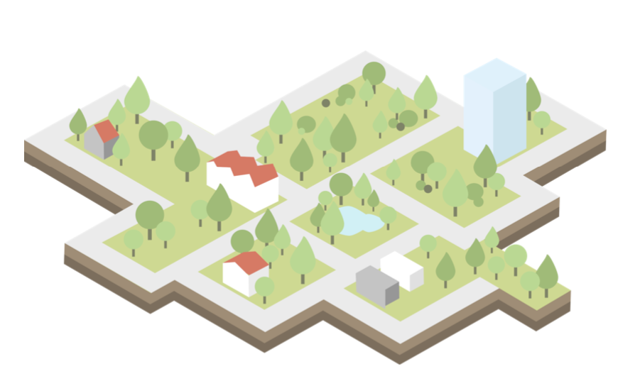
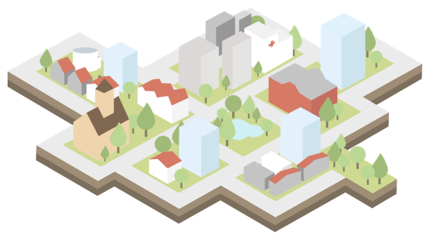
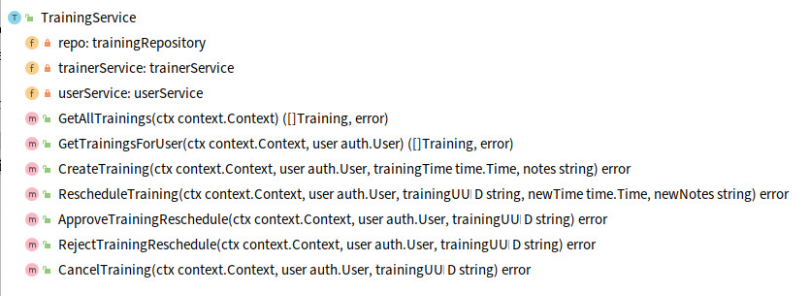
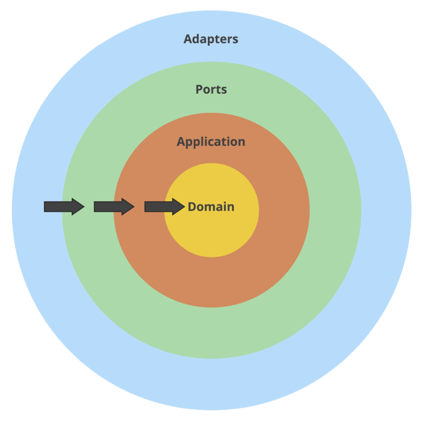

## Combining DDD, CQRS, and Clean Architecture

Robert Laszczak

In the previous chapters, we introduced techniques like DDD Lite, CQRS, and Clean Architecture. Even if using them alone
is beneficial, they work the best together. Like Power Rangers. Unfortunately, it is not easy to use them together in a
real project.
**In this chapter, we will show how to connect DDD Lite, CQRS, and Clean Architecture in the most pragmatic and efficient
way.**

### Why should I care?

Working on a programming project is similar to planning and building a residential district. If you know that the
district will be expanding in the near future, you need to keep space for future improvements. Even if at the beginning
it may look like a waste of space. You should keep space for future facilities like residential blocks, hospitals, and
temples.
**Without that, you will be forced to destroy buildings and streets to make space for new buildings.**
It’s much better to think about that earlier.



<center>Figure 11.1: Empty district</center>


The situation is the same with the code. If you know that the project will be developed for longer than 1 month, you
should keep the long term in mind from the beginning.
**You need to create your code in a way that will not block your future work. Even if at the beginning it may look like
over-engineering and a lot of extra boilerplate, you need to keep in mind the long term.**

It doesn’t mean that you need to plan every feature that you will implement in the future – it’s actually the opposite
one. This approach helps to adapt to new requirements or changing understanding of our domain. Big up front design is
not needed here. It’s critical in current times, when the world is changing really fast and who can’t adapt to these
changes can get simply out of business.



<center>Figure 11.2: Full district</center>

**This is exactly what these patterns give you when they are combined – the ability to keep constant development speed.
Without destroying and touching existing code too much.**

Does it require more thinking and planning? Is it a more challenging way? Do you need to have extra knowledge to do
that? Sure!
**But the long term result is worth that!**
Fortunately, you are in the right place to learn that.

But let’s leave the theory behind us. Let’s go to the code. In this chapter, we will skip reasonings for our design
choices. We described these already in the previous chapters. If you did not read them yet, I recommend doing it – you
will understand this chapter better.

Like in previous chapters, we will base our code on refactoring a real open-source project. This should make the
examples more realistic and applicable to your projects.

Are you ready?

### Let’s refactor

Let’s start our refactoring with the [Domain-First](./chapter06.md) approach. We will start with introduction of
a [domain layer](./chapter09.md). Thanks to that, we will be sure that implementation details do not affect our domain
code.
**We can also put all our efforts into understanding the business problem. Not on writing boring database queries and
API endpoints.**

Domain-First approach works good for both rescue (refactoring ) and greenfield projects.

To start building my domain layer, I needed to identify what the application is actually doing. This chapter will focus
on refactoring of [trainings](https://bit.ly/3bt5spP) Wild Workouts microservice. I started with identifying use cases
handled by the application. After previous refactoring to [Clean Architecture](./chapter09.md). When I work with a messy
application, I look at RPC and HTTP endpoints to find supported use cases.

One of functionalities that I identified is the **approval of training reschedule**. In Wild Workouts, a training
reschedule approval is required if it was requested less than 24h before its date. If a reschedule is requested by the
attendee, the approval needs to be done by the trainer. When it’s requested by the trainer, it needs to be accepted by
the attendee.

```
- func (c TrainingService) ApproveTrainingReschedule(ctx context.Context, user auth.User, trainingUUID string) error {
-  return c.repo.ApproveTrainingReschedule(ctx, trainingUUID, func(training Training) (Training, error) {
-     if training.ProposedTime == nil {
-        return Training{}, errors.New("training has no proposed time")
-     }
-     if training.MoveProposedBy == nil {
-        return Training{}, errors.New("training has no MoveProposedBy")
-     }
-     if *training.MoveProposedBy == "trainer" && training.UserUUID != user.UUID {
-        return Training{}, errors.Errorf("user '%s' cannot approve reschedule of user '%s'", user.UUID, training.UserUUID)
-     }
-     if *training.MoveProposedBy == user.Role {
-        return Training{}, errors.New("reschedule cannot be accepted by requesting person")
-     }
-
-     training.Time = *training.ProposedTime
-     training.ProposedTime = nil
-
-     return training, nil
-  })
- }
```

Source: [8d9274811559399461aa9f6bf3829316b8ddfb63 on GitHub](https://bit.ly/3udkQiV)

### Start with the domain

Even if it doesn’t look like the worst code you’ve seen in your life, functions like ApproveTrainingReschedule tend to
get more complex over time. More complex functions mean more potential bugs during future development.

It’s even more likely if we are new to the project, and we don’t have the “shaman knowledge” about it.
**You should always consider all the people who will work on the project after you, and make it resistant to be broken
accidentally by them. That will help your project to not become the legacy that everybody is afraid to touch.**
You probably hate that feeling when you are new to the project, and you are afraid to touch anything to not break the
system.

It’s not uncommon for people to change their job more often than every 2 years. That makes it even more critical for
long-term project development.

If you don’t believe that this code may become complex, I recommend checking the Git history of the worst place in the
project you work on. In most cases, that worst code started with “just a couple simple ifs”. The more complex the code
will be, the more difficult it will be to simplify it later.

**We should be sensitive to emerging complexity and try to simplify it as soon as we can.**

#### Training domain entity

During analyzing the current use cases handled by the trainings microservice, I found that they are all related to a
training. It is pretty natural to create a Training type to handle these operations.



<center>Figure 11.3: Methods of refactored TrainingService</center>

#### noun == entity

> Is it a valid approach to discover entities? Well, not really.
>
> DDD provides tools that help us to model complex domains without guessing (Strategic DDD Patterns, Aggregates). We don’t want to guess how our aggregates look like – we want to have tools to discover them. Event Storming technique is extremely useful here... but it’s a topic for an entire separate chapter.
>
> The topic is complex enough to have a couple chapters about that. And this is what we will do shortly. Does it mean that you should not use these techniques without Strategic DDD Patterns? Of course not! The current approach can be good enough for simpler projects. Unfortunately (or fortunately ), not all projects are simple.

```go
package training

// ...
type Training struct {
	uuid            string
	userUUID        string
	userName        string
	time            time.Time
	notes           string
	proposedNewTime time.Time
	moveProposedBy  UserType
	canceled        bool
}
```

Source: [training.go on GitHub](https://bit.ly/37x7Lal)

All fields are private to provide encapsulation. This is critical to meet
“[always keep a valid state in the memory](./chapter07.md)” rule from the chapter about DDD Lite.

Thanks to the validation in the constructor and encapsulated fields, we are sure that Training is always valid.
**Now, a person that doesn’t have any knowledge about the project is not able to use it in a wrong way.**

The same rule applies to any methods provided by Training.

```go
package training

func NewTraining(uuid string, userUUID string, userName string, trainingTime time.Time) (*Training, error) {
	if uuid == "" {
		return nil, errors.New("empty training uuid")
	}
	if userUUID == "" {
		return nil, errors.New("empty userUUID")
	}
	if userName == "" {
		return nil, errors.New("empty userName")
	}
	if trainingTime.IsZero() {
		return nil, errors.New("zero training time")
	}

	return &Training{
		uuid:     uuid,
		userUUID: userUUID,
		userName: userName,
		time:     trainingTime,
	}, nil
}
```

Source: [training.go on GitHub](https://bit.ly/3qEeQgP)

#### Approve reschedule in the domain layer

As described in [DDD Lite introduction](./chapter09.md), we build our domain with methods oriented on behaviours. Not on
data. Let’s model ApproveReschedule on our domain entity.

```go
package training

// ...s

func (t *Training) IsRescheduleProposed() bool {
	return !t.moveProposedBy.IsZero() && !t.proposedNewTime.IsZero()
}

var ErrNoRescheduleRequested = errors.New("no training reschedule was requested yet")

func (t *Training) ApproveReschedule(userType UserType) error {
	if !t.IsRescheduleProposed() {
		return errors.WithStack(ErrNoRescheduleRequested)
	}

	if t.moveProposedBy == userType {
		return errors.Errorf(
			"trying to approve reschedule by the same user type which proposed reschedule (%s)",
			userType.String(),
		)
	}

	t.time = t.proposedNewTime

	t.proposedNewTime = time.Time{}
	t.moveProposedBy = UserType{}

	return nil
}
```

Source: [reschedule.go on GitHub](https://bit.ly/2NLBncQ)

### Orchestrate with command

Now the application layer can be responsible only for the orchestration of the flow. There is no domain logic there.
**We hide the entire business complexity in the domain layer. This was exactly our goal.**

For getting and saving a training, we use the [Repository pattern](./chapter07.md)

```go
package command

// ...
func (h ApproveTrainingRescheduleHandler) Handle(ctx context.Context, cmd ApproveTrainingReschedule) (err error) {
	defer func() {
		logs.LogCommandExecution("ApproveTrainingReschedule", cmd, err)
	}()
	return h.repo.UpdateTraining(ctx,
		cmd.TrainingUUID,
		cmd.User,
		func(ctx context.Context, tr *training.Training) (*training.Training, error) {
			originalTrainingTime := tr.Time()
			if err := tr.ApproveReschedule(cmd.User.Type()); err != nil {
				return nil, err
			}
			err := h.trainerService.MoveTraining(ctx, tr.Time(), originalTrainingTime)
			if err != nil {
				return nil, err
			}
			return tr, nil
		},
	)
}
```

Source: [approve_training_reschedule.go on GitHub](https://bit.ly/3k8VdLo)

### Refactoring of training cancelation

Let’s now take a look at CancelTraining from TrainingService.

The domain logic is simple there: you can cancel a training up to 24h before its date. If it’s less than 24h before the
training, and you want to cancel it anyway:

- if you are the trainer, the attendee will have his training “back” plus one extra session (nobody likes to change
  plans on the same day!)
- if you are the attendee, you will lose this training

This is how the current implementation looks like:

``` shell
- func (c TrainingService) CancelTraining(ctx context.Context, user auth.User, trainingUUID string) error {
-  return c.repo.CancelTraining(ctx, trainingUUID, func(training Training) error {
-     if user.Role != "trainer" && training.UserUUID != user.UUID {
-        return errors.Errorf("user '%s' is trying to cancel training of user '%s'", user.UUID, training.UserUUID)
-     }
-
-     var trainingBalanceDelta int
-     if training.CanBeCancelled() {
-        // just give training back
-        trainingBalanceDelta = 1
-     } else {
-        if user.Role == "trainer" {
-           // 1 for cancelled training +1 fine for cancelling by trainer less than 24h before training
-           trainingBalanceDelta = 2
-        } else {
-           // fine for cancelling less than 24h before training
-           trainingBalanceDelta = 0
-        }
-     }
-
-     if trainingBalanceDelta != 0 {
-        err := c.userService.UpdateTrainingBalance(ctx, training.UserUUID, trainingBalanceDelta)
-        if err != nil {
-           return errors.Wrap(err, "unable to change trainings balance")
-        }
-     }
-
-     err := c.trainerService.CancelTraining(ctx, training.Time)
-     if err != nil {
-        return errors.Wrap(err, "unable to cancel training")
-     }
-
-     return nil
-  })
- }

```

You can see some kind of “algorithm” for calculating training balance delta during cancelation. That’s not a good sign
in the application layer.

Logic like this one should live in our domain layer.
**If you start to see some if’s related to logic in your application layer, you should think about how to move it to the
domain layer.**
It will be easier to test and re-use in other places.

It may depend on the project, but often **domain logic is pretty stable after the initial development and can live
unchanged for a long time**. It can survive moving between services, framework changes, library changes, and API
changes. Thanks to that separation, we can do all these changes in a much safer and faster way.

Let’s decompose the CancelTraining method to multiple, separated pieces. That will allow us to test and change them
independently.

First of all, we need to handle cancelation logic and marking Training as canceled.

```go
package training

func (t Training) CanBeCanceledForFree() bool {
	return t.time.Sub(time.Now()) >= time.Hour*24
}

var ErrTrainingAlreadyCanceled = errors.New("training is already canceled")

func (t *Training) Cancel() error {
	if t.IsCanceled() {
		return ErrTrainingAlreadyCanceled
	}
	t.canceled = true
	return nil
}
```

Source: [cancel.go on GitHub](https://bit.ly/3dwBaoJ)

Nothing really complicated here. That’s good!

The second part that requires moving is the “algorithm” of calculating trainings balance after cancelation. In theory,
we could put it to the Cancel() method, but IMO it would break
the [Single Responsibility Principle](https://en.wikipedia.org/wiki/Single-responsibility_principle)
and [CQS](https://en.wikipedia.org/wiki/Command%E2%80%93query_separation). And I like small functions.

But where to put it? Some object? A domain service? In some languages, like the one that starts with J and ends with
ava, it would make sense. But in Go, it’s good enough to just create a simple function.

```go
package training

// CancelBalanceDelta return trainings balance delta that should be adjusted after training cancelation.
func CancelBalanceDelta(tr Training, cancelingUserType UserType) int {
	if tr.CanBeCanceledForFree() {
		// just give training back
		return 1
	}

	switch cancelingUserType {
	case Trainer:
		// 1 for cancelled training +1 "fine" for cancelling by trainer less than 24h before training
		return 2
	case Attendee:
		// "fine" for cancelling less than 24h before training
		return 0
	default:
		panic(fmt.Sprintf("not supported user type %s", cancelingUserType))
	}
}
```

Source: [cancel_balance.go on GitHub](https://bit.ly/3pInEAN)

The code is now straightforward.
**I can imagine that I could sit with any non-technical person and go through this code to explain how it works.**

What about tests? It may be a bit controversial, but IMO tests are redundant there. Test code would replicate the
implementation of the function. Any change in the calculation algorithm will require copying the logic to the tests. I
would not write a test there, but if you will sleep better at night – why not!

#### Moving CancelTraining to command

Our domain is ready, so let’s now use it. We will do it in the same way as previously:

1. getting the entity from the repository,
2. orchestration of domain stuff,
3. calling external trainer service to cancel the training (this service is the point of truth of “trainer’s calendar”),
4. returning entity to be saved in the database.

```go
package command

// ...

func (h CancelTrainingHandler) Handle(ctx context.Context, cmd CancelTraining) (err error) {
	defer func() {
		logs.LogCommandExecution("CancelTrainingHandler", cmd, err)
	}()

	return h.repo.UpdateTraining(
		ctx,
		cmd.TrainingUUID,
		cmd.User,
		func(ctx context.Context, tr *training.Training) (*training.Training, error) {
			if err := tr.Cancel(); err != nil {
				return nil, err
			}

			if balanceDelta := training.CancelBalanceDelta(*tr, cmd.User.Type()); balanceDelta != 0 {
				err := h.userService.UpdateTrainingBalance(ctx, tr.UserUUID(), balanceDelta)
				if err != nil {
					return nil, errors.Wrap(err, "unable to change trainings balance")
				}
			}

			if err := h.trainerService.CancelTraining(ctx, tr.Time()); err != nil {
				return nil, errors.Wrap(err, "unable to cancel training")
			}

			return tr, nil
		},
	)
}
```

Source: [cancel_training.go on GitHub](https://bit.ly/3dtVKGs)

### Repository refactoring

The initial implementation of the repository was pretty tricky because of the custom method for every use case.

```
- type trainingRepository interface {
-  FindTrainingsForUser(ctx context.Context, user auth.User) ([]Training, error)
-  AllTrainings(ctx context.Context) ([]Training, error)
-  CreateTraining(ctx context.Context, training Training, createFn func() error) error
-  CancelTraining(ctx context.Context, trainingUUID string, deleteFn func(Training) error) error
-  RescheduleTraining(ctx context.Context, trainingUUID string, newTime time.Time, updateFn func(Training) (Training, error)) error
-  ApproveTrainingReschedule(ctx context.Context, trainingUUID string, updateFn func(Training) (Training, error)) error
-  RejectTrainingReschedule(ctx context.Context, trainingUUID string, updateFn func(Training) (Training, error)) error
- }
```

Thanks to introducing the training.Training entity, we can have a much simpler version, with one method for adding a new
training and one for the update.

```go
package training

// ...

type Repository interface {
	AddTraining(ctx context.Context, tr *Training) error

	GetTraining(ctx context.Context, trainingUUID string, user User) (*Training, error)

	UpdateTraining(
		ctx context.Context,
		trainingUUID string,
		user User,
		updateFn func(ctx context.Context, tr *Training) (*Training, error),
	) error
}
```

Source: [repository.go on GitHub](https://bit.ly/3dykNIy)

As in **[The Repository Pattern](./chapter07.md)** (Chapter 7), we implemented our repository using Firestore. We will
also use Firestore in the current implementation. Please keep in mind that this is an implementation detail – you can
use any database you want. In the previous chapter, we have shown example implementations using different databases.

```go
package adapters

// ...
func (r TrainingsFirestoreRepository) UpdateTraining(ctx context.Context,
	trainingUUID string,
	user training.User,
	updateFn func(ctx context.Context, tr *training.Training) (*training.Training, error), ) error {
	trainingsCollection := r.trainingsCollection()
	return r.firestoreClient.RunTransaction(ctx, func(ctx context.Context, tx *firestore.Transaction) error {
		documentRef := trainingsCollection.Doc(trainingUUID)
		firestoreTraining, err := tx.Get(documentRef)
		if err != nil {
			return errors.Wrap(err, "unable to get actual docs")
		}
		tr, err := r.unmarshalTraining(firestoreTraining)
		if err != nil {
			return err
		}
		if err := training.CanUserSeeTraining(user, *tr); err != nil {
			return err
		}
		updatedTraining, err := updateFn(ctx, tr)
		if err != nil {
			return err
		}
		return tx.Set(documentRef, r.marshalTraining(updatedTraining))
	})
}
```

Source: [trainings_firestore_repository.go on GitHub](https://bit.ly/3sfAdWi)

### Connecting everything

How to use our code now? What about our ports layer? Thanks to the refactoring that Miłosz did
in **[Clean Architecture](./chapter09.md)** (Chapter 9), our ports layer is decoupled from other layers. That’s why,
after this refactoring, it doesn’t require almost any significant changes. We just call the application command instead
of the application service.



<center>Figure 11.4: Clean/Hexagonal Architecture layers.</center>

```go
package ports

// ...
type HttpServer struct {
	app app.Application
}

// ...
func (h HttpServer) CancelTraining(w http.ResponseWriter, r *http.Request) {
	trainingUUID := r.Context().Value("trainingUUID").(string)
	user, err := newDomainUserFromAuthUser(r.Context())
	if err != nil {
		httperr.RespondWithSlugError(err, w, r)
		return
	}
	err = h.app.Commands.CancelTraining.Handle(r.Context(), command.CancelTraining{
		TrainingUUID: trainingUUID,
		User:         user,
	})
	if err != nil {
		httperr.RespondWithSlugError(err, w, r)
		return
	}
}

```

Source: [http.go on GitHub](https://bit.ly/3bpwWwD)

### How to approach such refactoring in a real project?

It may not be obvious how to do such refactoring in a real project. It’s hard to do a code review and agree on the team
level on the refactoring direction.

From my experience, the best approach is [Pair](https://en.wikipedia.org/wiki/Pair_programming)
or [Mob](https://en.wikipedia.org/wiki/Mob_programming) programming. Even if, at the beginning, you may feel that it is
a waste of time, the knowledge sharing and instant review will save a lot of time in the future. Thanks to great
knowledge sharing, you can work much faster after the initial project or refactoring phase.

In this case, you should not consider the time lost for Mob/Pair programming. You should consider the time that you may
lose because of not doing it. It will also help you finish the refactoring much faster because you will not need to wait
for the decisions. You can agree on them immediately.

Mob and pair programming also work perfectly while implementing complex, greenfield projects. Knowledge sharing is
especially important investment in that case. I’ve seen multiple times how this approach allowed to go very fast in the
project in the long term.

When you are doing refactoring, it’s also critical to agree on reasonable timeboxes. **And keep them**. You can quickly
lose your stakeholders’ trust when you spend an entire month on refactoring, and the improvement is not visible. It is
also critical to integrate and deploy your refactoring as fast as you can. Perfectly, on a daily basis (if you can do it
for non-refactoring work, I’m sure that you can do it for refactoring as well!). If your changes stay unmerged and
undeployed for a longer time, it will increase the chance of breaking functionalities. It will also block any work in
the refactored service or make changes harder to merge (it is not always possible to stop all other development around).

But when to know if the project is complex enough to use mob programming? Unfortunately, there is no magic formula for
that. But there are questions that you should ask yourself: - do we understand the domain? - do we know how to implement
that? - will it end up with a monstrous pull request that nobody will be able to review? - can we risk worse knowledge
sharing while not doing mob/pair programming?

### Summary

And we come to an end.

The entire diff for the refactoring is available on our [Wild Workouts GitHub](https://bit.ly/3udkQiV) (watch out, it’s
huge!).

I hope that after this chapter, you also see how all introduced patterns are working nicely together. If not yet, don’t
worry.
**It took me 3 years to connect all the dots.**
But it was worth the time spent. After I understood how everything is connected, I started to look at new projects in a
totally different way. It allowed me and my teams to work more efficiently in the long-term.

It is also important to mention, that as all techniques, this combination is not a silver bullet. If you are creating
project that is not complex and will be not touched any time soon after 1 month of development, probably it’s enough to
put everything to one main package. Just keep in mind, when this 1 month of development will become one year!