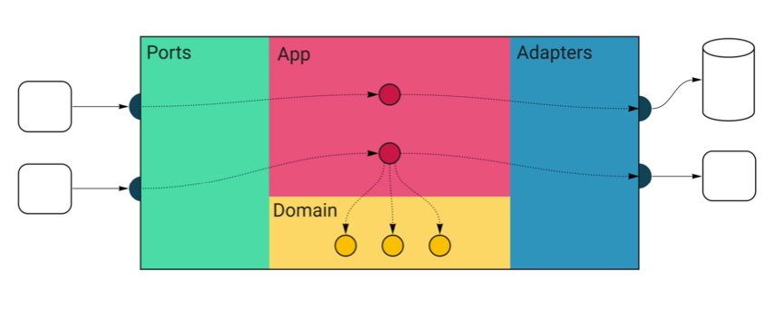
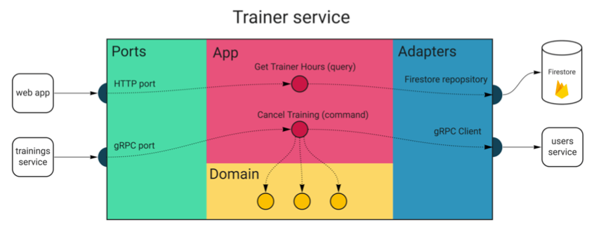
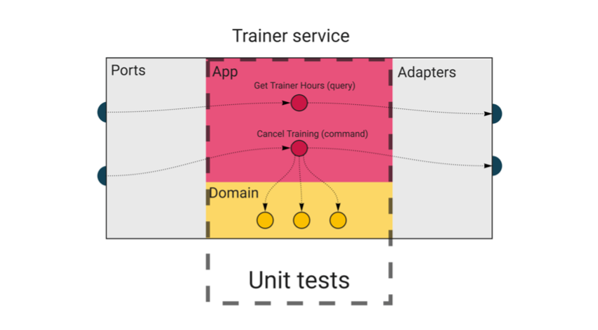
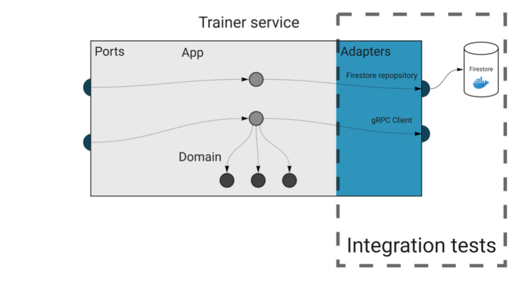
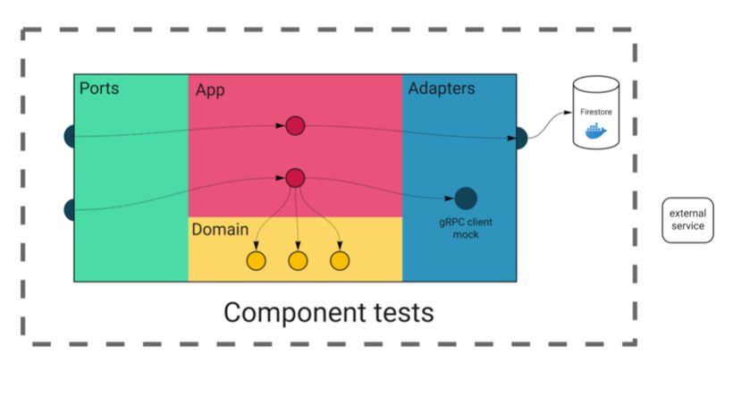
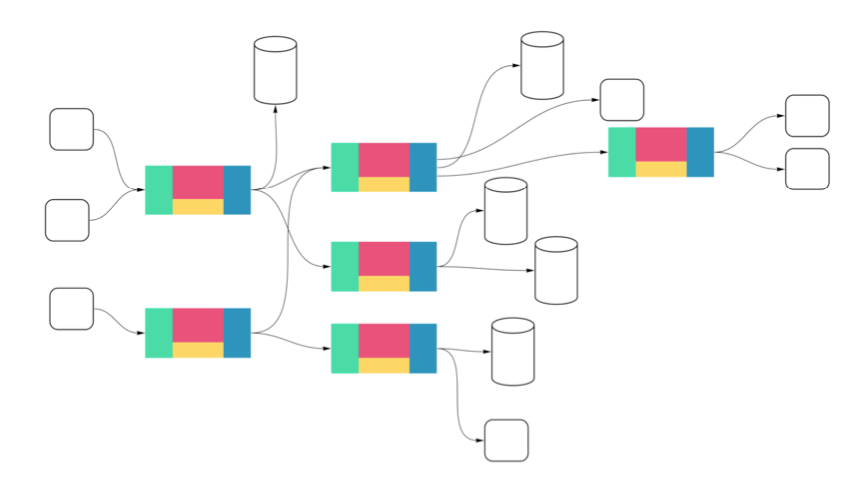
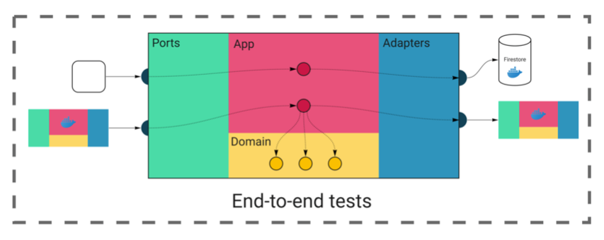
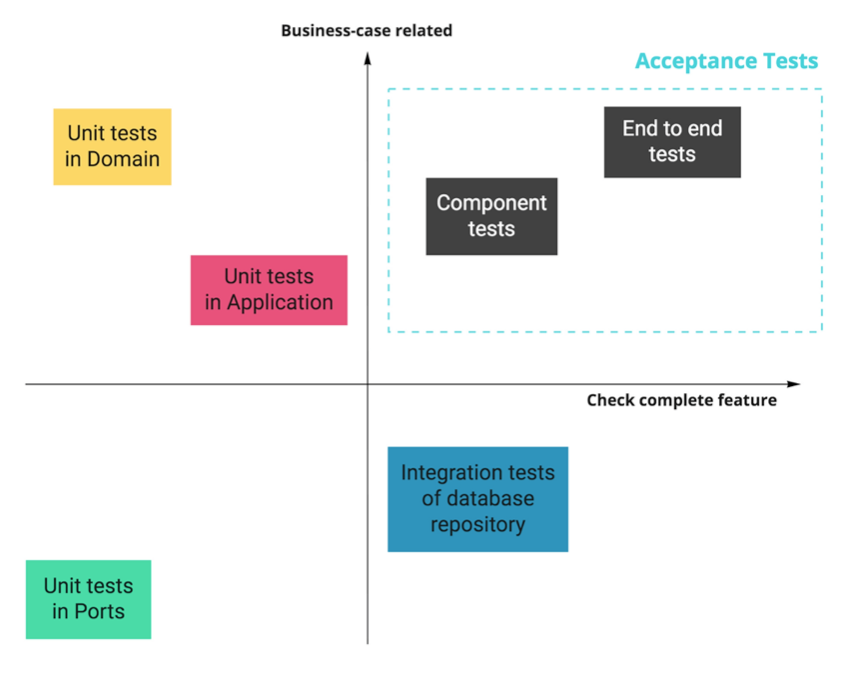

## Tests Architecture

Miłosz Smółka

Do you know the rare feeling when you develop a new application from scratch and can cover all lines with proper tests?

I said “rare” because most of the time, you will work with software with a long history, multiple contributors, and not
so obvious testing approach. Even if the code uses good patterns, the test suite doesn’t always follow.

Some projects have no modern development environment set up, so there are only unit tests for things that are easy to
test. For example, they test single functions separately because it’s hard to test the public API. The team needs to
manually verify all changes, probably on some kind of staging environment. You know what happens when someone introduces
changes and doesn’t know they need to test it manually.

Other projects have no tests from the beginning. It allows quicker development by taking shortcuts, for example, keeping
dependencies in the global state. When the team realizes the lack of tests causes bugs and slows them down, they decide
to add them. But now, it’s impossible to do it reasonably. So the team writes an end-to-end test suite with proper
infrastructure in place.

End-to-end tests might give you some confidence, but **you don’t want to maintain such a test suite.** It’s hard to
debug, takes a long time to test even the simplest change, and releasing the application takes hours. Introducing new
tests is also not trivial in this scenario, so developers avoid it if they can.

I want to introduce some ideas that have worked for us so far and should help you avoid the scenarios above.

This chapter is not about which testing library is best or what tricks you can use (although I will show a few tips).
It’s closer to something I would call “test architecture”. It’s not only about “how”, but also “where”, “what”, and
“why”.

There’s been a lot of discussion on different types of tests, for example, the
“[test pyramid](https://martinfowler.com/bliki/TestPyramid.html)” (Robert mentioned it in
**[High-Quality Database Integration Tests](./chapter08.md)** (Chapter 8)). It’s a helpful model to keep in mind.
However, it’s also abstract, and you can’t easily measure it. I want to take a more practical approach and show how to
introduce a few kinds of tests in a Go project.

### Why bother about tests?

But isn’t the test code not as important as the rest of the application? Can’t we just accept that keeping tests in good
shape is hard and move on? Wouldn’t it speed up the development?

If you’ve been following this series, you know we base all chapters on
the [Wild Workouts](https://github.com/ThreeDotsLabs/wild-workouts-go-ddd-example) application.

When I started writing this chapter, running tests locally didn’t even work correctly for me, and this is a relatively
new project. There’s one reason this happened: we’re not running tests in the CI pipeline.

It’s a shock, but it seems **even a serverless, cloud-native application using the most popular, cutting edge
technologies can be a mess in disguise.**

We know we should now add tests to the pipeline. It’s common knowledge that this gives you the confidence to deploy the
changes to production safely. However, there’s also a cost.

Running tests will likely take a significant part of your pipeline’s duration. If you don’t approach their design and
implementation with the same quality as the application code, you can realize it too late, with the pipeline taking one
hour to pass and randomly failing on you.
**Even if your application code is well designed, the tests can become a bottleneck of delivering the changes.**

### The Layers

We’re now after a few refactoring sessions of the project. We introduced patterns like [Repository](./chapter07.md).
With the solid separation of concerns, we can much easier reason about particular parts of the project.

Let’s revisit the concept of layers we’ve introduced in previous chapters. If you didn’t have a chance to read these
earlier, I recommend doing so before you continue — it’ll help you better understand this chapter.

Take a look at a diagram that will help us understand the project’s structure. Below is a generic service built with the
approach used in Wild Workouts.



All external inputs start on the left. The only entry point to the application is through the **Ports** layer (HTTP
handlers, Pub/Sub message handlers). Ports execute relevant handlers in the **App** layer. Some of these will call the
**Domain** code, and some will use **Adapters**, which are the only way out of the service. The adapters layer is where
your database queries and HTTP clients live.

The diagram below shows the layers and flow of a part of the trainer service in Wild Workouts.



Let’s now see what types of tests we would need to cover all of it.

### Unit tests

We kick off with the inner layers and something everyone is familiar with: unit tests.



The domain layer is where the most complex logic of your service lives. However, **the tests here should be some of the
simplest to write and running super fast**. There are no external dependencies in the domain, so you don’t need any
special infrastructure or mocks (except for really complex scenarios, but let’s leave that for now).

As a rule of thumb, you should aim for high test coverage in the domain layer. Make sure you test only the exported
code (_black-box testing_). Adding the _test suffix to the package name is a great practice to enforce this.

The domain code is pure logic and straightforward to test, so it’s the best place to check all corner cases.
Table-driven tests are especially great for this.

```go
package hour_test

func TestFactoryConfig_Validate(t *testing.T) {
	testCases := []struct {
		Name        string
		Config      hour.FactoryConfig
		ExpectedErr string
	}{
		{
			Name: "valid",
			Config: hour.FactoryConfig{
				MaxWeeksInTheFutureToSet: 10,
				MinUtcHour:               10,
				MaxUtcHour:               12,
			},
			ExpectedErr: "",
		},
		{
			Name: "equal_min_and_max_hour",
			Config: hour.FactoryConfig{
				MaxWeeksInTheFutureToSet: 10,
				MinUtcHour:               12,
				MaxUtcHour:               12,
			},
			ExpectedErr: "",
		},

		// ...
	}

	for _, c := range testCases {
		t.Run(c.Name, func(t *testing.T) {
			err := c.Config.Validate()

			if c.ExpectedErr != "" {
				assert.EqualError(t, err, c.ExpectedErr)
			} else {
				assert.NoError(t, err)
			}
		})
	}
}
```

Source: [hour_test.go on GitHub](https://bit.ly/2NgvXqH)

We leave the domain and enter the application layer. After introducing [CQRS](./chapter10.md), we’ve split it further
into Commands and Queries.

Depending on your project, there could be nothing to test or some complex scenarios to cover. Most of the time,
especially in queries, this code just glues together other layers. Testing this doesn’t add any value. But if there’s
any complex orchestration in commands, it’s another good case for unit tests.


> Watch out for complex logic living in the application layer. If you start testing business scenarios here, it’s worth considering introducing the domain layer.
>
> On the other hand, it’s the perfect place for orchestration — calling adapters and services in a particular order and passing the return values around. If you separate it like that, application tests should not break every time you change the domain code.
>

**There are many external dependencies in the application’s commands and queries,**
as opposed to the domain code. They will be trivial to mock if you follow Clean Architecture6. In most cases, a struct
with a single method will make a perfect mock here.

> If you prefer to use mocking libraries or code-generated mocks, you can use them as well. Go lets you define and implement small interfaces, so we choose to define the mocks ourselves, as it’s the simplest way.

The snippet below shows how an application command is created with injected mocks.

```
func newDependencies() dependencies {
    repository := &repositoryMock{}
    trainerService := &trainerServiceMock{}
    userService := &userServiceMock{}

    return dependencies{
        repository:     repository,
        trainerService: trainerService,
        userService:    userService,
        handler:        command.NewCancelTrainingHandler(repository, userService, trainerService),
    }
}

// ...

    deps := newDependencies()

    tr := tc.TrainingConstructor()
    deps.repository.Trainings = map[string]training.Training{
        trainingUUID: *tr,
    }

    err := deps.handler.Handle(context.Background(), command.CancelTraining{
        TrainingUUID: trainingUUID,
        User:         training.MustNewUser(requestingUserID, tc.UserType),
    })
```

Source: [cancel_training_test.go on GitHub](https://bit.ly/2NOwgsn)

Watch out for adding tests that don’t check anything relevant, so you don’t end up testing the mocks. Focus on the
logic, and if there’s none, skip the test altogether.

We’ve covered the two inner layers. I guess this didn’t seem novel so far, as we’re all familiar with unit tests.
However, the [Continuous Delivery Maturity Model](https://www.infoq.com/articles/Continuous-Delivery-Maturity-Model/)
lists them only on the “base” maturity level. Let’s now look into integration testing.

### Integration tests

After reading this header, did you just imagine a long-running test that you have to retry several times to pass? And
it’s because of that 30-seconds sleep someone added that turns out to be too short when Jenkins is running under load?

There’s no reason for integration tests to be slow and flaky. And practices like automatic retries and increasing sleep
times should be absolutely out of the question.

In our context,
**an integration test is a test that checks if an adapter works correctly with an external infrastructure.**
Most of the time, this means testing database repositories.

These tests are not about checking whether the database works correctly, but whether you use it correctly (the
integration part). It’s also an excellent way to verify if you know how to use the database internals, like handling
transactions.



Because we need real infrastructure,
**integration tests are more challenging than unit tests to write and maintain.**
Usually, we can use docker-compose to spin up all dependencies.

> Should we test our application with the Docker version of a database? The Docker image will almost always be slightly different than what we run on production. In some cases, like Firestore, there’s only an emulator available, not the real database.
>
> Indeed, Docker doesn’t reflect the exact infrastructure you run on production. However, you’re much more likely to mess up an SQL query in the code than to stumble on issues because of a minor configuration difference.
>
> A good practice is to pin the image version to the same as running on the production. Using Docker won’t give you 100% production parity, but it eliminates the “works on my machine” issues and tests your code with proper infrastructure.
>

Robert covered integration tests for databases in-depth in [High-Quality Database Integration Tests](./chapter08.md) (
Chapter 8).

### Keeping integration tests stable and fast

When dealing with network calls and databases, the test speed becomes super important. It’s crucial to run tests in
parallel, which can be enabled in Go by calling t.Parallel().
**It seems simple to do, but we have to make sure our tests support this behavior.**

For example, consider this trivial test scenario:

1. Check if the trainings collection is empty.
2. Call repository method that adds a training.
3. Check if there’s one training in the collection.

If another test uses the same collection, you will get random fails because of the race condition. Sometimes, the
collection will contain more than one training we’ve just added.

The simplest way out of this is never to assert things like a list length, but check it for the exact thing we’re
testing. For example, we could get all trainings, then iterate over the list to check if the expected ID is present.

Another approach is to isolate the tests somehow, so they can’t interfere with each other. For example, each test case
can work within a unique user’s context (see component tests below).

Of course, both patterns are more complex than a simple length assertion.
**When you stumble upon this issue for the first time, it may be tempting to give up and decide that “our integration
tests don’t need to run in parallel”. Don’t do this.**
You will need to get creative sometimes, but it’s not that much effort in the end. In return, your integration tests
will be stable and running as fast as unit tests.

If you find yourself creating a new database before each run, it’s another sign that you could rework tests to not
interfere with each other.

#### Warning! A common, hard-to-spot, gotcha when iterating test cases

When working with table-driven tests, you’ll often see code like this:

```
for _, c := range testCases { 
        t.Run(c.Name, func(t *testing.T) {
                // ...
        }) 
}
```

It’s an idiomatic way to run tests over a slice of test cases. Let’s say you now want to run each test case in parallel.
The solution seems trivial:

```
for _, c := range testCases { 
        t.Run(c.Name, func(t *testing.T) {
                t.Parallel()
                // ...
        }) 
}
```

Sadly, this won’t work as expected.

[The Common Mistakes](https://github.com/golang/go/wiki/CommonMistakes) page on Go’s GitHub wiki lists just two items,
and both are actually about the same thing. So it seems there’s only one mistake you should worry about in Go. However,
this one is really hard to spot sometimes.

It’s not obvious initially, but adding the parallel switch makes the parent test function not wait for the subtests
spawned by t.Run. Because of this, you can’t safely use the c loop variable inside the func closure. Running the tests
like this will usually cause all subtests to work with the last test case, ignoring all others.
**The worst part is the tests will pass, and you will see correct subtest names when running go test with the -v flag.**
The only way to notice this issue is to change the code expecting tests to fail and see them pass instead.

As mentioned in the wiki, one way to fix this is to introduce a new scoped variable:

```
for _, c := range testCases { 
        c := c
        t.Run(c.Name, func(t *testing.T) { 
            t.Parallel()
            // ...
        })
}
```

It’s just a matter of taste, but we don’t like this approach, as it looks like some magic spell to anyone who doesn’t
know what this means. Instead, we choose the more verbose but obvious approach:

```
for i := range testCases { 
    c := testCases[i]
    t.Run(c.Name, func(t *testing.T) { 
          t.Parallel()
          // ...
    }) 
}
```

Even if you know about this behavior, it’s dangerously easy to misuse it. What’s worse, it seems that popular linters
don’t check this by default — if you know of a linter that does it well, please share in the comments. We made this
mistake in the [Watermill](https://github.com/ThreeDotsLabs/watermill) library, which caused some of the tests not to
run at all. You can
see [the fix in this commit](https://github.com/ThreeDotsLabs/watermill/commit/c72e26a67cb763ab3dd93ecf57a2b298fc81dd19)
.

We covered the database repository with tests, but we also have a gRPC client adapter. How should we test this one?

It’s similar to the application layer in this regard. If your test would duplicate the code it checks, it probably makes
no sense to add it. It just becomes additional work when changing the code.

Let’s consider the users service gRPC adapter:

```
func (s UsersGrpc) UpdateTrainingBalance(ctx context.Context, userID string, amountChange int) error {
    _, err := s.client.UpdateTrainingBalance(ctx, &users.UpdateTrainingBalanceRequest{
        UserId:       userID,
        AmountChange: int64(amountChange),
    })
    return err 
}
```

Source: [users_grpc.go on GitHub](https://bit.ly/2OXVTaY)

There’s nothing interesting to test here. We could inject a mock client and check whether a proper method has been
called. But this won’t verify anything, and each change in the code will require a corresponding change in the test.

### Component tests

So far, we’ve created mostly narrow, specialized tests for isolated parts of the application. Such tests work great for
checking corner cases and specific scenarios,
**but it doesn’t mean each service works correctly.**
It’s easy enough to forget to call an application handler from a port. Also, unit tests alone won’t help us make sure
the application still works after a major refactoring.

Is it now the time to run end-to-end tests across all our services? Not yet.

s there is no standard of calling test types, I encourage you to follow Simon Stewart’s advice from
his [Test Sizes post](https://testing.googleblog.com/2010/12/test-sizes.html). Create a table that will make it obvious
for everyone on the team what to expect from a particular test. You can then cut all (unproductive) discussions on the
topic.

In our case, the table could look like this:

| Feature                   | Unit                       | Integration  | Component        | End-to-End |
|---------------------------|----------------------------|--------------|------------------|------------|
| Docker database           | No                         | Yes          | Yes              | Yes        |
| Use external systems      | No                         | No           | No               | Yes        |
| Focused on business cases | Depends on the tested code | No           | Yes              | Yes        |
| Used mocks                | Most dependencies          | Usually none | External systems | None       |
| Tested API                | Go package                 | Go package   | HTTP and gRPC    | HTTP       |

To ensure each service works correctly internally,
**we introduce component tests to check all layers working together.**
A component test covers a single service, isolated from other services in the application.

We will call real port handlers and use the infrastructure provided by Docker. However, we will
**mock all adapters reaching external services.**



You might be wondering, why not test external services as well? After all, we could use Docker containers and test all
of them together.

The issue is the complexity of testing several connected services. If you have just a couple of them, that can work well
enough. But remember, you need to have the proper infrastructure in place for each service you spin up, including all
databases it uses and all external services it calls. It can easily be tens of services in total, usually owned by
multiple teams.



<center>Figure 12.1: You don’t want this as your primary testing approach.</center>

We’ll come to this next in end-to-end tests. But for now, we add component tests because we need a fast way to know if a
service works correctly.

To better understand why it’s essential to have component tests in place, I suggest looking at some quotes
from [Accelerate](https://itrevolution.com/book/accelerate/) .

> If you haven’t heard about Accelerate yet, it’s a book describing research on high-performing software teams. I recommend reading it to learn what can help your team get up to speed.

According to the book, this is what the best software teams said about testability.

> We can do most of our testing without requiring an integrated environment. We can and do deploy or release our application independently of other applications/services it depends on.
>
> Accelerate (https://itrevolution.com/book/accelerate/)
>


Wait, weren’t microservices supposed to fix teams being dependent on each other? If you think it’s impossible to achieve
this in the application you work on, it’s likely because of poor architecture choices. You can fix it by applying
strategic DDD patterns that we plan to introduce in future chapters.

Accelerate follows up with:

> Unfortunately, in real life, many so-called service-oriented architectures don’t permit testing and deploy- ing services independently of each other, and thus will not enable teams to achieve higher performance.
>
> Accelerate (https://itrevolution.com/book/accelerate/)
>

We raise this point through the series:
**using microservices doesn’t make your application and teams less coupled by itself. Decoupling takes a conscious
design of the application’s architecture and at the system level.**

**In component tests, our goal is to check the completeness of a single service in isolation, with all infrastructure it
needs.**
We make sure the service accepts the API we agreed on and responds with expected results.

These tests are more challenging technically, but still relatively straightforward. We won’t be running a real service
binary because we need to mock some dependencies. We have to modify the way we start the service to make it possible.

> Once again, if you follow the Dependency Inversion Principle (just a reminder, it’s part of SOLID), injecting mocks at the service level should be trivial.


I’ve introduced two constructors for our app.Application struct, which holds all commands and queries. The first one
works just like before, setting up real gRPC clients and injecting them. The second replaces them with mocks.

```
func NewApplication(ctx context.Context) (app.Application, func()) { 
    // ...
    trainerGrpc := adapters.NewTrainerGrpc(trainerClient)
    usersGrpc := adapters.NewUsersGrpc(usersClient)
    return newApplication(ctx, trainerGrpc, usersGrpc),
    // ...
}

func NewComponentTestApplication(ctx context.Context) app.Application {
    return newApplication(ctx, TrainerServiceMock{}, UserServiceMock{})
}
```

Source: [service.go on GitHub](https://bit.ly/2Zzy0Zl)

We can now simply run the service in a separate goroutine.

We want to run just a single service instance for all tests, so we use the TestMain function. It’s a simple way to
insert a setup before running tests.

```go
package service

func startService() bool {
	app := NewComponentTestApplication(context.Background())
	trainingsHTTPAddr := os.Getenv("TRAININGS_HTTP_ADDR")
	go server.RunHTTPServerOnAddr(trainingsHTTPAddr, func(router chi.Router) http.Handler {
		return ports.HandlerFromMux(ports.NewHttpServer(app), router)
	})
	ok := tests.WaitForPort(trainingsHTTPAddr)
	if !ok {
		log.Println("Timed out waiting for trainings HTTP to come up")
	}
	return ok
}

func TestMain(m *testing.M) {
	if !startService() {
		os.Exit(1)
	}
	os.Exit(m.Run())
}

```

Source: [component_test.go on GitHub](https://bit.ly/3uidFpt)

I’ve created the WaitForPort helper function that waits until the specified port is open or times out. It’s crucial, as
you need to ensure that the service has properly started. **Don’t replace it with sleeps.** You will either add too much
delay and make the test slow or make it too short, and it will fail randomly.

What to test in component tests?
**Usually, the happy path should be enough. Don’t check for corner cases there. Unit and integration tests should
already cover these.**
Make sure the correct payloads are processed, the storage works, and responses are correct.

#### Calling the ports

I use HTTP clients generated by openapi-codegen. Similar to the server part, this makes writing tests much easier. For
example, you don’t need to specify the whole REST path and worry about marshaling JSON each time.

Even though the generated clients save us a lot of boilerplate, I’ve still added the tests/client.go file with client
wrappers for test purposes.

```go
package tests

func (c TrainingsHTTPClient) CreateTraining(t *testing.T, note string, hour time.Time) string {
	response, err := c.client.CreateTrainingWithResponse(context.Background(), trainings.CreateTrainingJSONRequestBody{
		Notes: note,
		Time:  hour,
	})
	require.NoError(t, err)
	require.Equal(t, http.StatusNoContent, response.StatusCode())

	contentLocation := response.HTTPResponse.Header.Get("content-location")

	return lastPathElement(contentLocation)
}
```

Source: [clients.go on GitHub](https://bit.ly/2ZznyB3)

The tests become even more readable, and it’s easy to understand what’s going on.
**Making tests pass is easy enough, but it’s much harder to understand them in a code review, reading between all
asserts and mocks.**
It’s twice as important when modifying tests.

Instead of the snippet above, we can now use a single line that clearly states what’s happening.

```
trainingUUID := client.CreateTraining(t, "some note", hour)
```

Source: [component_test.go on GitHub]()

Other helper methods are `FakeAttendeeJWT` and `FakeTrainerJWT`. They generate valid authorization tokens with the
chosen role.

As gRPC uses structs generated from protobuf, the clients are already straightforward to use.

### End-to-end tests

Finally, we come to the most dreaded part of our test suite. We will now leave all mocks behind.

**End-to-end tests verify your whole system working together. They are slow, error-prone, and hard to maintain.**
You still need them, but make sure you build them well.

In Wild Workouts, it will be similar to running component tests, except we’re going to spin up all services inside the
docker-compose. We’ll then verify a few critical paths calling just the HTTP endpoints, as this is what we expose to the
external world.

> If you can’t run the entire platform on docker-compose, you need to find a similar approach. It could be a separate Kubernetes cluster or namespace if you’re already using it, or some kind of staging environment.
>



Now comes the part where you’re going to have more questions than answers. Where should you keep end-to-end tests? Which
team should own it? Where to run them? How often? Should they be part of the CI/CD pipeline or a separate thing ran from
a cronjob?

I can’t give you clear answers, as this heavily depends on your teams’ structure, organizational culture, and CI/CD
setup. As with most challenges, try an approach that seems the best and iterate over it until you’re happy.

We’re lucky to have just three services for the entire application, all using the same database. As the number of
services and dependencies grows, your application will become harder to test this way.

Try to keep end-to-end tests short. **They should test if services correctly connect together, not the logic inside
them.** These tests work as a double-check. They shouldn’t fail most of the time, and if they do, it usually means
someone has broken the contract.

> I said we’ll use just HTTP endpoints, as this is what is exposed publicly. There’s one exception: we’re calling users service by gRPC to add trainings balance for our test attendee. As you would expect, this endpoint is not accessible to the public.
>

I said we’ll use just HTTP endpoints, as this is what is exposed publicly. There’s one exception: we’re calling users
service by gRPC to add trainings balance for our test attendee. As you would expect, this endpoint is not accessible to
the public.

```
user := usersHTTPClient.GetCurrentUser(t)
originalBalance := user.Balance
_, err = usersGrpcClient.UpdateTrainingBalance(context.Background(), &users.UpdateTrainingBalanceRequest{
    UserId:       userID,
    AmountChange: 1,
})
require.NoError(t, err)
user = usersHTTPClient.GetCurrentUser(t)
require.Equal(t, originalBalance+1, user.Balance, "Attendee's balance should be updated")
trainingUUID := trainingsHTTPClient.CreateTraining(t, "some note", hour)
trainingsResponse := trainingsHTTPClient.GetTrainings(t)
require.Len(t, trainingsResponse.Trainings, 1)
require.Equal(t, trainingUUID, trainingsResponse.Trainings[0].Uuid, "Attendee should see the training")
user = usersHTTPClient.GetCurrentUser(t)
require.Equal(t, originalBalance, user.Balance, "Attendee's balance should be updated after a training is scheduled")
```

Source: [e2e_test.go on GitHub](https://bit.ly/3uhiGPc)

### Acceptance tests

You can often find acceptance tests defined as the next level after unit and integration tests. We see them as
orthogonal to the technical aspects of tests. It’s a test that focuses on a complete business feature instead of
implementation details. As Martin Fowler puts it:

> Here’s the thing: At one point you should make sure to test that your software works correctly from a user’s perspective, not just from a technical perspective. What you call these tests is really not that important. Having these tests, however, is. Pick a term, stick to it, and write those tests.
>
> Acceptance Tests — Do Your Features Work Correctly? (https://martinfowler.com/articles/practical-test-pyramid.html)


In our case, component tests and end-to-end tests can both be considered acceptance tests.

If you like, you can use the [BDD](https://en.wikipedia.org/wiki/Behavior-driven_development) style for some of them —
it makes them easier to read but adds some boilerplate.



### Can we sleep well now?

> A service is not really tested until we break it in production.
>
> Jesse Robbins, according to The DevOps Handbook (https://itrevolution.com/the-devops-handbook/)

A reliable test suite will catch most of your bugs so that you can deliver consistently. But you want to be ready for
outages anyway. We now enter the topic of monitoring, observability, and chaos engineering. However, this is not in the
scope for today.

Just keep in mind that no test suite will give you total confidence. It’s also crucial to have a straightforward process
in place that allows quick rollbacks, reverts, and undoing migrations.

### Moving on

If you look through the [full commit](https://bit.ly/2Mj1vM2), you might notice how we inject dependencies now is not
very elegant. We’re going to iterate over this in the future.

We have the test suite in place, but we still miss a critical part: it’s not running in our Continuous Integration
pipeline.

Also, coming up with proper docker-compose and environment variables for tests wasn’t trivial. The current solution
works but is not straightforward to understand if you don’t know what’s going on. And running the tests in an automated
build will only make it more complicated.

We will cover these topics in future chapters.
