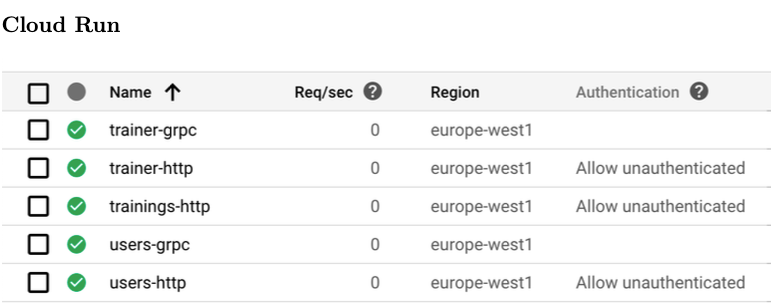
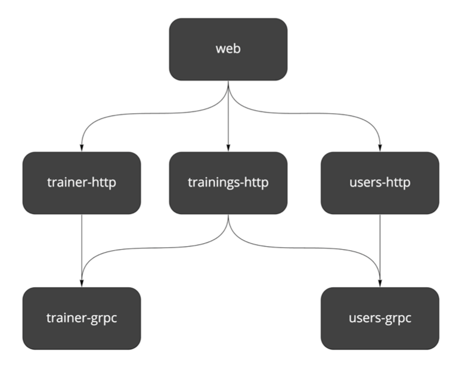
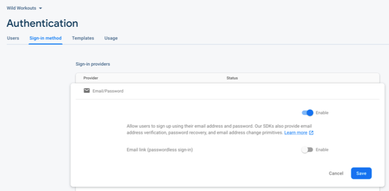

## Setting up infrastructure with Terraform

Miłosz Smółka

We picked **Google Cloud Platform (GCP)** as the provider of all infrastructure parts of the project. We use **Cloud
Run** for running Go services, **Firestore** as the database, **Cloud Build** as CI/CD, and **Firebase** for web hosting
and authentication. The project is based on [Terraform](https://www.terraform.io/).

### Infrastructure as Code

If you’re not familiar with Terraform at all, it’s a tool for keeping infrastructure configuration as text files. This
technique is also known as “Infrastructure as Code”. It’s a broad topic, so I’ll mention just a few benefits:

- **Storing infrastructure configuration in a repository.**  This gives you all benefits that come with version control,
  like the history of commits, one source of truth, and code reviews.
- **Consistency over time.** Ideally, there are no manual changes to infrastructure other than those described in the
  configuration.
- **Multiple environments.**  When you stop treating your servers as pets, it’s much easier to create identical
  environments, sometimes even on demand.

### Terraform 101

_You can skip this part if you already know Terraform basics._

In Terraform, you define a set of **resources** in .tf files using [**HCL**](https://github.com/hashicorp/hcl) syntax. A
resource can be a database, network configuration, compute instance, or even a set of permissions. Available resource
types depend on the used provider (e.g., AWS, GCP, Digital Ocean).

All resources are defined in a **declarative** way. You don’t write pseudocode that creates servers. Instead, you define
the desired outcome. It’s up to Terraform to come up with a way to configure what you specified. For example, it’s smart
enough to create a resource only if it doesn’t exist.

Resources can refer to each other using the full name.

Besides resources, a project can also specify **input variables** to be filled by user and **output values**, that can
be printed on the screen or stored in a file.

There are also **data sources** that don’t create anything but read existing remote resources.

You can find all the available resources in the specific provider documentation. Here’s an example
for [Google Cloud Platform](https://www.terraform.io/docs/providers/google/index.html) .

Two basic commands that you need to know are terraform plan and terraform apply.

apply applies all resources defined in the current directory in all files with .tf extension. The plan command is a
“dry-run” mode, printing out all changes that would be applied by apply.

After applying changes, you will find a terraform.tfstate file in the same directory. This file holds a local “state4”
of your infrastructure.

### Google Cloud Project

Our Terraform configuration creates a new GCP project. It’s completely separated from your other projects and is easy to
clean up.

Because some resources go beyond the free trier, you need to have a Billing Account. It can be an account with a linked
credit card, but the $300 credit for new accounts is also fine.

The basic part of the project definition looks like this:

```tf
provider "google" {
  project = var.project
  region  = var.region
}

data "google_billing_account" "account" {
  display_name = var.billing_account
}

resource "google_project" "project" {
  name            = "Wild Workouts"
  project_id      = var.project
  billing_account = data.google_billing_account.account.id
}

resource "google_project_iam_member" "owner" {
  role    = "roles/owner"
  member  = "user:${var.user}"

  depends_on = [google_project.project]
}
```

Source: [project.tf on GitHub](https://bit.ly/2OM8w8P)

Let’s consider what each block does:

1. Enables the GCP provider. Sets **project** name and chosen **region** from variables. These two fields are
   “inherited” by all resources unless overridden.
2. Finds a billing account with the display name provided by the variable.
3. Creates a new google project linked with the billing account. **Note the reference to the account ID**.
4. Adds your user as the owner of the project. **Note the string interpolation**.

### Enabling APIs

On a fresh GCP project, you can’t use most services right away. You have to first enable the API for each of them. You
can enable an API by clicking a button in the GCP Console, or do the same
in [Terraform](https://www.terraform.io/docs/providers/google/r/google_project_service.html):

```
resource "google_project_service" "compute" {
  service    = "[compute.googleapis.com](http://compute.googleapis.com/)"
  depends_on = [google_project.project]
}
```

Source: [project.tf on GitHub](https://bit.ly/3qJjLNu)

We enable the following APIs:

* Cloud Source Repositories
* Cloud Build
* Container Registry
* Compute
* Cloud Run
* Firebase
* Firestore

#### A note on dependencies

If you’re wondering about the depends_on line, it’s there to set an explicit dependency between the service and the
project. Terraform detects dependencies between resources if they refer to each other. In the first snippet, you can see
this with billing account that’s referenced by the project:

```
data "google_billing_account" "account" {
  display_name = var.billing_account
}
resource "google_project" "project" {
  # ...
  billing_account = data.google_billing_account.account.id
}
```

In the google_project_service resource, we don’t use project anywhere, because it’s already set in the provider block.
Instead, we use depends_on to specify explicit dependency. This line tells Terraform to wait with creating the resource
until the project is correctly created.

### Cloud Run



<center>Figure 14.1: Cloud Run services</center>


In Cloud Run, a service is a set of Docker containers with a common endpoint, exposing a single port (HTTP or gRPC).
Each service is automatically scaled, depending on the incoming traffic. You can choose the maximum number of containers
and how many requests each container can handle.

It’s also possible to connect services with Google Cloud Pub/Sub. Our project doesn’t use it yet, but we will introduce
it in the future versions.

You are charged only for the computing resources you use, so when a request is being processed or when the container
starts.

Wild Workouts consists of 3 services: `trainer`, `trainings`, and `users`. We decided to serve public API with HTTP and
internal API with gRPC.



<center>Figure 14.2: Services</center>

Because you can’t have two separate ports exposed from a single service, we have to expose two containers per service (
except trainings, which doesn’t have internal API at the moment).

We deploy 5 services in total, each with a similar configuration. Following the [**
DRY**](https://en.wikipedia.org/wiki/Don%27t_repeat_yourself) principle, the common Terraform configuration is
encapsulated in the [service module](https://bit.ly/3aJee3R).

> A [Module](https://www.terraform.io/docs/configuration/modules.html) in Terraform is a separate set of files in a subdirectory. Think of it as a container for a group of resources. It can have its input variables and output values.
>
> Any module can call other modules by using the module block and passing a path to the directory in the source field. A single module can be called multiple times.
>
> Resources defined in the main working directory are considered to be in a _root module_.
>

The module holds a definition of a single generic Cloud Run service and is used multiple times in cloud-run.tf. It
exposes several variables, e.g., name and type of the server (HTTP or gRPC).

A service exposing gRPC is the simpler one:

```
module cloud_run_trainer_grpc {
  source = "./service"
  project    = var.project
  location   = var.region
  dependency = null_resource.init_docker_images
  name     = "trainer"
  protocol = "grpc"
}
```

Source: [cloud-run.tf on GitHub](https://bit.ly/3dwBuUt)

The protocol is passed to the `SERVER_TO_RUN` environment variable, which decides what server is run by the service.

Compare this with an HTTP service definition. We use the same module, and there are additional environment variables
defined. We need to add them because public services contact internal services via the gRPC API and need to know their
addresses.

```
module cloud_run_trainings_http {
  source = "./service"

  project    = var.project
  location   = var.region
  dependency = null_resource.init_docker_images

  name     = "trainings"
  protocol = "http"
  auth     = false

  envs = [
    {
      name = "TRAINER_GRPC_ADDR"
      value = module.cloud_run_trainer_grpc.endpoint
    },
    {
      name  = "USERS_GRPC_ADDR"
      value = module.cloud_run_users_grpc.endpoint
    }
  ]
}
```

Source: [cloud-run.tf on GitHub](https://bit.ly/3btsm0e)

The reference: module.cloud_run_trainer_grpc.endpoint points to endpoint output defined in the service module:

```
output endpoint {
  value = "${trimprefix(google_cloud_run_service.service.status[0].url, "https://")}:443"
}
```

Source: [outputs.tf on GitHub](https://bit.ly/3udkNDL)

Using environment variables is an easy way to make services know each other. It would probably be best to implement some
kind of service discovery with more complex connections and more services. Perhaps we will cover this in another chapter
in the future.

If you’re curious about the dependency variable see In-depth down below for details.

### Cloud Run Permissions

Cloud Run services have authentication enabled by default. Setting the auth = false variable in the service module adds
additional IAM policy for the service, making it accessible for the public. We do this just for the HTTP APIs.

```
data "google_iam_policy" "noauth" {
  binding {
    role = "roles/run.invoker"
    members = [
      "allUsers",
    ]
  }
}

resource "google_cloud_run_service_iam_policy" "noauth_policy" {
  count = var.auth ? 0 : 1

  location = google_cloud_run_service.service.location
  service  = google_cloud_run_service.service.name

  policy_data = data.google_iam_policy.noauth.policy_data
}
```

Source: [service.tf on GitHub](https://bit.ly/3sq0aCD)

Note the following line:

```
count = var.auth ? 0 : 1
```

This line is Terraform’s way of making an if statement. count defines how many copies of a resource Terraform should
create. It skips resources with count equal 0.

### Firestore

We picked Firestore as the database for Wild Workouts. See our [first post](./chapter02.md) for reasons behind this.

Firestore works in two modes - Native or Datastore. You have to decide early on, as the choice is permanent after your
first write to the database.

You can pick the mode in GCP Console GUI, but we wanted to make the setup fully automated. In Terraform, there’s
google_project_service resource available, but it enables the Datastore mode. Sadly, we can’t use it, since we’d like to
use the Native mode.

A workaround is to use the gcloud command to enable it (note the alpha version).

```shell
gcloud alpha firestore databases create
```

To run this command, we use the [null resource](https://www.terraform.io/docs/providers/null/resource.html). It’s a
special kind of resource that lets you run custom provisioners locally or on remote servers.
A [provisioner](https://www.terraform.io/docs/provisioners/index.html) is a command or other software making changes in
the system.

We use [local-exec provisioner](https://www.terraform.io/docs/provisioners/local-exec.html), which is simply executing a
bash command on the local system. In our case, it’s one of the targets defined in `Makefile`.

```
resource "null_resource" "enable_firestore" {
  provisioner "local-exec" {
    command = "make firestore"
  }

  depends_on = [google_firebase_project_location.default]
}
```

Source: [firestore.tf on GitHub](https://bit.ly/2ZznMYV)

Firestore requires creating all composite indexes upfront. It’s also available as
a [Terraform resource](https://www.terraform.io/docs/providers/google/r/firestore_index.html).

```
resource "google_firestore_index" "trainings_user_time" {
  collection = "trainings"
  fields {
    field_path = "UserUuid"
    order      = "ASCENDING"
}
  fields {
    field_path = "Time"
    order      = "ASCENDING"
}
  fields {
    field_path = "__name__"
    order      = "ASCENDING"
}
  depends_on = [null_resource.enable_firestore]
}
```

Source: [firestore.tf on GitHub](https://bit.ly/3qE9iD9)

### Firebase

Firebase provides us with frontend application hosting and authentication.

Currently, Terraform supports only part of Firebase API, and some of it is still in beta. That’s why we need to enable
the google-beta provider:

```
provider "google-beta" {
  project     = var.project
  region      = var.region
  credentials = base64decode(google_service_account_key.firebase_key.private_key)
}
```

Source: [firebase.tf on GitHub](https://bit.ly/37zdkVB)

Then we define the project, [project’s location](https://bit.ly/37zdkVB) and the web application.

```
resource "google_firebase_project" "default" {
  provider = google-beta
  
  depends_on = [
    google_project_service.firebase,
    google_project_iam_member.service_account_firebase_admin,
  ] 
}
resource "google_firebase_project_location" "default" {
  provider = google-beta

  location_id = var.firebase_location

  depends_on = [
    google_firebase_project.default,
  ]
}

resource "google_firebase_web_app" "wild_workouts" {
  provider     = google-beta
  display_name = "Wild Workouts"

  depends_on = [google_firebase_project.default]
}

```

Source: [firebase.tf on GitHub](https://bit.ly/3bowwqm)

Authentication management still misses a Terraform API, so you have to enable it manually in
the [Firebase Console](https://console.firebase.google.com/project/_/authentication/providers). Firebase authentication
is the only thing we found no way to automate.



### Firebase Routing

Firebase also handles public routing to services. Thanks to this the frontend application can call API with
`/api/trainer` instead
of [`https://trainer-http-smned2eqeq-ew.a.run.app`](https://trainer-grpc-lmned2eqeq-ew.a.run.app/). `web/firebase.json`.

``` 
"rewrites": [ 
    {
      "source": "/api/trainer{,/**}",
      "run": {
        "serviceId": "trainer-http",
        "region": "europe-west1"
      }
    },
    // ...
]
```

Source: [firebase.json on GitHub](https://bit.ly/37wRbYf)

### Cloud Build

Cloud Build is our Continuous Delivery pipeline. It has to be enabled for a repository, so we define
a [trigger](https://www.terraform.io/docs/providers/google/r/cloudbuild_trigger.html) in Terraform and
the [repository](https://www.terraform.io/docs/providers/google/r/cloudbuild_trigger.html) itself.

```
resource "google_sourcerepo_repository" "wild_workouts" {
  name = var.repository_name
  depends_on = [
    google_project_service.source_repo,
  ]
 }
resource "google_cloudbuild_trigger" "trigger" {
  trigger_template {
    branch_name = "master"
    repo_name   =  google_sourcerepo_repository.wild-workouts.name
  }
  filename = "cloudbuild.yaml"
}
```

Source: [repo.tf on GitHub](https://bit.ly/3k6hGZo)

The build configuration has to be defined in the [cloudbuild.yaml](https://bit.ly/3umPOoK) file committed to the
repository. We defined a couple of steps in the pipeline:

- Linting (go vet) - this step could be extended in future with running tests and all kinds of static checks and linters
- Building docker images
- Deploying docker images to Cloud Run
- Deploying web app to Firebase hosting

We keep several services in one repository, and their building and deployment are almost the same. To reduce repetition,
there are a few helper bash scripts in the [scripts](https://bit.ly/3dGyiWv) directory.

> #### Should I use a monorepo?
> We decided to keep all services in one repository. We did this mainly because Wild Workouts is an example project, and it’s much easier to set up everything this way. We can also easily share the common code (e.g., setting up gRPC and HTTP servers).
>
> From our experience, using a single repository is a great starting point for most projects. It’s essential, though, that all services are entirely isolated from each other. If there’s a need, we could easily split them into separate repositories. We might show this in the future chapters in this book.
>
> The biggest disadvantage of the current setup is that all services and the frontend application are deployed at the same time. That’s usually not what you want when working with microservices with a bigger team. But it’s probably acceptable when you’re just starting out and creating an MVP.
>

As usual in CI/CD tools, the [Build configuration](https://cloud.google.com/cloud-build/docs/build-config) is defined in
YAML. Let’s see the whole configuration for just one service, to reduce some noise.

```yaml
steps:
  - id: trainer-lint
    name: golang
    entrypoint: ./scripts/lint.sh
    args: [ trainer ]

  - id: trainer-docker
    name: gcr.io/cloud-builders/docker
    entrypoint: ./scripts/build-docker.sh
    args: [ "trainer", "$PROJECT_ID" ]
    waitFor: [ trainer-lint ]

  - id: trainer-http-deploy
    name: gcr.io/cloud-builders/gcloud
    entrypoint: ./scripts/deploy.sh
    args: [ trainer, http, "$PROJECT_ID" ]
    waitFor: [ trainer-docker ]

  - id: trainer-grpc-deploy
    name: gcr.io/cloud-builders/gcloud
    entrypoint: ./scripts/deploy.sh
    args: [ trainer, grpc, "$PROJECT_ID" ]
    waitFor: [ trainer-docker ]

options:
  env:
    - 'GO111MODULE=on'
  machineType: 'N1_HIGHCPU_8'

images:
  - 'gcr.io/$PROJECT_ID/trainer'

```

Source: [cloudbuild.yaml on GitHub](https://bit.ly/3uicMgI)

A single step definition is pretty short:

- **id** is a unique identifier of a step. It can be used in waitFor array to specify dependencies between steps (steps
  are running in parallel by default).
- **name** is the name of a docker image that will be run for this step.
- **entrypoint** works like in docker images, so it’s a command that is executed on the container’s start. We use bash
  scripts to make the YAML definition short, but this can be any bash command.
- **args** will be passed to entrypoint as arguments.

In options, we override the machine type to make our builds run faster. There’s also an environment variable to force
the use of go modules.

images list defines docker images that should be pushed to Container Registry. In the example above, the docker image is
built in the trainer-docker step.

### Deploys

Deploys to Cloud Run are done with the gcloud run deploy command. Cloud Build builds the docker image in the previous
step, so we can use the latest image on the registry.

```yaml
- id: trainer-http-deploy
  name: gcr.io/cloud-builders/gcloud
  entrypoint: ./scripts/deploy.sh
  args: [ trainer, http, "$PROJECT_ID" ]
  waitFor: [ trainer-docker ]
```

Source: [cloudbuild.yaml on GitHub](https://bit.ly/2OSRDtb)

```shell
gcloud run deploy "$service-$server_to_run" \
    --image "gcr.io/$project_id/$service" \
    --region europe-west1 \
    --platform managed
```

Source: [deploy.sh on GitHub](https://bit.ly/3s9lJXR)

Frontend is deployed with the `firebase` command. There’s no need to use a helper script there, as there’s just one
frontend application.

```yaml
- name: gcr.io/$PROJECT_ID/firebase
  args: [ 'deploy', '--project=$PROJECT_ID' ]
  dir: web
  waitFor: [ web-build ]
```

Source: [cloudbuild.yaml on GitHub](https://bit.ly/2ZBjCQo)

This step uses [`gcr.io/$PROJECT_ID/firebase`](http://gcr.io/$PROJECT_ID/firebase) docker image. It doesn’t exist by
default, so we use another null_resource to build it
from [cloud-builders-community](https://github.com/GoogleCloudPlatform/cloud-builders-community.git):

```
resource "null_resource" "firebase_builder" {
  provisioner "local-exec" {
    command = "make firebase_builder"
  }
  depends_on = [google_project_service.container_registry]
}
```

Source: [repo.tf on GitHub](https://github.com/GoogleCloudPlatform/cloud-builders-community.git)

### Cloud Build Permissions

All required permissions are defined in iam.tf. Cloud Build needs permissions
for [Cloud Run](https://cloud.google.com/cloud-build/docs/deploying-builds/deploy-cloud-run) (to deploy backend
services) and [Firebase](https://cloud.google.com/cloud-build/docs/deploying-builds/deploy-firebase) (to deploy frontend
application).

First of all, we define account names as local variables to make the file more readable. If you’re wondering where these
names come from, you can find them in
the [Cloud Build documentation](https://cloud.google.com/cloud-build/docs/deploying-builds/deploy-cloud-run).

```
locals {
  cloud_build_member = "serviceAccount:${google_project.project.number}@cloudbuild.gserviceaccount.com"
  compute_account    = "projects/${var.project}/serviceAccounts/${google_project.project.number}-compute@de
}
```

Source: [iam.tf on GitHub](https://bit.ly/3pG9YXb)

We then define all permissions, as described in the documentation. For example, here’s **Cloud Build member**
with **Cloud Run Admin role**:

```
resource "google_project_iam_member" "cloud_run_admin" {
  role   = "roles/run.admin"
  member = local.cloud_build_member
  depends_on = [google_project_service.cloud_build]
}
```

Source: [iam.tf on GitHub](https://bit.ly/3bi6qVK)

### Dockerfiles

We have a couple of Dockerfiles defined in the project in the [docker](https://bit.ly/3dDa7Io) directory.

- [app](https://bit.ly/3dDa7Io) - Go service image for local development. It uses reflex for hot code recompilation.
  See [our post about local Go environment](https://bit.ly/3smkjsT) to learn how it works.
- [app-prod](https://bit.ly/3keqBYR) - production image for Go services. It builds the Go binary for a given service and
  runs it.
- [web](https://bit.ly/3dIJd29) - frontend application image for local development.

### Setup

Usually, you would execute a Terraform project with terraform apply. This command applies all resources in the current
directory.

Our example is a bit more complex because it sets up the whole GCP project along with dependencies. Makefile
orchestrates the setup.

Requirements:

- `git`, `gcloud`, and `terraform` installed on your system.
- Docker
- A GCP account with a Billing Account.

### Authentication

There are two credentials that you need for the setup.

Start with logging in with `gcloud`:

```shell
gcloud auth login
```

Then you need to obtain **Application Default Credentials**:

```shell
gcloud auth application-default login
```

This stores your credentials in a well-known place, so Terraform can use it.

> #### Security warning!
> Authenticating like this is the easiest way and okay for local development, but you probably don’t want to use it in a production setup.
>
> Instead, consider creating a service account with only a subset of necessary permissions (depending on what your Terraform configuration does). You can then download the JSON key and store its path in the `GOOGLE_CLOUD_KEYFILE_JSON` environment variable.
>

### Picking a Region

During the setup, you need to pick [Cloud Run region](https://cloud.google.com/run/docs/locations)
and [Firebase location](https://cloud.google.com/run/docs/locations). These two are not the same thing (see the lists on
linked documentation).

We picked europe-west1 as the default region for Cloud Run. It’s hardcoded on the repository in two files:

- [scripts/deploy.sh](https://bit.ly/2ZFxl8K) - for deploying the Cloud Run services
- [web/firebase.json](https://bit.ly/3dyYdzv) - for routing Cloud Run public APIs

If you’re fine with the defaults, you don’t need to change anything. Just pick Firebase location that’s close, i.e.,
europe-west.

If you’d like to use another region, you need to update the files mentioned above. It’s important to commit your changes
on master before you run the setup. It’s not enough to change them locally!

### Run it!

Clone the [project repository](https://github.com/ThreeDotsLabs/wild-workouts-go-ddd-example) and enter the terraform
directory from the command line. A single make command should be enough to start. See the
included [README](https://bit.ly/3qM21AW) for more details.

> #### Billing warning!
> This project goes beyond the Google Cloud Platform free tier. You need to have a billing account to use it. You can use the $300 free credit given to new accounts or create a new account in the [Billing section](https://console.cloud.google.com/billing/create).
>
> For pricing, see [Cloud Run Pricing](https://cloud.google.com/run/pricing). The best way to estimate your project cost is to use the [official calculator](https://cloud.google.com/products/calculator) .
>

At the end of the setup, a new git remote will be added to your local repository, called google. The master branch will
be pushed to this remote, triggering your first Cloud Build.

If you’d like to make any changes to the project, you need to push to the correct origin, i.e., `git push google`. You
can also update the origin remote with git remote set-url.

> If you keep your code on GitHub, GitLab, or another platform, you can set up a mirror instead of hosting the repository on Cloud Source Repositories.
>

### In-depth

#### Env variables

All possible variables are defined in the vars.tf file. If a variable has no default value and you don’t provide it,
Terraform won’t let you apply anything.

There are several ways to supply variables for `terraform apply`. You can pass them individually with -var flag or all
at once with -var-file flag. Terraform also looks for them in `TF_VAR_name` environment variables.

We’ve picked the last option for this project. We need to use the environment variables anyway in Makefile and bash
scripts. This way, there’s just one source of truth.

Make runs `set-envs.sh` at the beginning of the setup. It’s just a helper script to ask the user for all the required
variables. These are then saved to .env file. You can edit this file manually as well.

Note Terraform does not automatically read it. It’s sourced just before running apply:

```
load_envs:=source ./.env
# ...

apply:
    ${load_envs} && terraform apply

```

Source: [Makefile on GitHub](https://bit.ly/2M7eqjU)

#### Building docker images

Because we’re setting up the project from scratch, we run into a dilemma: we need docker images in the project’s
Container Registry to create Cloud Run instances, but we can’t create the images without a project.

You could set the image name in Terraform definition to an example image and then let Cloud Build overwrite it. But then
each terraform apply would try to change them back to the original value.

Our solution is to build the images based on the “hello” image first and then deploy Cloud Run instances. Then Cloud
Build builds and deploys proper images, but the name stays the same.

```
resource "null_resource" "init_docker_images" {
  provisioner "local-exec" {
    command = "make docker_images"
  }
  depends_on = [google_project_service.container_registry]
}
```

Source: [docker-images.tf on GitHub](https://bit.ly/3qIqqaA)

Note the `depends_on` that points at Container Registry API. It ensures Terraform won’t start building images until
there’s a registry where it can push them.

#### Destroying

You can delete the entire project with make destroy. If you take a look in the Makefile, there’s something unusual
before terraform destroy:

```
terraform state rm "google_project_iam_member.owner"
terraform state rm "google_project_service.container_registry"
terraform state rm "google_project_service.cloud_run"
```

Source: [Makefile on GitHub](https://bit.ly/3bpLVGP)

These commands are a workaround
for [Terraform’s lack of a “skip destroy” feature](https://github.com/hashicorp/terraform/issues/23547). They remove
some resources from Terraform’s local state file. Terraform won’t destroy these resources (as far as it’s concerned,
they don’t exist at this point).

We don’t want to destroy the owner IAM policy, because if something goes wrong during the destroy, you will lock
yourself out of the project and won’t be able to access it.

The other two lines are related with enabled APIs — there’s a possible race condition where some resources would still
use these APIs during destroy. By removing them from the state, we avoid this issue.

#### A note on magic

Our goal was to make it as easy as possible to set up the whole project. Because of that, we had to cut some corners
where Terraform is missing features, or an API is not yet available. There’s also some Makefile and bash magic involved
that’s not always easy to understand.

I want to make this clear because you will likely encounter similar dilemmas in your projects. You will need to choose
between fully-automated solutions glued together with alpha APIs or using plain Terraform with some manual steps
documented in the project.

Both approaches have their place. For example, this project is straightforward to set up multiple times with the same
configuration. So if you’d like to create the exact copy of the production environment, you can have a completely
separate project working within minutes.

If you keep just one or two environments, you won’t need to recreate them every week. It’s then probably fine to stick
to the available APIs and document the rest.

### Is serverless the way to go?

This project is our first approach to “serverless” deployment, and at first, we had some concerns. Is this all just
hype, or is serverless the future?

Wild Workouts is a fairly small project that might not show all there is to Cloud Run. Overall we found it quite simple
to set up, and it nicely hides all complexities. It’s also more natural to work with than Cloud Functions.

After the initial setup, there shouldn’t be much infrastructure maintenance needed. You don’t have to worry about
keeping up a Docker registry or a Kubernetes cluster and can instead focus on creating the application.

On the other hand, it’s also quite limited in features, as there are only a few protocols supported. It looks like a
great fit for services with a REST API. The pricing model also seems reasonable, as you pay only for the used resources.

### What about vendor lock-in?

The entire Terraform configuration is now tied to GCP, and there is no way around it. If we’d like to migrate the
project to AWS, a new configuration will be needed.

However, there are some universal concepts. Services running in docker images can be deployed on any platform, whether
it’s a Kubernetes cluster or docker-compose. Most platforms also offer some kind of registry for images.

Is writing a new Terraform configuration all that’s required to migrate out of Google? Not really, as the application
itself is coupled to Firebase and Authentication offered by GCP. We will show a better approach to this problem in
future chapters in this book.

### What’s next?

This chapter just scratches the surface of Terraform. There are many advanced topics you should take a look at if you
consider using it. For example, the [remote state](https://www.terraform.io/docs/state/remote.html) is necessary when
working in a team.

