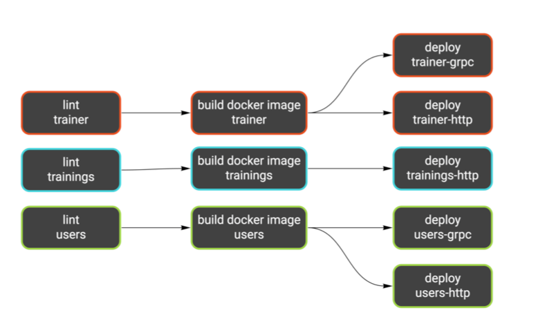
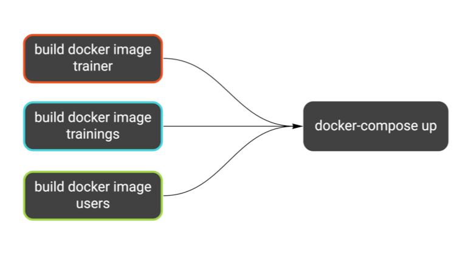
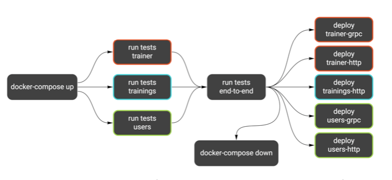

## Running integration tests in the CI/CD pipeline

Miłosz Smółka

This post is a direct follow-up to [Tests Architecture](./chapter12.md) (Chapter 12) where I’ve introduced new kinds of
tests to our example project.

[Wild Workouts](https://github.com/ThreeDotsLabs/wild-workouts-go-ddd-example) uses Google Cloud Build as CI/CD
platform. It’s configured in a continuous deployment manner, meaning the changes land on production as soon as the
pipeline passes. If you consider our current setup, it’s both brave and naive. We have no tests running there that could
save us from obvious mistakes (the not-so-obvious mistakes can rarely be caught by tests, anyway).

In this chapter I will show how to run integration, component, and end-to-end tests on Google Cloud Build using
docker-compose.

### The current config

Let’s take a look at the current cloudbuild.yaml file. While it’s pretty simple, most steps are being run several times
as we keep 3 microservices in a single repository. I focus on the backend part, so I will skip all config related to
frontend deployment now.

```yaml
steps:
  - id: trainer-lint
    name: golang
    entrypoint: ./scripts/lint.sh
    args: [ trainer ]
  - id: trainings-lint
    name: golang
    entrypoint: ./scripts/lint.sh
    args: [ trainings ]
  - id: users-lint
    name: golang
    entrypoint: ./scripts/lint.sh
    args: [ users ]

  - id: trainer-docker
    name: gcr.io/cloud-builders/docker
    entrypoint: ./scripts/build-docker.sh
    args: [ "trainer", "$PROJECT_ID" ]
    waitFor: [ trainer-lint ]
  - id: trainings-docker
    name: gcr.io/cloud-builders/docker
    entrypoint: ./scripts/build-docker.sh
    args: [ "trainings", "$PROJECT_ID" ]
    waitFor: [ trainings-lint ]
  - id: users-docker
    name: gcr.io/cloud-builders/docker
    entrypoint: ./scripts/build-docker.sh
    args: [ "users", "$PROJECT_ID" ]
    waitFor: [ users-lint ]

  - id: trainer-http-deploy
    name: gcr.io/cloud-builders/gcloud
    entrypoint: ./scripts/deploy.sh
    args: [ trainer, http, "$PROJECT_ID" ]
    waitFor: [ trainer-docker ]
  - id: trainer-grpc-deploy
    name: gcr.io/cloud-builders/gcloud
    entrypoint: ./scripts/deploy.sh
    args: [ trainer, grpc, "$PROJECT_ID" ]
    waitFor: [ trainer-docker ]
  - id: trainings-http-deploy
    name: gcr.io/cloud-builders/gcloud
    entrypoint: ./scripts/deploy.sh
    args: [ trainings, http, "$PROJECT_ID" ]
    waitFor: [ trainings-docker ]
  - id: users-http-deploy
    name: gcr.io/cloud-builders/gcloud
    entrypoint: ./scripts/deploy.sh
    args: [ users, http, "$PROJECT_ID" ]
    waitFor: [ users-docker ]
  - id: users-grpc-deploy
    name: gcr.io/cloud-builders/gcloud
    entrypoint: ./scripts/deploy.sh
    args: [ users, grpc, "$PROJECT_ID" ]
    waitFor: [ users-docker ]
```

Source: [cloudbuild.yaml on GitHub](https://bit.ly/3u4O8PQ)

Notice the `waitFor` key. It makes a step wait only for other specified steps. Some jobs can run in parallel this way.

Here’s a more readable version of what’s going on:



We have a similar workflow for each service: lint (static analysis), build the Docker image, and deploy it as one or two
Cloud Run services.

Since our test suite is ready and works locally, we need to figure out how to plug it in the pipeline.

### Docker Compose

We already have one docker-compose definition, and I would like to keep it this way. We will use it for:

- running the application locally,
- running tests locally,
- running tests in the CI.

These three targets have different needs. For example, when running the application locally, we want to have hot code
reloading. But that’s pointless in the CI. On the other hand, we can’t expose ports on localhost in the CI, which is the
easiest way to reach the application in the local environment.

Luckily docker-compose is flexible enough to support all of these use cases. We will use a base `docker-compose.yml`
file and an additional docker-compose.ci.yml file with overrides just for the CI. You can run it by passing both files
using the -f flag (notice there’s one flag for each file). Keys from the files will be merged in the provided order.

```shell
docker-compose -f docker-compose.yml -f docker-compose.ci.yml up -d
```

> Typically, docker-compose looks for the `docker-compose.yml` file in the current directory or parent directo- ries. Using the `-f` flag disables this behavior, so only specified files are parsed.

To run it on Cloud Build, we can use the docker/compose image.

```yaml
- id: docker-compose
  name: 'docker/compose:1.19.0'
  args: [ '-f', 'docker-compose.yml', '-f', 'docker-compose.ci.yml', 'up', '-d' ]
  env:
    - 'PROJECT_ID=$PROJECT_ID'
  waitFor: [ trainer-docker, trainings-docker, users-docker ]
```

Source: [cloudbuild.yaml on GitHub](https://bit.ly/39xjcQb)

Since we filled waitFor with proper step names, we can be sure the correct images are present. This is what we’ve just
added:



The first override we add to `docker-compose.ci.yml` makes each service use docker images by the tag instead of building
one from `docker/app/Dockerfile`. This ensures our tests check the same images we’re going to deploy.

Note the `${PROJECT_ID}` variable in the image keys. This needs to be the production project, so we can’t hardcode it in
the repository. Cloud Build provides this variable in each step, so we just pass it to the `docker-compose up` command (
see the definition above).

```yaml
services:
  trainer-http:
    image: "gcr.io/${PROJECT_ID}/trainer"

  trainer-grpc:
    image: "gcr.io/${PROJECT_ID}/trainer"

  trainings-http:
    image: "gcr.io/${PROJECT_ID}/trainings"

  users-http:
    image: "gcr.io/${PROJECT_ID}/users"

  users-grpc:
    image: "gcr.io/${PROJECT_ID}/users”

```

Source: [docker-compose.ci.yml on GitHub](https://bit.ly/2PqNMEr)

### Network

Many CI systems use Docker today, typically running each step inside a container with the chosen image. Using
docker-compose in a CI is a bit trickier, as it usually means running Docker containers from within a Docker container.

On Google Cloud Build, all containers live inside
the [cloudbuild network](https://cloud.google.com/build/docs/build-config#network). Simply adding this network as the
default one for our docker-compose.ci.yml is enough for CI steps to connect to the docker-compose services.

Here’s the second part of our override file:

```yaml
networks:
  default:
    external:
      name: cloudbuild”
```

Source: [docker-compose.ci.yml on GitHub](https://bit.ly/3sHojEW)

### Environment variables

Using environment variables as configuration seems simple at first, but it quickly becomes complex considering how many
scenarios we need to handle. Let’s try to list all of them:

- running the application locally,
- running component tests locally,
- running component tests in the CI,
- running end-to-end tests locally,
- running end-to-end tests in the CI.

I didn’t include running the application on production, as it doesn’t use docker-compose.

Why component and end-to-end tests are separate scenarios? The former spin up services on demand and the latter
communicate with services already running within docker-compose. It means both types will use different endpoints to
reach the services.

> For more details on component and end-to-end tests see [Tests Architecture](./chapter12.md) (Chapter 12). The TL;DR version is: we focus coverage on component tests, which don’t include external services. End-to-end tests are there just to confirm the contract is not broken on a very high level and only for the most critical path. This is the key to decoupled services.
>

We already keep a base .env file that holds most variables. It’s passed to each service in the docker-compose
definition.

Additionally, docker-compose loads this file automatically when it finds it in the working directory. Thanks to this, we
can use the variables inside the yaml definition as well.

```yaml
services:
  trainer-http:
    build:
      context: docker/app
    ports:
      # The $PORT variable comes from the .env file
      - "127.0.0.1:3000:$PORT"
    env_file:
      # All variables from .env are passed to the service
      - .env
    # (part of the definition omitted)

```

Source: [docker-compose.yml on GitHub](https://bit.ly/31uSXWd)

We also need these variables loaded when running tests. That’s pretty easy to do in bash:

```
source .env
# exactly the same thing
. .env
```

However, the variables in our .env file have no export prefix, so they won’t be passed further to the applications
running in the shell. We can’t use the prefix because it wouldn’t be compatible with the syntax docker-compose expects.

Additionally, we can’t use a single file with all scenarios. We need to have some variable overrides, just like we did
with the docker-compose definition. My idea is to keep one additional file for each scenario. It will be loaded together
with the base .env file.

Let’s see what’s the difference between all scenarios. For clarity, I’ve included only users-http, but the idea will
apply to all services.

| Scenario               | MySQL host | Firestore host            | users-http address | File                                   |
|------------------------|------------|---------------------------|--------------------|----------------------------------------|
| Running locally        | localhost  | localhost                 | localhost:3002     | [.env](https://bit.ly/2PhgMyu)         |
| Local component tests  | localhost  | localhost                 | localhost:5002     | [.test.env ](https://bit.ly/31zBMmi)   |
| CI component tests     | mysql      | firestore-component-tests | localhost:5002     | [.test.ci.env](https://bit.ly/2Odc5VO) |
| Local end-to-end tests | --         | --                        | localhost:3002     | [ .e2e.env](https://bit.ly/3dq7TKH)    |
| CI end-to-end tests    | --         | --                        | users-http:3000    | [.e2e.ci.env](https://bit.ly/39wDwRQ)  |

Services ran by docker-compose use ports 3000+, and component tests start services on ports 5000+. This way, both
instances can run at the same time.

I’ve created a bash script that reads the variables and runs tests.
**Please don’t try to define such a complex scenario directly in the Makefile. Make is terrible at managing environment
variables.**
Your mental health is at stake.

The other reason for creating a dedicated script is that we keep 3 services in one repository and end-to-end tests in a
separate directory. If I need to run the same command multiple times, I prefer calling a script with two variables
rather than a long incantation of flags and arguments.

The third argument in favor of separate bash scripts is they can be linted
with [shellcheck](https://www.shellcheck.net/).

```shell
#!/bin/bash
set -e

readonly service="$1"
readonly env_file="$2"

cd "./internal/$service"
env $(cat "../../.env" "../../$env_file" | grep -Ev '^#' | xargs) go test -count=1 ./...

```

Source: [test.sh on GitHub](https://bit.ly/2PlQtXG)

The script runs go test in the given directory with environment variables loaded from .env and the specified file. The
env / xargs trick passes all variables to the following command. Notice how we remove comments from the file with grep.

> #### Testing Testing
> go test caches successful results, as long as the related files are not modified.
>
> With tests that use Docker, it may happen that you will change something on the infrastructure level, like the docker-compose definition or some environment variables. go test won’t detect this, and you can mistake a cached test for a successful one.
>
> It’s easy to get confused over this, and since our tests are fast anyway, we can disable the cache. The -count=1 flag is an idiomatic (although not obvious) way to do it.
>

### Running tests

I have the end-to-end tests running after tests for all the services passed. It should resemble the way you would
usually run them.

**Remember, end-to-end tests should work just as a double-check, and each service’s own tests should have the most
coverage.**

Because our end-to-end tests are small in scope, we can run them before deploying the services. If they were running for
a long time, this could block our deployments. A better idea in this scenario would be to rely on each service’s
component tests and run the end-to-end suite in parallel.

```yaml
- id: trainer-tests
  name: golang
  entrypoint: ./scripts/test.sh
  args: [ "trainer", ".test.ci.env" ]
  waitFor: [ docker-compose ]
- id: trainings-tests
  name: golang
  entrypoint: ./scripts/test.sh
  args: [ "trainings", ".test.ci.env" ]
  waitFor: [ docker-compose ]
- id: users-tests
  name: golang
  entrypoint: ./scripts/test.sh
  args: [ "users", ".test.ci.env" ]
  waitFor: [ docker-compose ]
    - id: e2e-tests
      name: golang
      entrypoint: ./scripts/test.sh
      args: [ "common", ".e2e.ci.env" ]
      waitFor: [ trainer-tests, trainings-tests, users-tests ]
```

Source: [cloudbuild.yaml on GitHub](https://bit.ly/31y3f84)

The last thing we add is running docker-compose down after all tests have passed. This is just a cleanup.

```yaml
- id: docker-compose-down
  name: 'docker/compose:1.19.0'
  args: [ '-f', 'docker-compose.yml', '-f', 'docker-compose.ci.yml', 'down' ]
  env:
    - 'PROJECT_ID=$PROJECT_ID'
  waitFor: [ e2e-tests ]

```

Source: [cloudbuild.yaml on GitHub](https://bit.ly/3cGGo0C)

The second part of our pipeline looks like this now:



Here’s how running the tests locally looks like (I’ve introduced this make target in the previous chapter). It’s exactly
the same commands as in the CI, just with different .env files.

```
test:
    @./scripts/test.sh common .e2e.env
    @./scripts/test.sh trainer .test.env
    @./scripts/test.sh trainings .test.env
    @./scripts/test.sh users .test.env
```

Source: [Makefile on GitHub](https://bit.ly/3ftPIXp)

### Separating tests

Looking at the table from the previous chapter, we could split tests into two groups, depending on whether they use
Docker.

| Feature         | Unit | Integration | Component | End-to-End |
|-----------------|------|-------------|-----------|------------|
| Docker database | No   | Yes         | Yes       | Yes        |

Unit tests are the only category not using a Docker database, while integration, component, and end-to-end tests do.

Even though we made all our tests fast and stable, setting up Docker infrastructure adds some overhead. It’s helpful to
run all unit tests separately, to have a first guard against mistakes.

We could use build tags to separate tests that don’t use Docker. You can define the build tags in the first line of a
file.

```
// +build docker
```

We could now run unit tests separately from all tests. For example, the command below would run only tests that need
Docker services:

```
go test -tags=docker ./...
```

Another way to separate tests is using the -short flag and checking testing.Short()18 in each test case.

In the end, I decided to not introduce this separation. We made our tests stable and fast enough that running them all
at once is not an issue. However, our project is pretty small, and the test suite covers just the critical paths. When
it grows, it might be a good idea to introduce the build tags in component tests.

### Digression: A short story about CI debugging

While I was introducing changes for this chapter, the initial test runs on Cloud Build kept failing. According to logs,
tests couldn’t reach services from docker-compose.

So I started debugging and added a simple bash script that would connect to the services via telnet.

To my surprise, connecting to mysql:3306 worked correctly, but firestore:8787 didn’t, and the same for all Wild Workouts
services.

I thought this is because docker-compose takes a long time to start, but any number of retries didn’t help. Finally, I
decided to try something crazy, and I’ve set up a reverse SSH tunnel from one of the containers in docker-compose.

This allowed me to SSH inside one of the containers while the build was still running. I then tried using telnet and
curl, and they worked correctly for all services.

Finally, I spotted a bug in the bash script I’ve used.

```
readonly host="$1"
readonly port="$1"
# (some retries code)
telnet "$host" "$port"
```

The typo in variables definition caused the telnet command to run like this: telnet $host $host. So why it worked for
MySQL? It turns out, telnet recognizes ports defined in /etc/services. So telnet mysql mysql got translated to telnet
mysql 3306 and worked fine, but it failed for any other service.

Why the tests failed though? Well, it turned out to be a totally different reason.

Originally, we connected to MySQL like this:

```
config := mysql.Config{
   Addr:      os.Getenv("MYSQL_ADDR"),
   User:      os.Getenv("MYSQL_USER"),
   Passwd:    os.Getenv("MYSQL_PASSWORD"),
   DBName:    os.Getenv("MYSQL_DATABASE"),
   ParseTime: true, // with that parameter, we can use time.Time in mysqlHour.Hour
}

db, err := sqlx.Connect("mysql", config.FormatDSN())
if err != nil {
    return nil, errors.Wrap(err, "cannot connect to MySQL")
}
```

Source: [hour_mysql_repository.go on GitHub](https://bit.ly/2PlVyiT)

I looked into environment variables, and all of them were filled correctly. After adding some fmt.Println() debugs,
**I’ve found out the config’s Addr part is completely ignored by the MySQL client because we didn’t specify the Net
field**. Why it worked for local tests? Because MySQL was exposed on localhost, which is the default address.

The other test failed to connect to one of Wild Workouts services, and it turned out to be because I’ve used incorrect
port in the .env file.

Why I’m sharing this at all? I think it’s a great example of how working with CI systems can often look like.
** When multiple things can fail, it’s easy to come to wrong conclusions and dig deep in the wrong direction**.

When in doubt, I like to reach for basic tools for investigating Linux issues, like strace, curl, or telnet. That’s also
why I did the reverse SSH tunnel, and I’m glad I did because it seems like a great way to debug issues inside the CI. I
feel I will use it again sometime.

### Summary

We managed to keep a single docker-compose definition for running tests locally and in the pipeline. The entire Cloud
Build run from git push to production takes 4 minutes.

We’ve used a few clever hacks, but that’s just regular stuff when dealing with CI. Sometimes you just can’t avoid adding
some bash magic to make things work.

In contrast to the domain code, hacks in your CI setup shouldn’t hurt you too much, as long as there are only a few of
them. Just make sure it’s easy to understand what’s going on, so you’re not the only person with all the knowledge.